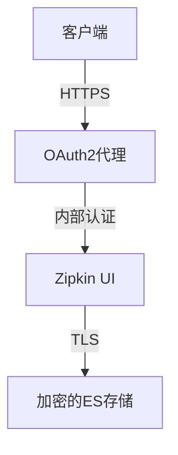

# 安全基线

## 介绍

安全基线是系统安全配置的最低标准要求，用于确保Zipkin在部署时具备基本的安全防护能力。对于初学者而言，理解安全基线能帮助你在不熟悉复杂安全机制的情况下，快速建立可用的安全防护。

:::note 为什么需要安全基线？
分布式追踪系统可能包含敏感数据（如HTTP头、服务间调用关系），安全基线能防止未授权访问和数据泄露。
:::

---

## 核心安全措施

### 1. 网络隔离
将Zipkin服务部署在内网环境，仅允许通过API网关或VPN访问。示例Nginx配置限制IP访问：

```nginx
location /zipkin/ {
    allow 192.168.1.0/24;
    deny all;
    proxy_pass http://zipkin-server:9411;
}
```

### 2. 认证与授权
通过Spring Security集成基础认证（示例配置）：

```java
@Configuration
@EnableWebSecurity
public class SecurityConfig extends WebSecurityConfigurerAdapter {
    @Override
    protected void configure(HttpSecurity http) throws Exception {
        http
            .authorizeRequests()
                .antMatchers("/zipkin/**").authenticated()
            .and()
            .httpBasic();
    }
}
```

### 3. 数据传输加密
强制使用HTTPS（以Let's Encrypt证书为例）：

```bash
# 使用Certbot获取证书
certbot certonly --nginx -d zipkin.yourdomain.com
```

---

## 实际案例

### 场景：电商微服务架构
- **问题**：订单服务调用支付服务的追踪数据包含金额和用户ID
- **解决方案**：
  1. 在Zipkin UI前部署OAuth2代理
  2. 启用Span数据脱敏（通过`zipkin.collector.sample-rate`降低敏感数据采集）
  3. 存储加密（使用AWS KMS加密存储后端）



---

## 进阶配置

### 安全头加固
在反向代理层添加安全头：

```nginx
add_header X-Frame-Options "DENY";
add_header Content-Security-Policy "default-src 'self'";
```

### 审计日志
启用Zipkin的请求日志（通过`logging.level.zipkin2=DEBUG`）并定期分析异常请求。

:::warning 注意
调试日志可能包含敏感信息，生产环境应设置为`INFO`级别。
:::

---

## 总结

安全基线配置要点：
- ✅ 最小化网络暴露面
- ✅ 强制认证机制
- ✅ 端到端加密
- ✅ 敏感数据保护

## 延伸学习
- [OWASP安全基线指南](https://owasp.org)
- Zipkin官方文档的`SECURITY.md`文件
- 练习：尝试用Docker Compose部署带HTTPS的Zipkin

:::tip 小测验
Q: 为什么即使在内网也需要启用Zipkin认证？<br />
A: 防御横向移动攻击，防止内网渗透后直接访问敏感数据。
:::