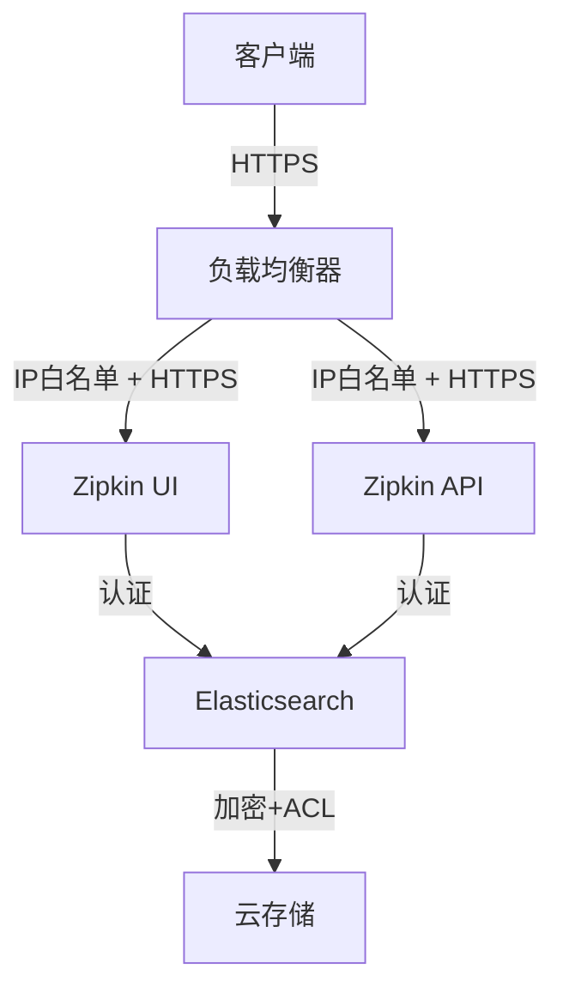

# 安全最佳实践

## 介绍

Zipkin是一个开源的分布式追踪系统，用于收集和分析微服务架构中的请求链路数据。在生产环境中，确保Zipkin的安全性至关重要，因为它可能包含敏感的服务调用信息和业务数据。本文将介绍保护Zipkin实例的关键安全措施。

:::note 为什么需要Zipkin安全性？
- 防止未授权访问追踪数据
- 保护敏感信息（如HTTP头、数据库查询）
- 避免恶意用户篡改追踪数据
:::

## 1. 启用基本身份验证

最简单的安全措施是为Zipkin UI和API添加基本身份验证。

### 示例：Spring Boot集成

```java
@Configuration
@EnableWebSecurity
public class SecurityConfig extends WebSecurityConfigurerAdapter {
    @Override
    protected void configure(HttpSecurity http) throws Exception {
        http
            .authorizeRequests()
                .anyRequest().authenticated()
                .and()
            .httpBasic();
    }

    @Autowired
    public void configureGlobal(AuthenticationManagerBuilder auth) throws Exception {
        auth.inMemoryAuthentication()
            .withUser("admin")
            .password("{noop}securepassword")  // {noop}表示不加密（仅用于演示）
            .roles("USER");
    }
}
```

## 2. 传输层加密（HTTPS）

始终通过HTTPS访问Zipkin，防止中间人攻击。

### Nginx配置示例

```nginx
server {
    listen 443 ssl;
    server_name zipkin.example.com;

    ssl_certificate /path/to/cert.pem;
    ssl_certificate_key /path/to/key.pem;

    location / {
        proxy_pass http://localhost:9411;
        proxy_set_header Host $host;
    }
}
```

## 3. 访问控制列表（ACL）

限制可以访问Zipkin的IP地址范围。

### 使用Spring Security的IP限制

```java
http.authorizeRequests()
    .antMatchers("/**")
    .hasIpAddress("192.168.1.0/24")
    .and()
    .httpBasic();
```

## 4. 敏感数据过滤

配置Zipkin来过滤掉敏感信息，如认证令牌或信用卡号。

### 示例配置（通过环境变量）

```bash
# 过滤特定header
ZIPKIN_COLLECTOR_HEADER_KEYS_TO_DROP=authorization,password
```

## 5. 存储安全

保护Zipkin的后端存储（如Elasticsearch或MySQL）。

:::warning 重要
- 为存储系统启用认证
- 定期备份数据
- 限制存储系统的网络访问
:::

## 实际案例：电商平台安全部署



这个电商平台部署中：
1. 所有外部访问强制HTTPS
2. 负载均衡器实施IP白名单
3. Zipkin和Elasticsearch都有认证
4. 数据存储加密并有访问控制

## 总结

保护Zipkin实例需要多层次的安全措施：

1. **认证**：确保只有授权用户能访问
2. **加密**：传输和存储中保护数据
3. **访问控制**：限制谁可以访问系统
4. **数据过滤**：防止敏感信息泄露
5. **监控**：记录所有访问尝试

## 延伸学习

- [Zipkin官方安全文档](https://zipkin.io/pages/security.html)
- [OWASP安全指南](https://owasp.org/www-project-top-ten/)
- 练习：设置一个本地Zipkin实例并配置基本认证和HTTPS

:::tip 小技巧
在开发环境可以使用自签名证书测试HTTPS配置，但在生产环境必须使用可信CA签发的证书。
:::