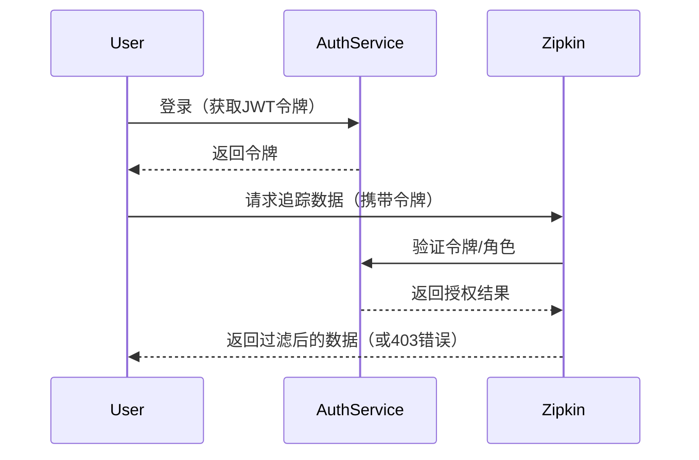

# 授权管理

## 介绍

在分布式系统中，Zipkin 作为链路追踪工具，可能包含敏感的服务调用信息。**授权管理**（Authorization）是确保只有经过验证的用户或服务能够访问这些数据的关键机制。与认证（Authentication）不同，授权关注的是**权限分配**，即“用户能做什么”。

本节将介绍 Zipkin 的授权实现方式，包括基础配置、角色控制，以及如何集成外部安全框架（如 Spring Security）。

---

## 基础概念

### 1. Zipkin 的默认安全行为
默认情况下，Zipkin 服务**不启用授权**。这意味着所有能访问网络端点的人都可以查看追踪数据。在生产环境中，必须通过以下方式加固：
- 网络层隔离（如防火墙规则）。
- 应用层授权（如通过反向代理或集成安全框架）。

### 2. 关键术语
- **角色（Role）**：权限的集合（例如 `ADMIN` 可删除数据，`VIEWER` 仅能查询）。
- **策略（Policy）**：定义角色与资源访问规则的映射。

---

## 配置授权

### 方案1：通过反向代理（如 Nginx）
在 Zipkin 前部署反向代理，通过请求头（如 `X-Forwarded-User`）传递用户身份，并限制路径访问。

```nginx
# Nginx 示例：限制 /api/v2/* 路径仅允许内网IP
location /api/v2/ {
  allow 192.168.1.0/24;
  deny all;
  proxy_pass http://zipkin:9411;
}
```

### 方案2：集成 Spring Security
如果 Zipkin 使用 Spring Boot 部署，可通过 `spring-boot-starter-security` 添加授权。

```java
// Spring Security 配置示例
@Configuration
@EnableWebSecurity
public class SecurityConfig extends WebSecurityConfigurerAdapter {
  @Override
  protected void configure(HttpSecurity http) throws Exception {
    http
      .authorizeRequests()
        .antMatchers("/zipkin/**").hasRole("VIEWER") // 要求 VIEWER 角色
        .anyRequest().authenticated()
      .and()
      .httpBasic(); // 使用基础认证
  }
}
```

:::note
启动服务后，访问 Zipkin UI 时将需要输入用户名和密码。
:::

---

## 实际案例

### 场景：多团队共享 Zipkin
假设公司有 `team-a` 和 `team-b`，要求：
1. 每个团队只能查看自己的追踪数据。
2. 管理员可访问全部数据。

**实现步骤**：
1. 在追踪数据中添加团队标签（如 `team=team-a`）。
2. 使用 Zipkin 的 `StorageComponent` 自定义查询逻辑，过滤非授权数据：
```java
public class TeamAwareStorage extends ForwardingStorageComponent {
  @Override public SpanStore spanStore() {
    return new FilteredSpanStore(super.spanStore(), currentUserTeam());
  }
}
```

---

## 可视化流程



---

## 总结

- 始终在生产环境启用授权。
- 结合网络层和应用层控制（深度防御）。
- 通过标签或自定义逻辑实现细粒度权限。

**延伸练习**：
1. 使用 Docker 部署 Zipkin，并通过 Nginx 配置路径 `/api/v2/traces` 的 IP 限制。
2. 尝试用 Spring Security 实现基于数据库的动态角色加载。

**附加资源**：
- [Zipkin 服务器配置文档](https://zipkin.io/zipkin-server/)
- [Spring Security 官方指南](https://spring.io/guides/gs/securing-web/)