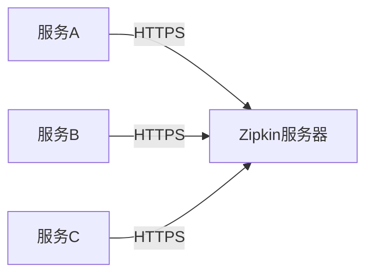

# TLS/SSL配置

## 介绍

TLS（Transport Layer Security）和SSL（Secure Sockets Layer）是用于在网络上加密通信的协议。在Zipkin中配置TLS/SSL可以确保追踪数据在传输过程中不被窃取或篡改，这对于生产环境至关重要。本文将逐步介绍如何在Zipkin中启用和配置TLS/SSL。

:::note
TLS是SSL的继任者，现代系统通常使用TLS。术语"SSL"仍被广泛使用，但实际指的是TLS。
:::

## 为什么需要TLS/SSL？

1. **数据加密**：防止敏感数据在传输过程中被窃听。
2. **身份验证**：确保客户端连接到的是真正的服务器，而非中间人攻击者。
3. **数据完整性**：防止数据在传输过程中被篡改。

## 基本概念

在配置TLS/SSL前，需要了解以下关键概念：

- **证书（Certificate）**：数字文件，用于验证服务器身份。
- **私钥（Private Key）**：必须保密，用于解密数据。
- **证书颁发机构（CA）**：受信任的第三方，签发证书。

## 生成证书和私钥

在配置Zipkin之前，你需要获得证书和私钥。以下是使用OpenSSL生成自签名证书的示例：

```bash
# 生成私钥
openssl genrsa -out zipkin.key 2048

# 生成证书签名请求（CSR）
openssl req -new -key zipkin.key -out zipkin.csr

# 生成自签名证书（有效期365天）
openssl x509 -req -days 365 -in zipkin.csr -signkey zipkin.key -out zipkin.crt
```

:::caution
自签名证书仅适用于测试环境。生产环境应使用由受信任CA签发的证书。
:::

## 配置Zipkin使用TLS/SSL

Zipkin服务器可以通过以下方式配置TLS：

### 使用Java属性配置

在启动Zipkin服务器时，可以通过Java系统属性启用TLS：

```bash
java -jar zipkin-server.jar \
    --server.ssl.enabled=true \
    --server.ssl.key-store-type=PKCS12 \
    --server.ssl.key-store=path/to/keystore.p12 \
    --server.ssl.key-store-password=yourpassword
```

### 使用环境变量配置

也可以使用环境变量配置：

```bash
export SERVER_SSL_ENABLED=true
export SERVER_SSL_KEY_STORE_TYPE=PKCS12
export SERVER_SSL_KEY_STORE=/path/to/keystore.p12
export SERVER_SSL_KEY_STORE_PASSWORD=yourpassword

java -jar zipkin-server.jar
```

### 使用application.yml配置

创建或修改`application.yml`文件：

```yaml
server:
  ssl:
    enabled: true
    key-store-type: PKCS12
    key-store: classpath:keystore.p12
    key-store-password: yourpassword
```

## 将证书转换为Java Keystore

如果你有PEM格式的证书和私钥，需要先转换为Java Keystore格式：

```bash
# 将证书和私钥转换为PKCS12格式
openssl pkcs12 -export -in zipkin.crt -inkey zipkin.key -out zipkin.p12 -name zipkin

# 验证keystore内容
keytool -list -v -keystore zipkin.p12
```

## 客户端配置

当Zipkin服务器启用TLS后，客户端也需要相应配置。以下是使用Zipkin Java客户端（Brave）的示例：

```java
@Bean
Sender sender() {
  return URLConnectionSender.newBuilder()
    .endpoint("https://your-zipkin-server:9411/api/v2/spans")
    .connectTimeout(5000)
    .compressionEnabled(true)
    .build();
}
```

## 实际案例

假设你有一个微服务架构，包含以下组件：



配置步骤：
1. 为Zipkin服务器获取证书
2. 配置Zipkin使用TLS
3. 更新所有客户端配置为HTTPS端点
4. 测试追踪数据是否正常传输

## 常见问题解决

**问题1**：证书不受信任错误
- 解决方案：将CA证书导入客户端的信任库

**问题2**：协议或密码套件不匹配
- 解决方案：在Zipkin配置中指定支持的协议和密码套件：

```yaml
server:
  ssl:
    enabled: true
    protocol: TLSv1.2
    ciphers: TLS_ECDHE_RSA_WITH_AES_128_GCM_SHA256,TLS_ECDHE_RSA_WITH_AES_256_GCM_SHA384
```

## 总结

配置TLS/SSL是保护Zipkin追踪数据安全的重要步骤。本文介绍了：
- TLS/SSL的基本概念
- 如何生成证书和私钥
- 多种配置Zipkin使用TLS的方法
- 客户端配置示例
- 实际应用场景和问题解决

## 附加资源

1. [OpenSSL官方文档](https://www.openssl.org/docs/)
2. [Spring Boot SSL配置指南](https://docs.spring.io/spring-boot/docs/current/reference/html/howto.html#howto.webserver.configure-ssl)
3. [Zipkin服务器配置参考](https://github.com/openzipkin/zipkin/tree/master/zipkin-server)

## 练习

1. 使用OpenSSL生成自签名证书
2. 配置本地Zipkin服务器使用TLS
3. 修改一个示例客户端，使其通过HTTPS连接到Zipkin
4. 使用Wireshark验证数据是否加密传输