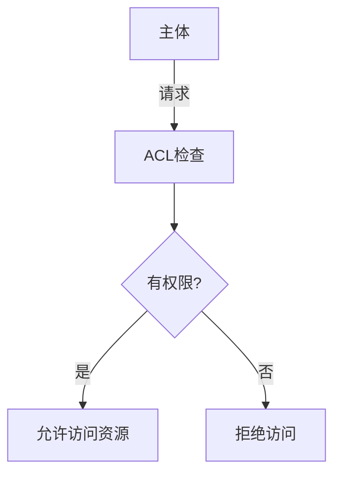
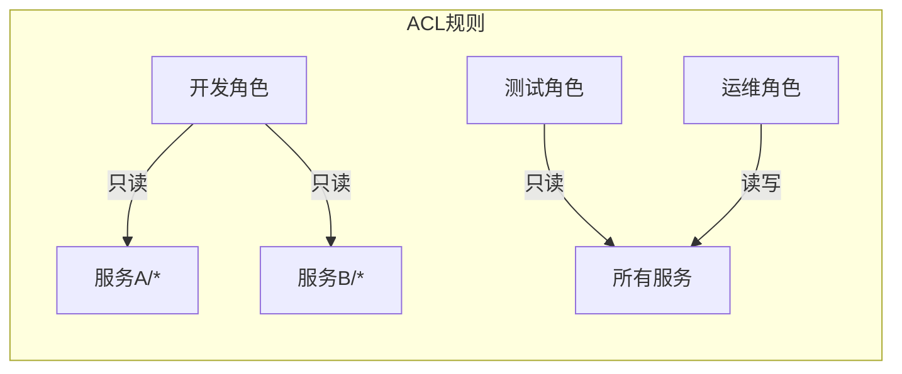

# 访问控制列表

## 介绍

访问控制列表（Access Control List，简称ACL）是Zipkin中用于限制对追踪数据访问权限的安全机制。它通过定义哪些用户或系统可以执行特定操作（如查看、修改或删除追踪数据），帮助保护敏感信息免受未授权访问。

对于初学者来说，可以将ACL理解为：
- **数字门卫**：控制谁可以进入系统
- **权限清单**：明确规定每个用户能做什么
- **安全过滤器**：在数据被访问前进行权限检查

## ACL基础概念

### 核心组件

1. **主体(Subject)**：需要访问资源的实体（如用户、服务或IP地址）
2. **资源(Resource)**：被保护的对象（如特定追踪数据）
3. **操作(Operation)**：对资源执行的动作（如read、write）
4. **权限(Permission)**：主体-资源-操作的组合规则



## Zipkin 中的ACL配置

### 基本配置示例

在Zipkin的`application.properties`或`application.yml`中配置基本ACL：

```properties
# 启用基本认证
zipkin.server.basic.enabled=true
zipkin.server.basic.username=admin
zipkin.server.basic.password=securepassword

# 限制特定IP访问
zipkin.server.allowed-origins=192.168.1.100,10.0.0.0/8
```

### 基于角色的访问控制

更高级的配置可以使用Spring Security：

```java
@Configuration
@EnableWebSecurity
public class ZipkinSecurityConfig extends WebSecurityConfigurerAdapter {
    
    @Override
    protected void configure(HttpSecurity http) throws Exception {
        http
            .authorizeRequests()
                .antMatchers("/zipkin/**").hasRole("MONITOR")
                .anyRequest().authenticated()
            .and()
            .httpBasic();
    }
}
```

## 实际应用场景

### 案例1：多团队环境

**场景**：公司有开发、测试和运维三个团队需要访问Zipkin，但需要不同权限：

1. **开发团队**：只能查看自己服务的追踪
2. **测试团队**：可以查看所有追踪但不能修改
3. **运维团队**：完全访问权限

**解决方案**：


### 案例2：合规性要求

**场景**：金融应用需要满足PCI DSS合规要求，必须记录所有对追踪数据的访问。

**实现**：
```properties
# 启用审计日志
zipkin.server.audit.enabled=true
zipkin.server.audit.events=READ_TRACE,WRITE_TRACE
zipkin.server.audit.logfile=/var/log/zipkin/audit.log
```

## 最佳实践

:::tip 安全建议
1. **最小权限原则**：只授予必要的最小权限
2. **定期审查**：至少每季度检查一次ACL规则
3. **多层防御**：结合网络ACL和应用层ACL
4. **敏感数据**：考虑对追踪中的敏感字段进行脱敏
:::

## 常见问题

:::caution 注意
1. **性能影响**：复杂的ACL规则可能增加系统开销
2. **规则冲突**：当多个规则匹配时，明确优先级
3. **测试不足**：确保在生产前充分测试ACL规则
:::

## 总结

访问控制列表是Zipkin安全架构的关键组件，通过合理配置ACL可以：
- 防止数据泄露
- 满足合规要求
- 实现团队间安全协作

## 延伸学习

1. **实践练习**：
   - 创建一个只允许查看特定服务追踪的ACL规则
   - 配置基于IP的限制规则

2. **进阶主题**：
   - OAuth2集成
   - 基于属性的访问控制(ABAC)
   - 服务网格中的追踪安全

3. **官方资源**：
   - [Zipkin安全文档](https://zipkin.io/security)
   - [Spring Security参考](https://docs.spring.io/spring-security/reference/)