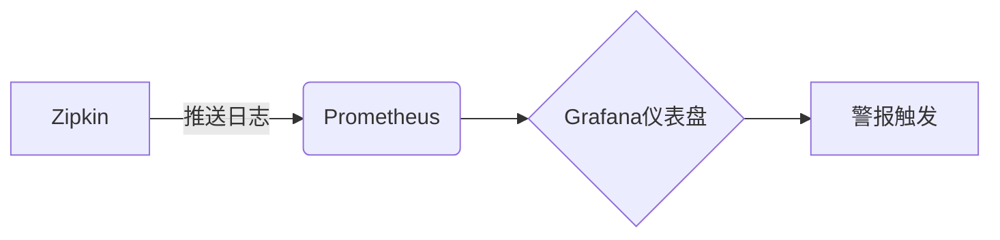

# 安全审计

## 介绍

安全审计是确保Zipkin分布式追踪系统安全性的重要实践，通过记录和分析系统活动，检测潜在的安全威胁或违规行为。对于初学者而言，理解安全审计的基础概念和实施方法，有助于构建更可靠的监控体系。

:::note 关键目标
- **追踪访问行为**：记录谁访问了Zipkin数据以及何时访问。
- **合规性检查**：确保符合行业安全标准（如GDPR、HIPAA）。
- **异常检测**：识别异常操作模式（如频繁查询敏感数据）。
:::

---

## 核心组件

### 1. 审计日志
Zipkin的审计日志通常包含以下信息：
- **操作类型**（如查询、写入）。
- **用户身份**（如IP、认证令牌）。
- **时间戳**和**请求参数**。

示例日志条目（JSON格式）：
```json
{
  "timestamp": "2023-10-05T14:23:45Z",
  "user": "admin@example.com",
  "action": "QUERY_TRACE",
  "resource": "trace/123456",
  "metadata": {"ip": "192.168.1.100"}
}
```

### 2. 访问控制
通过角色（如 `READ_ONLY`、`ADMIN`）限制用户权限。  
示例Zipkin API配置（基于Spring Security）：
```java
@Configuration
@EnableWebSecurity
public class SecurityConfig extends WebSecurityConfigurerAdapter {
    @Override
    protected void configure(HttpSecurity http) throws Exception {
        http.authorizeRequests()
            .antMatchers("/api/v2/traces").hasRole("READ_ONLY")
            .antMatchers("/api/v2/admin/**").hasRole("ADMIN");
    }
}
```

---

## 实施步骤

### 步骤1：启用审计日志
在Zipkin服务器配置中（如 `application.properties`）：
```properties
# 启用审计日志
zipkin.audit.enabled=true
zipkin.audit.destination=file:/var/log/zipkin/audit.log
```

### 步骤2：监控关键操作
使用Prometheus和Grafana监控异常请求频率：


### 步骤3：定期审查
- **每日**：检查失败登录尝试。
- **每周**：分析敏感数据访问模式。

---

## 实际案例

### 场景：检测未授权访问
1. **问题**：某员工频繁查询生产环境的全量追踪数据。
2. **审计发现**：日志显示同一IP在非工作时间发起大量请求。
3. **解决**：限制该账号权限并启用双因素认证。

:::warning 注意
审计日志可能包含敏感信息，需加密存储并限制访问权限。
:::

---

## 总结

安全审计是Zipkin安全性的基石，通过记录、分析和响应系统活动，帮助团队快速识别风险。初学者可以从以下方向深入：
1. **工具集成**：将审计日志接入ELK或Splunk。
2. **自动化测试**：使用脚本模拟攻击检测防御漏洞。

---

## 扩展资源
- [Zipkin官方文档：安全最佳实践](https://zipkin.io/security)
- OWASP指南：《日志注入防御》