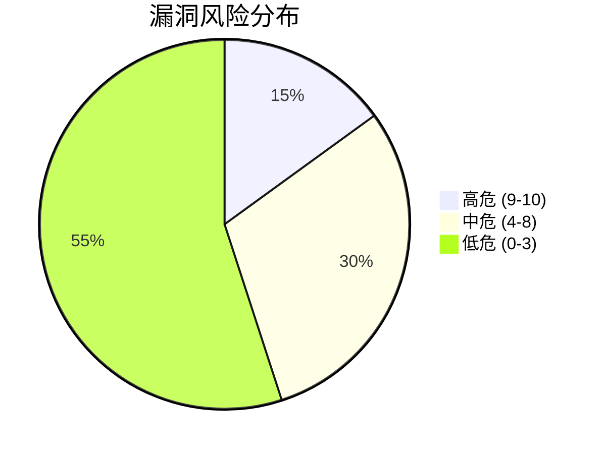

# Zipkin 漏洞管理

## 介绍

漏洞管理是Zipkin安全性的核心组成部分，它涉及识别、评估、修复和监控系统潜在安全弱点的持续过程。对于初学者而言，理解这一流程能帮助你在部署Zipkin时主动防范攻击，例如数据泄露或服务劫持。

:::note 为什么需要漏洞管理？
分布式追踪系统如Zipkin可能暴露敏感调用链数据，漏洞管理能确保这些信息不被恶意利用。
:::

## 漏洞管理流程

### 1. 漏洞识别
通过以下方式发现潜在漏洞：
- **版本检查**：使用`curl`验证Zipkin服务版本：
  ```bash
  curl -I http://your-zipkin-server:9411
  ```
  输出示例：
  ```http
  HTTP/1.1 200 OK
  X-Zipkin-Version: 2.24.0
  ```

- **依赖扫描**：检查`pom.xml`或`build.gradle`中的依赖项：
  ```xml
  <dependency>
    <groupId>io.zipkin.zipkin2</groupId>
    <artifactId>zipkin-server</artifactId>
    <version>2.24.0</version>
  </dependency>
  ```

### 2. 风险评估
使用CVSS（通用漏洞评分系统）评估漏洞严重性：



### 3. 修复实施
常见修复方法包括：
- **版本升级**：修改依赖版本号
  ```gradle
  implementation 'io.zipkin.zipkin2:zipkin-server:2.24.3'
  ```
- **配置加固**：禁用敏感接口
  ```yaml
  # application.yml
  zipkin:
    self-tracing:
      enabled: false
  ```

### 4. 验证与监控
使用自动化工具持续检测：
```bash
docker run --rm owasp/dependency-check \
  --project "Zipkin" --scan /path/to/project
```

## 实际案例

**案例：CVE-2022-24312（Zipkin XSS漏洞）**
- **影响版本**：`<2.23.0`
- **攻击场景**：恶意用户通过UI注入JavaScript代码
- **修复方案**：
  1. 升级至2.23.0+
  2. 添加内容安全策略头：
     ```nginx
     add_header Content-Security-Policy "default-src 'self'";
     ```

## 总结

完整的漏洞管理应包含：
1. 定期扫描依赖项
2. 订阅安全公告（如[Zipkin GitHub Advisories](https://github.com/zipkin/zipkin/security/advisories)）
3. 建立自动化检测流水线

:::tip 练习建议
1. 使用`OWASP ZAP`扫描本地Zipkin实例
2. 尝试在测试环境中复现一个已知低危漏洞
:::

## 延伸阅读
- [Zipkin官方安全指南](https://zipkin.io/security/)
- [NIST漏洞管理标准](https://nvd.nist.gov/vuln-metrics/cvss)