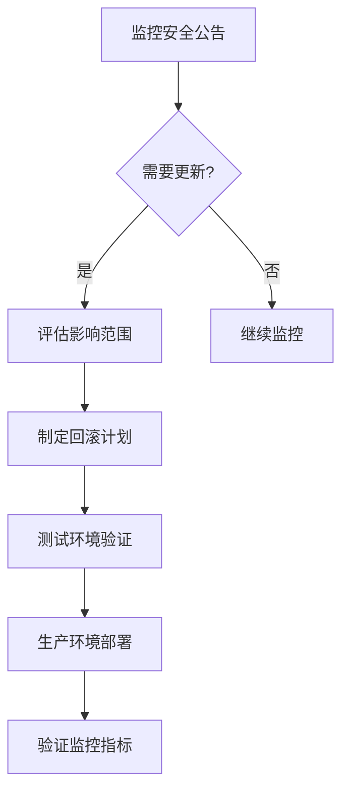

# 安全更新策略

## 介绍

安全更新策略是确保分布式追踪系统Zipkin长期稳定运行的关键。对于初学者来说，理解如何定期更新Zipkin组件、修复安全漏洞以及遵循最佳实践，可以显著降低系统被攻击的风险。本章将逐步讲解Zipkin的安全更新机制，并通过实际案例展示其重要性。

---

## 为什么需要安全更新？

Zipkin作为开源分布式追踪工具，可能面临以下安全风险：
1. **依赖库漏洞**：第三方库的已知漏洞可能被利用
2. **配置缺陷**：默认配置可能不符合安全要求
3. **协议弱点**：通信协议可能存在未修复的问题

:::tip 及时更新的意义
一个未打补丁的Zipkin实例可能成为整个微服务架构的攻击入口点。例如，CVE-2021-44228（Log4j漏洞）曾影响多个Java应用，包括Zipkin。
:::

---

## 更新策略核心要素

### 1. 版本监控
使用工具监控Zipkin及其依赖的版本状态：

```bash
# 检查当前Zipkin版本
curl -s http://localhost:9411/info | grep "zipkin.version"
```

示例输出：
```json
{"zipkin.version":"2.24.0"}
```

### 2. 更新分类
| 更新类型 | 响应时间 | 测试要求 |
|----------|----------|----------|
| 紧急安全补丁 | 24小时内 | 冒烟测试 |
| 常规版本升级 | 1-2周 | 完整回归测试 |
| 功能更新 | 按计划 | 新功能测试 |

### 3. 更新流程


---

## 实际案例：处理CVE漏洞

**场景**：Zipkin使用的Netty库曝出远程代码执行漏洞（CVE-2021-21295）

**解决步骤**：
1. 在[Zipkin GitHub公告](https://github.com/openzipkin/zipkin)确认受影响版本
2. 检查当前环境：

```bash
./mvnw dependency:tree | grep "io.netty"
```

3. 升级依赖版本（以Maven为例）：

```xml
<properties>
    <netty.version>4.1.63.Final</netty.version>
</properties>
```

4. 验证修复：

```bash
curl -I http://localhost:9411
# 应返回200且无异常日志
```

---

## 最佳实践

1. **自动化更新检测**：
   - 使用Dependabot或RenovateBot自动创建PR
   - 配置CI/CD流水线中的安全扫描步骤

2. **隔离部署**：
   ```yaml
   # docker-compose示例
   services:
     zipkin:
       image: openzipkin/zipkin:2.24.0
       networks:
         - secure-internal
       ports:
         - "9411:9411"
   ```

3. **备份策略**：
   - 在更新前备份存储（如Elasticsearch索引）
   - 使用Zipkin的`STORAGE_TYPE=mysql`时执行数据库转储

---

## 总结

有效的安全更新策略应包含：
- 定期监控官方安全公告
- 建立分级的响应机制
- 自动化更新验证流程
- 完善的回滚方案

:::warning 重要提醒
永远不要在未测试的情况下直接将更新部署到生产环境，即使标记为"安全补丁"。
:::

---

## 扩展资源

1. [Zipkin官方安全指南](https://zipkin.io/security/)
2. [OWASP依赖检查工具](https://owasp.org/www-project-dependency-check/)
3. 练习：设置一个本地Zipkin实例，使用`trivy`扫描容器镜像漏洞：

```bash
trivy image openzipkin/zipkin:2.24.0
```

通过系统化的更新策略，你可以确保Zipkin在提供强大追踪能力的同时保持高度安全性。