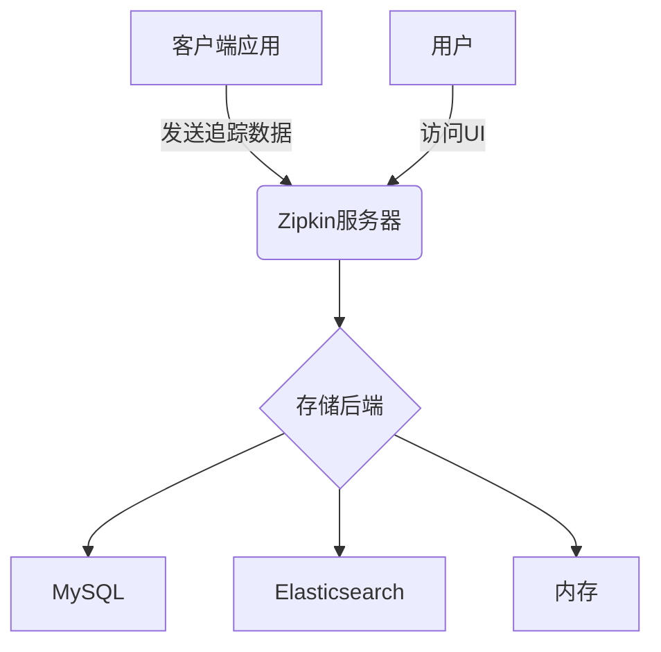

# Zipkin 服务器安装

## 介绍

Zipkin是一个开源的分布式追踪系统，用于收集、存储和可视化微服务架构中的请求链路数据。安装Zipkin服务器是使用Zipkin的第一步，本文将详细介绍多种安装方式及其配置方法。

## 安装方式

Zipkin服务器支持多种安装方式，以下是三种常见方法：

### 1. 使用Docker快速安装（推荐）

:::tip 适合场景
- 快速体验Zipkin功能
- 开发/测试环境
- 已具备Docker环境
:::

```bash
# 拉取最新Zipkin镜像
docker pull openzipkin/zipkin

# 运行Zipkin容器（默认端口9411）
docker run -d -p 9411:9411 --name zipkin openzipkin/zipkin
```

访问 `http://localhost:9411` 即可看到Zipkin Web界面。

### 2. 使用Java直接运行

:::note 前提条件
- 已安装Java 8或更高版本
:::

```bash
# 下载最新Zipkin jar包
curl -sSL https://zipkin.io/quickstart.sh | bash -s

# 运行Zipkin服务器
java -jar zipkin.jar
```

### 3. 从源码构建

适合需要自定义功能的开发者：

```bash
# 克隆仓库
git clone https://github.com/openzipkin/zipkin.git
cd zipkin

# 构建项目
./mvnw -DskipTests --also-make -pl zipkin-server clean install

# 运行
java -jar ./zipkin-server/target/zipkin-server-*-exec.jar
```

## 存储配置

默认情况下Zipkin使用内存存储，重启后数据会丢失。以下是持久化配置示例：

### 使用MySQL存储

```bash
# 启动时指定MySQL配置
docker run -d -p 9411:9411 \
  -e STORAGE_TYPE=mysql \
  -e MYSQL_HOST=127.0.0.1 \
  -e MYSQL_TCP_PORT=3306 \
  -e MYSQL_USER=zipkin \
  -e MYSQL_PASS=zipkin \
  -e MYSQL_DB=zipkin \
  openzipkin/zipkin
```

### 使用Elasticsearch存储

```bash
docker run -d -p 9411:9411 \
  -e STORAGE_TYPE=elasticsearch \
  -e ES_HOSTS=http://elasticsearch:9200 \
  openzipkin/zipkin
```

## 高级配置

### 自定义端口

```bash
# 通过环境变量修改端口
docker run -d -p 9412:9412 \
  -e SERVER_PORT=9412 \
  openzipkin/zipkin
```

### 启用HTTPS

```bash
docker run -d -p 9411:9411 \
  -e SERVER_SSL_ENABLED=true \
  -e SERVER_SSL_KEY_STORE=/path/to/keystore.p12 \
  -e SERVER_SSL_KEY_STORE_PASSWORD=changeit \
  -v /host/path/to/keystore.p12:/path/to/keystore.p12 \
  openzipkin/zipkin
```

## 架构示意图



## 验证安装

安装完成后，可以通过以下方式验证：

1. 访问Web界面：`http://localhost:9411`
2. 检查健康状态：`http://localhost:9411/health`
3. 查看已注册服务：`http://localhost:9411/api/v2/services`

## 实际案例

假设你有一个微服务架构的电商系统：

```
用户请求 → 网关服务 → 商品服务 → 库存服务 → 支付服务
```

安装Zipkin后，你可以：
1. 在每个服务中集成Zipkin客户端
2. 在Zipkin UI中查看完整请求链路
3. 分析各服务间的调用延迟

## 总结

本文介绍了Zipkin服务器的多种安装方式：
- Docker方式最简单快捷
- Java直接运行适合快速测试
- 源码构建适合深度定制

:::caution 生产环境建议
生产环境务必配置持久化存储（MySQL/Elasticsearch）并考虑集群部署
:::

## 后续步骤

1. 尝试集成Zipkin客户端到你的应用中
2. 学习使用Zipkin UI分析追踪数据
3. 探索高级功能：服务依赖图、采样率配置等

## 扩展资源

- [Zipkin官方文档](https://zipkin.io/)
- [Zipkin GitHub仓库](https://github.com/openzipkin/zipkin)
- [Spring Cloud Sleuth集成指南](https://spring.io/projects/spring-cloud-sleuth)