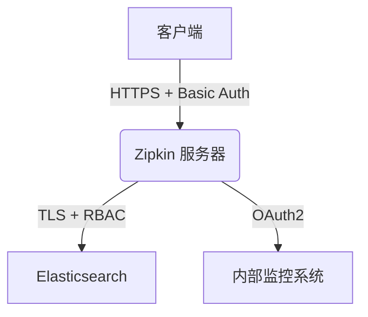

# Zipkin 安全性配置

## 介绍

在分布式系统中，Zipkin 作为链路追踪工具可能包含敏感的服务调用信息。默认安装的 Zipkin 通常不启用安全措施，这可能导致数据泄露或未经授权的访问。本节将介绍如何为 Zipkin 配置基础安全性功能，包括：

- 传输层加密 (HTTPS)
- 基础认证 (Basic Auth)
- 存储层访问控制
- 敏感数据脱敏

:::note 适用版本
本文配置基于 Zipkin **2.23+** 版本，部分功能可能需要额外依赖。
:::

---

## 1. 启用 HTTPS 加密

### 使用 Java 启动参数配置

通过启动参数为 Zipkin 服务器启用 HTTPS：

```bash
java -jar zipkin.jar \
  --server.ssl.enabled=true \
  --server.ssl.key-store-type=PKCS12 \
  --server.ssl.key-store=path/to/keystore.p12 \
  --server.ssl.key-store-password=yourpassword
```

参数说明：
- `key-store-type`: 证书类型 (JKS/PKCS12)
- `key-store`: 证书文件路径
- `key-store-password`: 证书密码

:::caution 证书生成
使用以下命令生成测试用自签名证书：
```bash
keytool -genkeypair -alias zipkin -keyalg RSA -keysize 2048 -storetype PKCS12 \
  -keystore keystore.p12 -validity 3650
```
:::

---

## 2. 配置基础认证

### 使用 Spring Security 添加认证

创建 `application.yml` 配置文件：

```yaml
# zipkin-server/src/main/resources/application.yml
spring:
  security:
    user:
      name: admin
      password: securepassword
    basic:
      enabled: true
```

访问时将需要输入凭证：
```bash
curl -u admin:securepassword http://localhost:9411
```

:::warning 生产环境注意
实际部署时应：
1. 使用环境变量注入密码
2. 配置多用户体系 (建议集成 LDAP/OAuth)
:::

---

## 3. 存储层安全配置

### Elasticsearch 安全示例

如果使用 Elasticsearch 作为存储后端：

```yaml
zipkin:
  storage:
    type: elasticsearch
    elasticsearch:
      hosts: https://elastic:9200
      username: zipkin_user
      password: ${ES_PASSWORD}
      ssl:
        verify: true
        certificate-authority: /path/to/ca.pem
```

---

## 4. 敏感数据脱敏

### 配置 Span 数据过滤

通过自定义 `SpanConsumer` 实现数据过滤：

```java
@Bean SpanConsumer customizeStorage(SpanConsumer delegate) {
  return span -> {
    // 移除敏感header
    span.tags().entrySet().removeIf(e -> 
      e.getKey().toLowerCase().contains("password"));
    
    delegate.accept(span);
  };
}
```

---

## 实际案例：电商平台安全配置



配置要点：
1. 对外暴露的 Zipkin 使用 Cloudflare 提供 WAF 防护
2. 内部服务间通信使用双向 TLS 认证
3. 所有日志中的支付信息自动脱敏

---

## 总结与练习

### 关键总结
- 始终启用传输层加密
- 最少权限原则配置存储访问
- 敏感数据应在收集阶段脱敏
- 定期轮换认证凭证

### 扩展练习
1. 尝试使用 Let's Encrypt 配置自动更新的 HTTPS 证书
2. 使用 Vault 动态管理存储密码
3. 实现 IP 白名单访问控制

### 附加资源
- [Zipkin 安全公告列表](https://github.com/openzipkin/zipkin/security/advisories)
- [OWASP API 安全指南](https://cheatsheetseries.owasp.org/cheatsheets/REST_Security_Cheat_Sheet.html)