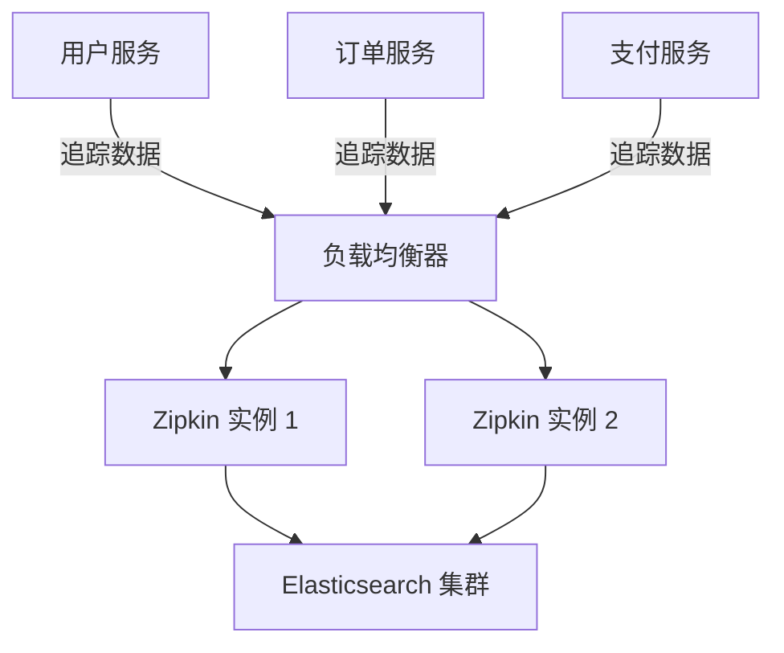

# 高可用性设置

## 介绍

高可用性（High Availability, HA）是指系统能够在预定的时间内持续提供服务的能力，即使部分组件发生故障。对于 Zipkin 这样的分布式追踪系统，高可用性尤为重要，因为它需要处理来自多个微服务的追踪数据。本节将介绍如何配置 Zipkin 以实现高可用性，包括存储后端的选择、负载均衡和故障转移策略。

## 为什么需要高可用性？

在分布式系统中，Zipkin 用于收集和展示请求的追踪数据。如果 Zipkin 服务不可用，可能会导致以下问题：
- 追踪数据丢失。
- 无法诊断性能问题。
- 影响开发团队的调试效率。

通过高可用性设置，可以确保 Zipkin 在部分节点故障时仍能继续工作。

---

## 高可用性配置步骤

### 1. 选择高可用的存储后端

Zipkin 支持多种存储后端，如 Elasticsearch、MySQL 或 Cassandra。为了实现高可用性，建议使用分布式存储系统（如 Elasticsearch 或 Cassandra），因为它们天生支持数据复制和分片。

#### 示例：配置 Elasticsearch 作为存储后端
在 `zipkin-server` 的配置文件中，指定 Elasticsearch 的集群地址：

```properties
STORAGE_TYPE=elasticsearch
ES_HOSTS=http://elasticsearch-node1:9200,http://elasticsearch-node2:9200,http://elasticsearch-node3:9200
```

:::note
确保 Elasticsearch 集群已配置为多节点模式，并启用了数据复制。
:::

### 2. 部署多个 Zipkin 实例

通过部署多个 Zipkin 实例，可以避免单点故障。可以使用容器编排工具（如 Kubernetes）或负载均衡器（如 Nginx）来管理这些实例。

#### 示例：使用 Docker Compose 启动多个 Zipkin 实例
```yaml
version: '3'
services:
  zipkin1:
    image: openzipkin/zipkin
    ports:
      - "9411:9411"
    environment:
      - STORAGE_TYPE=elasticsearch
      - ES_HOSTS=elasticsearch-node1:9200
  zipkin2:
    image: openzipkin/zipkin
    ports:
      - "9412:9411"
    environment:
      - STORAGE_TYPE=elasticsearch
      - ES_HOSTS=elasticsearch-node1:9200
```

### 3. 配置负载均衡

使用负载均衡器（如 Nginx）将请求分发到多个 Zipkin 实例。

#### 示例：Nginx 配置
```nginx
http {
    upstream zipkin {
        server zipkin1:9411;
        server zipkin2:9411;
    }

    server {
        listen 80;
        location / {
            proxy_pass http://zipkin;
        }
    }
}
```

### 4. 设置健康检查和故障转移

确保负载均衡器能够检测到不健康的 Zipkin 实例并将其从流量池中移除。

#### 示例：Nginx 健康检查配置
```nginx
upstream zipkin {
    server zipkin1:9411 max_fails=3 fail_timeout=30s;
    server zipkin2:9411 max_fails=3 fail_timeout=30s;
}
```

---

## 实际应用场景

假设你有一个微服务架构的电商平台，包含以下服务：
- 用户服务
- 订单服务
- 支付服务

所有服务都将追踪数据发送到 Zipkin。通过高可用性设置：
1. 即使一个 Zipkin 实例崩溃，其他实例仍能接收数据。
2. Elasticsearch 集群确保数据不会丢失。
3. 负载均衡器将流量均匀分配到健康的实例。



---

## 总结

高可用性设置是确保 Zipkin 在分布式环境中稳定运行的关键。通过以下步骤实现：
1. 使用分布式存储后端（如 Elasticsearch）。
2. 部署多个 Zipkin 实例。
3. 配置负载均衡和健康检查。

:::tip
在生产环境中，定期监控 Zipkin 和存储集群的健康状态，并设置告警机制。
:::

## 附加资源
- [Zipkin 官方文档](https://zipkin.io/)
- [Elasticsearch 高可用性指南](https://www.elastic.co/guide/en/elasticsearch/reference/current/high-availability.html)
- [Nginx 负载均衡配置](https://docs.nginx.com/nginx/admin-guide/load-balancer/http-load-balancer/)

## 练习
1. 使用 Docker Compose 部署两个 Zipkin 实例和一个 Elasticsearch 集群。
2. 配置 Nginx 作为负载均衡器，将请求分发到 Zipkin 实例。
3. 模拟一个 Zipkin 实例故障，观察系统是否仍能正常工作。