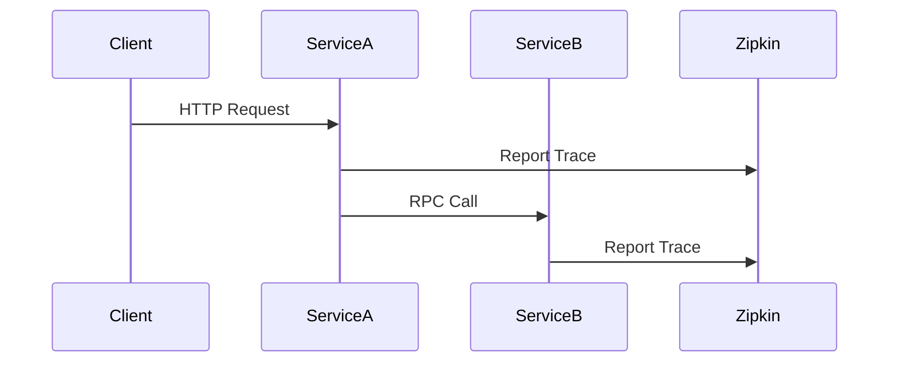

## 介绍

Zipkin是一个开源的**分布式追踪系统**，用于帮助开发者监控微服务架构中的请求链路。通过Kubernetes部署Zipkin，可以快速实现高可用、可扩展的追踪服务。本章将指导初学者完成从零开始的完整部署流程。

---

## 前置条件

在开始之前，请确保：
1. 已安装 `kubectl` 并配置访问Kubernetes集群的权限
2. 集群中有可用的存储类（StorageClass）
3. 安装了Helm（可选，用于简化部署）

:::tip
使用 `kubectl cluster-info` 验证集群连接状态。
:::

---

## 部署方案选择

### 方案1：使用原生YAML部署
```yaml
# zipkin-deployment.yaml
apiVersion: apps/v1
kind: Deployment
metadata:
  name: zipkin
spec:
  replicas: 2
  selector:
    matchLabels:
      app: zipkin
  template:
    metadata:
      labels:
        app: zipkin
    spec:
      containers:
      - name: zipkin
        image: openzipkin/zipkin
        ports:
        - containerPort: 9411
        env:
        - name: STORAGE_TYPE
          value: "mem" # 内存存储（测试用）
```

应用配置：
```bash
kubectl apply -f zipkin-deployment.yaml
```

### 方案2：使用Helm Chart（推荐生产环境）
```bash
helm repo add openzipkin https://openzipkin.github.io/zipkin
helm install zipkin openzipkin/zipkin \
  --set storage.type=elasticsearch \
  --set persistence.enabled=true
```

:::caution
生产环境务必使用持久化存储（如Elasticsearch），避免数据丢失。
:::

---

## 配置详解

### 存储后端配置
通过环境变量指定存储类型：
```yaml
env:
- name: STORAGE_TYPE
  value: "elasticsearch"
- name: ES_HOSTS
  value: "http://elasticsearch:9200"
```

支持的后端类型：
- `mem`：内存（仅测试）
- `mysql`：MySQL数据库
- `elasticsearch`：生产推荐

### 服务暴露
创建NodePort服务：
```yaml
# zipkin-service.yaml
apiVersion: v1
kind: Service
metadata:
  name: zipkin
spec:
  type: NodePort
  ports:
  - port: 9411
    nodePort: 30411
  selector:
    app: zipkin
```

---

## 验证部署

1. 检查Pod状态：
```bash
kubectl get pods -l app=zipkin
```
预期输出：
```
NAME                     READY   STATUS    RESTARTS   AGE
zipkin-7c6f8c6d9-2xg4l   1/1     Running   0          3m
```

2. 访问Web UI：
```bash
kubectl port-forward svc/zipkin 9411:9411
```
浏览器打开 `http://localhost:9411`

---

## 实际应用案例

### 微服务追踪配置
在应用容器中添加Zipkin上报地址：
```yaml
env:
- name: SPRING_ZIPKIN_BASEURL
  value: "http://zipkin:9411"
```



---

## 总结

通过本指南你学会了：
- 两种Kubernetes部署Zipkin的方式
- 不同存储后端的配置差异
- 如何验证部署结果
- 实际微服务集成方法

---

## 扩展练习
1. 尝试将存储后端切换为MySQL并验证数据持久化
2. 配置Ingress实现通过域名访问Zipkin UI
3. 集成Spring Boot应用并查看完整追踪链路

参考资源：
- [官方部署文档](https://zipkin.io/pages/quickstart.html)
- [Kubernetes存储配置指南](https://kubernetes.io/docs/concepts/storage/)