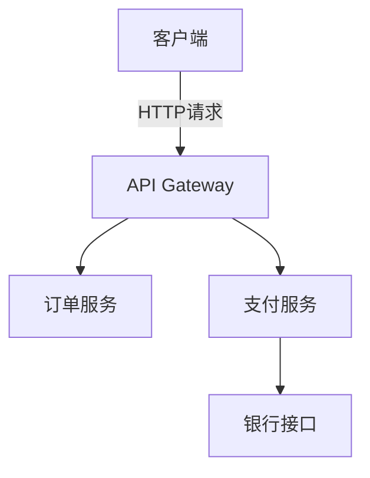

## 简介

Zipkin是一个分布式追踪系统，用于收集和可视化微服务架构中的请求链路数据。正确配置Zipkin的参数是确保其高效运行的关键。本章将详细介绍Zipkin的核心配置选项，包括存储后端、采样率、端口设置等，并通过实际案例演示如何针对不同场景进行调优。

## 基础配置参数

### 1. 存储后端配置
Zipkin支持多种存储后端，通过`STORAGE_TYPE`参数指定：

```bash
# 使用内存存储（仅适用于测试环境）
STORAGE_TYPE=mem

# 使用MySQL存储
STORAGE_TYPE=mysql
MYSQL_HOST=localhost
MYSQL_USER=zipkin
MYSQL_PASS=zipkin

# 使用Elasticsearch存储
STORAGE_TYPE=elasticsearch
ES_HOSTS=http://localhost:9200
```

:::note
生产环境推荐使用Elasticsearch或Cassandra作为存储后端，内存存储重启后数据会丢失
:::

### 2. 网络端口配置
默认情况下Zipkin运行在9411端口，可通过以下参数修改：

```bash
# 修改HTTP端口
SERVER_PORT=9412

# 修改管理端口（健康检查等）
MANAGEMENT_PORT=9901
```

### 3. 采样率配置
控制收集追踪数据的比例，平衡系统开销和数据完整性：

```properties
# 采样率配置（1.0表示100%采样）
ZIPKIN_SAMPLER_RATE=0.5
```

## 高级配置参数

### 1. 消息队列集成
当使用Kafka传输追踪数据时：

```bash
# 启用Kafka传输
KAFKA_BOOTSTRAP_SERVERS=localhost:9092
KAFKA_TOPIC=zipkin
```

### 2. 数据保留策略
对于基于时间的存储后端：

```bash
# Elasticsearch数据保留天数（默认7天）
ES_INDEX_TTL=30
```

### 3. 服务发现配置
在云原生环境中：

```yaml
# 使用Eureka服务发现
EUREKA_SERVICE_URL=http://eureka:8761/eureka/
```

## 配置示例

### 开发环境配置
```bash
STORAGE_TYPE=mem
SERVER_PORT=9411
ZIPKIN_SAMPLER_RATE=1.0
```

### 生产环境配置
```bash
STORAGE_TYPE=elasticsearch
ES_HOSTS=http://es1:9200,http://es2:9200
ZIPKIN_SAMPLER_RATE=0.1
KAFKA_BOOTSTRAP_SERVERS=kafka:9092
```

## 配置验证

启动Zipkin后，可以通过管理端点检查配置：

```bash
curl http://localhost:9411/actuator/env
```

典型响应会显示所有生效的配置参数：

```json
{
  "activeProfiles": [],
  "propertySources": [
    {
      "name": "server.ports",
      "properties": {
        "local.server.port": {
          "value": 9411
        }
      }
    }
  ]
}
```

## 实际案例

### 电商微服务架构配置
某电商平台使用以下配置处理高流量：



对应Zipkin配置：

```bash
STORAGE_TYPE=elasticsearch
ES_HOSTS=es-cluster:9200
ZIPKIN_SAMPLER_RATE=0.05  # 5%采样率处理高流量
KAFKA_BOOTSTRAP_SERVERS=kafka-cluster:9092
```

## 总结

关键配置要点：
- 生产环境务必使用持久化存储（ES/Cassandra）
- 根据流量调整采样率平衡性能和数据价值
- 高可用环境配置多节点存储和消息队列
- 定期检查`/actuator`端点验证配置

## 扩展学习

推荐练习：
1. 尝试在不同采样率下观察追踪数据完整性
2. 比较内存存储和ES存储的性能差异
3. 配置Kafka传输并模拟网络中断场景

官方资源：
- [Zipkin配置文档](https://zipkin.io/pages/configuration.html)
- [Spring Cloud Sleuth集成指南](https://spring.io/projects/spring-cloud-sleuth)