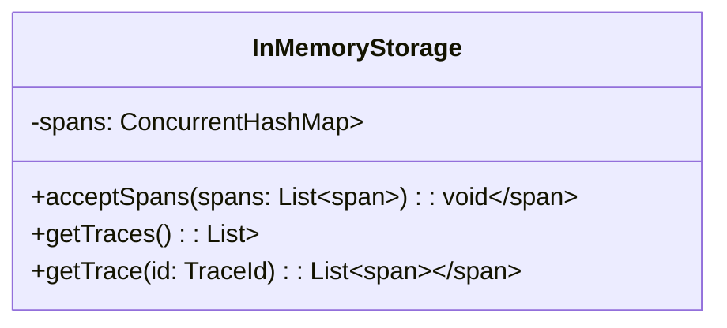

# Zipkin 内存存储设置

## 简介

Zipkin的内存存储（In-Memory Storage）是一种轻量级存储方案，将所有追踪数据保存在应用进程的内存中。它适合**快速原型开发**、**本地测试**或**短期数据分析**场景，但需注意以下特点：

- ⚡ **极速读写**：数据直接存储在内存中，无需磁盘I/O
- ⚠️ **非持久化**：应用重启后数据全部丢失
- 📏 **容量限制**：受JVM堆内存大小制约

:::note 何时选择内存存储？
- 开发环境快速验证功能
- 学习Zipkin基础概念时
- 单次会话的临时分析
:::

## 基础配置

### 1. 通过环境变量启用

启动Zipkin服务时设置存储类型：

```bash
java -jar zipkin-server.jar --STORAGE_TYPE=mem
```

### 2. 使用Docker运行

```bash
docker run -d -p 9411:9411 \
  -e STORAGE_TYPE=mem \
  openzipkin/zipkin
```

### 3. Spring Boot集成

在`application.properties`中配置：

```properties
zipkin.storage.type=mem
```

## 内存管理机制

Zipkin内存存储使用ConcurrentHashMap实现，其结构可简化为：



## 实际案例：本地调试配置

假设我们需要在开发环境中测试用户登录流程的追踪：

1. 启动带内存存储的Zipkin：

```bash
java -jar zipkin-server.jar \
  --STORAGE_TYPE=mem \
  --QUERY_PORT=9411
```

2. 在应用中配置上报（以Spring Cloud Sleuth为例）：

```java
// application.yml
spring:
  zipkin:
    base-url: http://localhost:9411
    sender.type: web
  sleuth:
    sampler:
      probability: 1.0 # 100%采样率
```

3. 执行测试流程后，可在Zipkin UI查看实时数据：

```
http://localhost:9411/zipkin/
```

:::warning 生产环境警告
内存存储**绝不**适用于生产环境：
- 数据丢失风险高
- 无法横向扩展
- 长期运行可能导致OOM
:::

## 高级配置选项

### 限制存储量

通过环境变量控制最大存储量（默认无限制）：

```bash
--MEM_MAX_SPANS=100000 # 限制存储10万条Span
```

### 手动清理数据

调用管理接口清空内存：

```bash
curl -X POST http://localhost:9411/zipkin/api/v2/clear
```

## 替代方案对比

| 特性     | 内存存储 | MySQL | Elasticsearch |
|--------|------|-------|---------------|
| 安装复杂度  | ⭐    | ⭐⭐    | ⭐⭐⭐           |
| 查询性能   | ⭐⭐⭐  | ⭐⭐    | ⭐⭐⭐           |
| 数据持久性  | ❌    | ✅     | ✅             |
| 适合生产环境 | ❌    | ⚠️    | ✅             |

## 总结与练习

### 关键点回顾
- 内存存储适合临时性使用场景
- 配置简单但存在数据易失性
- 通过环境变量即可快速启用

### 动手练习
1. 使用Docker启动内存存储模式的Zipkin
2. 配置一个Spring Boot应用上报追踪数据
3. 观察重启Zipkin后数据是否丢失

### 延伸阅读
- [Zipkin官方存储文档](https://zipkin.io/pages/storage.html)