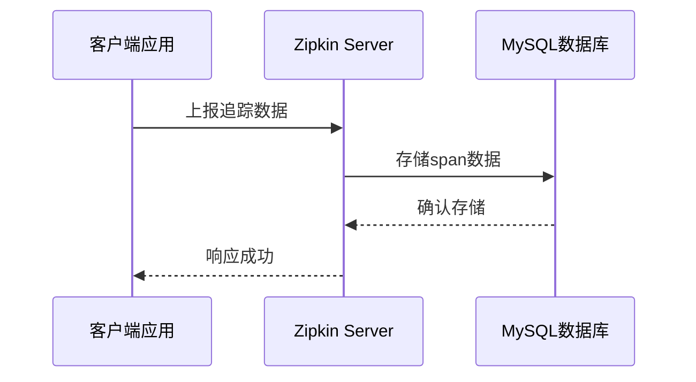

# MySQL存储设置

## 介绍

Zipkin默认使用内存存储追踪数据，这在开发环境中很方便，但生产环境需要持久化存储。MySQL是一个流行的关系型数据库，可以作为Zipkin的后端存储方案。本节将详细介绍如何配置Zipkin使用MySQL存储追踪数据。

:::note
使用MySQL存储前，请确保已安装：
1. Java 8+ 运行时环境
2. MySQL 5.7+ 数据库
3. Zipkin Server
:::

## 数据库准备

首先需要创建Zipkin专用的数据库和用户：

```sql
CREATE DATABASE zipkin;
CREATE USER 'zipkin'@'%' IDENTIFIED BY 'zipkin';
GRANT ALL PRIVILEGES ON zipkin.* TO 'zipkin'@'%';
FLUSH PRIVILEGES;
```

Zipkin的MySQL存储需要以下表结构：

```sql
CREATE TABLE IF NOT EXISTS zipkin_spans (
  `trace_id_high` BIGINT NOT NULL DEFAULT 0 COMMENT 'If non zero, this means the trace uses 128 bit traceIds instead of 64 bit',
  `trace_id` BIGINT NOT NULL,
  `id` BIGINT NOT NULL,
  `name` VARCHAR(255) NOT NULL,
  `remote_service_name` VARCHAR(255),
  `parent_id` BIGINT,
  `debug` BIT(1),
  `start_ts` BIGINT COMMENT 'Span.timestamp(): epoch micros used for endTs query and to implement TTL',
  `duration` BIGINT COMMENT 'Span.duration(): micros used for minDuration and maxDuration query',
  PRIMARY KEY (`trace_id_high`, `trace_id`, `id`)
) ENGINE=InnoDB ROW_FORMAT=COMPRESSED CHARACTER SET=utf8 COLLATE utf8_general_ci;

-- 其他表结构省略，完整SQL请参考Zipkin官方文档
```

## Zipkin 服务端配置

启动Zipkin时，需要通过环境变量或命令行参数指定MySQL存储：

```bash
java -jar zipkin-server.jar \
  --STORAGE_TYPE=mysql \
  --MYSQL_HOST=127.0.0.1 \
  --MYSQL_TCP_PORT=3306 \
  --MYSQL_USER=zipkin \
  --MYSQL_PASS=zipkin \
  --MYSQL_DB=zipkin
```

或者使用环境变量方式：

```bash
export STORAGE_TYPE=mysql
export MYSQL_HOST=127.0.0.1
export MYSQL_TCP_PORT=3306
export MYSQL_USER=zipkin
export MYSQL_PASS=zipkin
export MYSQL_DB=zipkin
java -jar zipkin-server.jar
```

## 客户端配置

在应用程序中，确保Zipkin客户端正确配置了上报地址：

```properties
# Spring Boot示例配置
spring.zipkin.base-url=http://localhost:9411
spring.zipkin.sender.type=web
```

## 数据存储流程



## 实际案例

假设我们有一个电商系统，包含订单服务和支付服务。当用户下单时：

1. 订单服务创建订单并调用支付服务
2. 支付服务处理支付
3. 两个服务都将追踪数据上报到Zipkin
4. Zipkin将数据存储到MySQL

通过MySQL存储，我们可以：
- 长期保存交易追踪数据
- 分析历史性能问题
- 进行跨天/跨月的统计分析

## 性能优化建议

:::tip
对于高流量系统，建议考虑以下优化：
1. 增加MySQL连接池大小：`MYSQL_MAX_CONNECTIONS=10`（默认5）
2. 定期清理旧数据：设置`MYSQL_USE_SSL=false`（如内网环境）
3. 考虑分表策略处理大量数据
:::

## 常见问题排查

1. **连接失败**：检查MySQL服务是否运行，网络是否通畅
   ```bash
   telnet 127.0.0.1 3306
   ```
2. **权限问题**：确认用户有数据库访问权限
3. **表不存在**：确保已执行初始化SQL脚本

## 总结

通过MySQL存储设置，Zipkin可以实现追踪数据的持久化，适合生产环境使用。关键配置包括：
- 数据库初始化
- Zipkin服务端存储类型配置
- 连接参数设置

## 扩展学习

1. [Zipkin官方MySQL存储文档](https://zipkin.io/pages/storage.html#mysql)
2. 尝试配置Zipkin使用其他存储后端（如Elasticsearch）
3. 练习设置数据自动清理策略（TTL）

:::caution
生产环境务必确保MySQL配置了适当的备份策略，避免追踪数据丢失。
:::