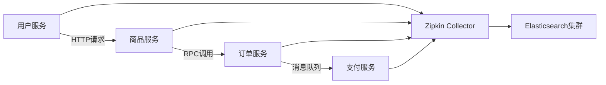

# Elasticsearch存储设置

## 介绍

Zipkin是一个分布式跟踪系统，用于收集、存储和可视化微服务架构中的请求链路数据。默认情况下，Zipkin使用内存存储，但生产环境通常需要更可靠的存储方案。Elasticsearch是一个流行的选择，因为它支持大规模数据存储、高性能检索和灵活的查询能力。

本节将指导你完成以下内容：
1. Elasticsearch的基本概念及其在Zipkin中的作用
2. 如何安装和配置Elasticsearch作为Zipkin的存储后端
3. 实际案例演示

:::note 为什么选择Elasticsearch？
- **可扩展性**：轻松处理海量跟踪数据
- **持久化**：数据不会因服务重启而丢失
- **查询能力**：支持复杂的搜索和聚合操作
:::

## 前置条件

在开始之前，请确保：
- 已安装Java运行环境（JRE/JDK 8+）
- 已安装Docker（可选，用于快速启动Elasticsearch）
- 基本了解Zipkin的架构和工作原理

## 安装Elasticsearch

### 方法1：使用Docker（推荐）

对于初学者，使用Docker是最简单的方式：

```bash
docker run -d --name elasticsearch \
  -p 9200:9200 -p 9300:9300 \
  -e "discovery.type=single-node" \
  docker.elastic.co/elasticsearch/elasticsearch:7.14.0
```

### 方法2：本地安装

1. 从[Elastic官网](https://www.elastic.co/downloads/elasticsearch)下载对应版本的Elasticsearch
2. 解压并运行：
```bash
tar -xzf elasticsearch-7.14.0-linux-x86_64.tar.gz
cd elasticsearch-7.14.0/
./bin/elasticsearch
```

验证安装是否成功：
```bash
curl -X GET "localhost:9200/"
```
预期输出应包含类似信息：
```json
{
  "name" : "your-hostname",
  "cluster_name" : "elasticsearch",
  "version" : {
    "number" : "7.14.0",
    "build_flavor" : "default",
    // 其他版本信息...
  }
}
```

## 配置Zipkin使用Elasticsearch

### 通过环境变量配置

启动Zipkin时设置以下环境变量：

```bash
STORAGE_TYPE=elasticsearch \
ES_HOSTS=http://localhost:9200 \
java -jar zipkin.jar
```

### 常用配置参数

| 参数 | 描述 | 示例值 |
|------|------|--------|
| `STORAGE_TYPE` | 存储类型 | `elasticsearch` |
| `ES_HOSTS` | Elasticsearch节点地址 | `http://host1:9200,http://host2:9200` |
| `ES_INDEX` | 索引名称前缀 | `zipkin` |
| `ES_DATE_SEPARATOR` | 日期分隔符 | `-` (默认) |
| `ES_INDEX_SHARDS` | 分片数量 | `5` |
| `ES_INDEX_REPLICAS` | 副本数量 | `1` |

:::caution 注意
生产环境建议配置多个Elasticsearch节点以提高可用性：
```bash
ES_HOSTS=http://node1:9200,http://node2:9200,http://node3:9200
```
:::

## 实际案例

### 场景：微服务架构的跟踪存储

假设你有一个包含以下服务的电商系统：
1. 用户服务
2. 商品服务
3. 订单服务
4. 支付服务

使用Elasticsearch存储跟踪数据的架构如下：



### 配置示例

完整的启动命令可能如下：
```bash
STORAGE_TYPE=elasticsearch \
ES_HOSTS=http://elastic1:9200,http://elastic2:9200 \
ES_INDEX=zipkin-prod \
ES_INDEX_SHARDS=10 \
ES_INDEX_REPLICAS=2 \
java -jar zipkin.jar
```

## 常见问题解决

1. **连接问题**：
   - 确保Elasticsearch服务已启动
   - 检查防火墙设置
   - 验证`ES_HOSTS`格式正确

2. **性能优化**：
   ```bash
   # 增加HTTP连接超时（默认10秒）
   ES_HTTP_LOGGING=headers
   ES_TIMEOUT=60000
   ```

3. **索引管理**：
   - 查看现有索引：
   ```bash
   curl -X GET "localhost:9200/_cat/indices?v"
   ```
   - 删除旧索引（谨慎操作）：
   ```bash
   curl -X DELETE "localhost:9200/zipkin-*"
   ```

## 总结

通过本指南，你学会了：
- Elasticsearch作为Zipkin存储后端的优势
- 如何安装和配置Elasticsearch
- 实际生产环境中的配置建议
- 常见问题的解决方法

## 扩展学习

1. **进阶主题**：
   - 配置Elasticsearch集群
   - 设置索引生命周期管理(ILM)
   - 安全配置（用户名/密码、TLS）

2. **推荐练习**：
   - 尝试在不同机器上部署Elasticsearch和Zipkin
   - 模拟高负载场景，观察系统表现
   - 实践索引的备份和恢复

3. **官方资源**：
   - [Zipkin Elasticsearch存储文档](https://zipkin.io/zipkin/#storage-component)
   - [Elasticsearch官方指南](https://www.elastic.co/guide/index.html)