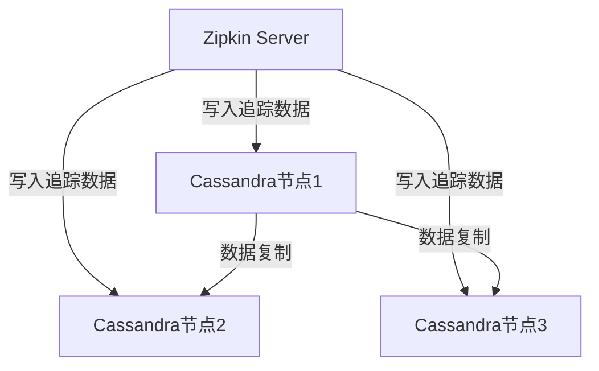

# Cassandra存储设置

## 介绍

Apache Cassandra是一个高性能、分布式的NoSQL数据库，适合存储Zipkin的分布式追踪数据。与内存或传统SQL存储相比，Cassandra提供了更好的水平扩展能力和高可用性。本节将指导你完成Zipkin与Cassandra的集成配置。

:::note 为什么选择Cassandra？
- **分布式架构**：天然支持多节点部署<br />
- **高写入吞吐量**：适合Zipkin的频繁追踪数据写入<br />
- **灵活的模式**：无需预先严格定义表结构
:::

## 前置条件

1. 已安装JDK 8+和Zipkin服务
2. 运行中的Cassandra集群（单机或分布式）
3. Cassandra的CQLSH工具（用于管理操作）

## 配置步骤

### 1. 创建Keyspace和表

使用CQLSH连接到Cassandra后执行以下CQL语句：

```sql
CREATE KEYSPACE IF NOT EXISTS zipkin
WITH replication = {'class': 'SimpleStrategy', 'replication_factor': 1};

USE zipkin;

CREATE TABLE IF NOT EXISTS traces (
    trace_id uuid,
    id uuid,
    timestamp bigint,
    duration bigint,
    name text,
    annotations list<text>,
    binary_annotations list<text>,
    PRIMARY KEY (trace_id, id)
) WITH compaction = {'class': 'TimeWindowCompactionStrategy'};
```

:::caution 生产环境注意
`SimpleStrategy`仅适用于开发环境，生产环境应使用`NetworkTopologyStrategy`并设置适当的`replication_factor`。
:::

### 2. 配置Zipkin使用Cassandra

在Zipkin的启动命令中添加存储参数：

```bash
java -jar zipkin-server.jar \
    --STORAGE_TYPE=cassandra3 \
    --CASSANDRA_KEYSPACE=zipkin \
    --CASSANDRA_CONTACT_POINTS=localhost:9042
```

或通过`application.properties`配置：

```properties
zipkin.storage.type=cassandra3
zipkin.storage.cassandra3.keyspace=zipkin
zipkin.storage.cassandra3.contact-points=localhost:9042
```

### 3. 验证配置

启动Zipkin后，检查日志中是否出现类似信息：

```
2023-01-01 12:00:00.000 INFO  o.s.c.s.CassandraSessionFactory - Connected to Cassandra cluster: Test Cluster
```

## 高级配置选项

| 参数 | 描述 | 默认值 |
|------|------|--------|
| `zipkin.storage.cassandra3.max-connections` | 最大连接数 | 8 |
| `zipkin.storage.cassandra3.local-dc` | 本地数据中心名称 | 第一个接触点DC |
| `zipkin.storage.cassandra3.ssl` | 启用SSL加密 | false |



## 实际案例

**电商平台应用场景**：
- 每天处理100万+追踪数据
- 使用3节点Cassandra集群
- 配置参数示例：

```properties
zipkin.storage.cassandra3.contact-points=cassandra1:9042,cassandra2:9042,cassandra3:9042
zipkin.storage.cassandra3.replication-factor=3
zipkin.storage.cassandra3.local-dc=DC1
```

## 常见问题解决

:::warning 连接问题
若出现`All host(s) tried for query failed`错误：
1. 检查Cassandra服务状态
2. 验证防火墙设置
3. 确认接触点地址和端口正确
:::

## 总结

通过本节学习，你应该已经掌握：
- Cassandra作为Zipkin存储的优势
- 基础Keyspace和表结构创建
- Zipkin服务与Cassandra的集成配置
- 生产环境的最佳实践

## 扩展学习

1. [Cassandra官方文档](https://cassandra.apache.org/doc/latest/)
2. Zipkin存储组件源码分析
3. 尝试配置多数据中心Cassandra集群

**练习任务**：
1. 在Docker中部署Cassandra并完成Zipkin集成
2. 模拟高负载场景测试存储性能
3. 实现数据自动过期策略（TTL）