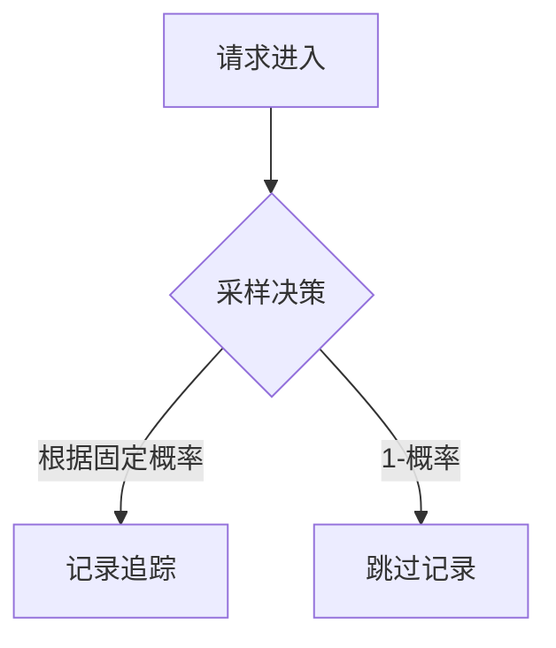

# 采样率配置

## 简介

采样率（Sampling Rate）是分布式追踪系统中的关键配置，它决定了系统收集多少比例的请求追踪数据。在Zipkin中，合理配置采样率可以：
- 减少不必要的性能开销
- 控制存储成本
- 同时仍能保留有代表性的追踪数据

对于高流量系统，100%采样（记录所有请求）会产生大量数据，而低采样率可能导致重要请求未被记录。本文将指导您如何找到平衡点。

## 采样率基础

采样率通常表示为0到1之间的小数：
- `1.0` = 100%采样（记录所有请求）
- `0.1` = 10%采样
- `0.01` = 1%采样

### 采样类型

Zipkin支持多种采样策略：

1. **恒定采样（Constant）**：固定比例的采样率
2. **速率限制采样（Rate Limiting）**：每秒最多采集N个样本
3. **自适应采样**：根据系统负载动态调整

## 配置方法

### 1. 通过环境变量配置

最简单的配置方式是通过环境变量：

```bash
# 设置50%的采样率
export ZIPKIN_SAMPLER_RATE=0.5
```

### 2. 在Java应用中配置

如果您使用Java和Spring Boot，可以在`application.properties`中配置：

```properties
# 设置采样率为30%
spring.zipkin.sampler.rate=0.3
```

或者在代码中配置：

```java
@Bean
public Sampler defaultSampler() {
    return Sampler.create(0.3f); // 30%采样率
}
```

### 3. 在Python应用中配置

使用Python的Zipkin客户端：

```python
from py_zipkin.zipkin import zipkin_span
from py_zipkin.util import generate_random_64bit_string

def do_stuff():
    with zipkin_span(
        service_name='my_service',
        span_name='my_span',
        transport_handler=transport_handler,
        sample_rate=0.2,  # 20%采样率
    ):
        # 业务代码
        pass
```

## 采样策略选择

### 恒定采样（适合大多数场景）



### 速率限制采样（适合流量突增场景）

```java
// 使用RateLimitingSampler，每秒最多10个样本
@Bean
public Sampler rateLimitingSampler() {
    return new RateLimitingSampler(10);
}
```

## 实际案例

### 案例1：电商网站

**场景**：
- 日均PV：1000万
- 重要交易路径：订单创建、支付流程
- 普通浏览路径：商品列表、详情页

**配置方案**：
```yaml
sampling:
  default: 0.01  # 普通请求1%采样
  important_paths:
    "/api/orders": 0.1  # 订单相关10%采样
    "/api/payments": 0.2 # 支付相关20%采样
```

### 案例2：微服务架构

**场景**：
- 服务A调用服务B，服务B调用服务C
- 需要保证完整调用链被采样或全部不采样

**解决方案**：
使用`Trace ID`传播采样决策，确保整个调用链采用一致的采样决策。

## 最佳实践

1. **分级采样**：对不同重要性的接口设置不同采样率
2. **动态调整**：根据系统负载自动调整采样率
3. **全采样调试**：在预发布环境短期使用100%采样发现问题
4. **监控采样效果**：定期检查采样数据是否具有代表性

:::tip 小贴士
生产环境通常从1-10%的采样率开始，然后根据存储容量和需求逐步调整。关键业务路径可以设置更高的采样率。
:::

## 常见问题

### Q: 采样会导致漏掉重要错误吗？
A: 是的，这是采样率的权衡。可以通过以下方式缓解：
- 对错误响应强制采样
- 对关键路径设置更高采样率
- 配合日志系统补充监控

### Q: 如何确定最佳采样率？
A: 考虑以下因素：
1. 系统流量大小
2. 存储容量
3. 监控需求强度
4. 性能影响容忍度

## 总结

采样率配置是Zipkin部署中的关键环节，需要平衡数据完整性和系统开销。通过本文您已经学习了：

- 采样率的基本概念和类型
- 多种配置方法
- 实际应用案例
- 最佳实践和常见问题

## 扩展学习

1. **实践练习**：
   - 在测试环境中尝试不同采样率，观察存储占用变化
   - 配置分级采样，对不同API路径设置不同采样率

2. **进阶主题**：
   - 自适应采样算法
   - 基于属性的采样（如对特定用户、特定错误码的请求提高采样率）
   - 采样决策传播机制

3. **相关工具**：
   - Zipkin的`StorageComponent`接口
   - OpenTelemetry的采样配置