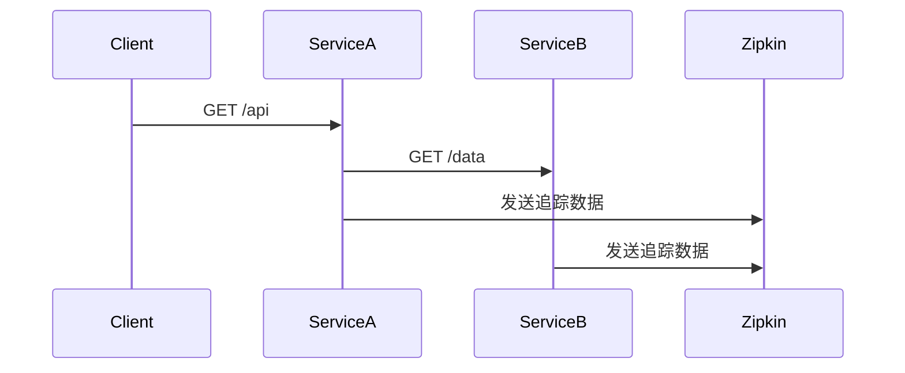

# Java客户端集成

## 介绍

Zipkin是一个开源的分布式追踪系统，用于收集、存储和可视化微服务架构中的请求链路数据。在Java应用中集成Zipkin客户端可以帮助开发者快速定位性能瓶颈和故障点。本节将介绍如何使用Brave库（Zipkin官方推荐的Java客户端）实现基础集成。

:::note
Brave是Zipkin团队维护的Java客户端库，支持Spring Boot、Servlet等常见框架。
:::

## 前置条件

1. JDK 8+ 环境
2. Maven/Gradle构建工具
3. 已部署的Zipkin服务端（或使用[Zipkin Docker镜像](https://zipkin.io/pages/quickstart.html)）

## 基础集成步骤

### 1. 添加依赖

对于Maven项目，在`pom.xml`中添加：

```xml
<dependency>
  <groupId>io.zipkin.brave</groupId>
  <artifactId>brave</artifactId>
  <version>5.16.0</version>
</dependency>
<dependency>
  <groupId>io.zipkin.reporter2</groupId>
  <artifactId>zipkin-sender-okhttp3</artifactId>
  <version>2.16.3</version>
</dependency>
```

### 2. 初始化Tracer

创建配置类初始化Brave的`Tracer`：

```java
import brave.Tracing;
import brave.sampler.Sampler;
import zipkin2.reporter.AsyncReporter;
import zipkin2.reporter.okhttp3.OkHttpSender;

public class TracingConfig {
  public static Tracing initTracing(String serviceName, String zipkinUrl) {
    OkHttpSender sender = OkHttpSender.create(zipkinUrl);
    AsyncReporter<zipkin2.Span> reporter = AsyncReporter.create(sender);
    
    return Tracing.newBuilder()
        .localServiceName(serviceName)
        .spanReporter(reporter)
        .sampler(Sampler.ALWAYS_SAMPLE) // 生产环境应调整采样率
        .build();
  }
}
```

### 3. 创建简单追踪示例

```java
import brave.ScopedSpan;
import brave.Tracer;

public class DemoService {
  private final Tracer tracer;
  
  public DemoService(Tracer tracer) {
    this.tracer = tracer;
  }
  
  public void doWork() {
    ScopedSpan span = tracer.startScopedSpan("doWork");
    try {
      // 业务逻辑...
      Thread.sleep(100);
    } catch (Exception e) {
      span.error(e); // 记录异常
    } finally {
      span.finish();
    }
  }
}
```

## Spring Boot集成

对于Spring Boot应用，可以使用`spring-cloud-starter-zipkin`简化配置：

```xml
<dependency>
  <groupId>org.springframework.cloud</groupId>
  <artifactId>spring-cloud-starter-zipkin</artifactId>
</dependency>
```

在`application.properties`中配置：

```properties
spring.application.name=my-service
spring.zipkin.base-url=http://localhost:9411
```

## 实际案例：HTTP请求追踪

以下示例展示如何追踪HTTP客户端请求：

```java
import brave.http.HttpTracing;
import brave.okhttp3.TracingInterceptor;
import okhttp3.OkHttpClient;
import okhttp3.Request;

public class TracedHttpClient {
  private final OkHttpClient client;
  
  public TracedHttpClient(HttpTracing httpTracing) {
    this.client = new OkHttpClient.Builder()
        .addInterceptor(TracingInterceptor.create(httpTracing))
        .build();
  }
  
  public String fetch(String url) throws IOException {
    Request request = new Request.Builder().url(url).build();
    try (Response response = client.newCall(request).execute()) {
      return response.body().string();
    }
  }
}
```

## 追踪数据可视化

集成后，请求数据会发送到Zipkin服务器。访问Zipkin UI（默认`http://localhost:9411`）可以看到：



## 常见问题解决

:::caution 采样率配置
生产环境不应使用`ALWAYS_SAMPLE`，推荐动态采样：
```java
Sampler.create(0.1f) // 10%的请求会被采样
```
:::

:::warning 性能影响
异步上报默认使用`AsyncReporter`，但大量追踪数据仍可能影响性能，建议：
- 调整批量上报参数
- 使用Kafka等缓冲机制
:::

## 总结

通过本文你学会了：
1. Brave库的基本使用方法
2. Spring Boot的快速集成方案
3. HTTP请求的追踪实现
4. 常见问题的解决方案

## 扩展资源

1. [Brave官方文档](https://github.com/openzipkin/brave)
2. [Spring Cloud Sleuth参考指南](https://spring.io/projects/spring-cloud-sleuth)
3. 练习：尝试在现有Spring Boot项目中集成Zipkin，并追踪一个REST API的完整调用链