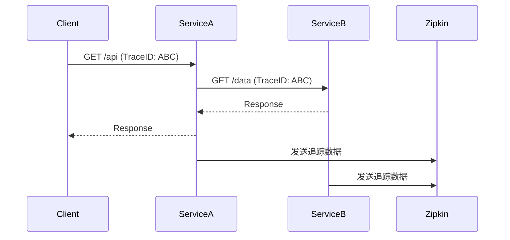

# Spring Boot集成Zipkin客户端

## 介绍

Zipkin是一个开源的分布式追踪系统，用于收集服务架构中的时序数据以解决微服务架构中的延迟问题。在Spring Boot应用中集成Zipkin客户端，可以帮助开发者监控请求在不同微服务之间的流转情况，快速定位性能瓶颈。

:::tip 为什么需要Zipkin？
当你的系统从单体架构转向微服务架构时，一个用户请求可能需要经过多个服务处理。Zipkin能清晰展示请求的完整路径和各环节耗时。
:::

## 前置条件

在开始之前，请确保：
- 已安装JDK 8+
- 使用Spring Boot 2.x+
- 基本了解Spring Boot和Maven/Gradle

## 集成步骤

### 1. 添加依赖

首先需要在`pom.xml`中添加必要的依赖：

```xml
<!-- Spring Cloud Sleuth (自动生成trace ID) -->
<dependency>
    <groupId>org.springframework.cloud</groupId>
    <artifactId>spring-cloud-starter-sleuth</artifactId>
</dependency>

<!-- Zipkin客户端 -->
<dependency>
    <groupId>org.springframework.cloud</groupId>
    <artifactId>spring-cloud-starter-zipkin</artifactId>
</dependency>
```

对于Gradle项目，在`build.gradle`中添加：

```groovy
implementation 'org.springframework.cloud:spring-cloud-starter-sleuth'
implementation 'org.springframework.cloud:spring-cloud-starter-zipkin'
```

### 2. 配置应用

在`application.properties`或`application.yml`中配置Zipkin：

```properties
# 启用Zipkin
spring.zipkin.enabled=true
# Zipkin 服务器地址
spring.zipkin.base-url=http://localhost:9411
# 采样率(1.0表示100%采样)
spring.sleuth.sampler.probability=1.0
```

### 3. 创建示例Controller

创建一个简单的REST端点来测试追踪：

```java
@RestController
public class HelloController {
    
    @GetMapping("/hello")
    public String sayHello() {
        return "Hello from Zipkin!";
    }
    
    @GetMapping("/chain")
    public String chain() {
        // 这里可以调用其他服务
        return "Chain response";
    }
}
```

### 4. 启动Zipkin服务器

你可以通过Docker快速启动一个Zipkin服务器：

```bash
docker run -d -p 9411:9411 openzipkin/zipkin
```

或者下载jar包直接运行：

```bash
java -jar zipkin-server-2.23.2-exec.jar
```

## 工作原理

当集成完成后，系统会自动：

1. 为每个请求生成唯一的Trace ID
2. 为每个服务间的调用生成Span
3. 将追踪数据发送到Zipkin服务器



## 实际案例

假设我们有一个电商系统，包含以下服务：
- 用户服务
- 商品服务
- 订单服务

当用户下订单时，请求会依次经过这些服务。通过Zipkin可以清晰地看到：

1. 用户认证耗时
2. 商品库存检查耗时
3. 订单创建耗时

## 高级配置

### 自定义采样策略

默认情况下，Spring Sleuth会采样所有请求。在生产环境中，你可能需要调整采样率：

```java
@Bean
public Sampler defaultSampler() {
    return Sampler.create(0.5f); // 50%的请求会被采样
}
```

### 添加自定义标签

你可以为Span添加自定义标签：

```java
@GetMapping("/detail/{id}")
public String getDetail(@PathVariable String id) {
    // 获取当前Span
    Span currentSpan = tracer.currentSpan();
    if (currentSpan != null) {
        currentSpan.tag("product.id", id);
    }
    return productService.getDetail(id);
}
```

## 常见问题

:::caution 问题1: 看不到追踪数据？
- 检查Zipkin服务器是否运行
- 确认应用配置中的`spring.zipkin.base-url`正确
- 检查网络连接是否允许应用访问Zipkin服务器
:::

:::caution 问题2: 采样率设置无效？
确保没有其他地方覆盖了采样器的配置，检查是否有多个`Sampler` bean定义。
:::

## 总结

通过本文，你已经学会了：
- 在Spring Boot中添加Zipkin依赖
- 配置基本的Zipkin客户端
- 理解Zipkin的工作原理
- 解决常见集成问题

## 进一步学习

- [Zipkin官方文档](https://zipkin.io/)
- [Spring Cloud Sleuth参考指南](https://spring.io/projects/spring-cloud-sleuth)
- 练习：尝试在多个微服务间设置追踪，观察Zipkin中的依赖图