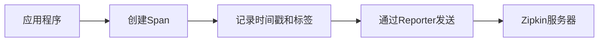

# 自定义客户端开发

## 介绍

Zipkin是一个分布式追踪系统，用于收集和分析微服务架构中的延迟数据。虽然Zipkin提供了多种官方客户端库（如Java、Python等），但在某些场景下，你可能需要开发自定义客户端以满足特定需求。本章将指导你如何从零开始实现一个基础的Zipkin客户端。

:::note
自定义客户端开发适用于需要深度定制追踪逻辑或支持非官方语言的场景。
:::

## 核心概念

在开始开发前，需要理解以下关键概念：

1. **Span**：代表一个独立的工作单元（如HTTP请求）
2. **Trace**：由多个Span组成的调用链
3. **Reporter**：负责将Span数据发送到Zipkin服务器



## 开发步骤

### 1. 设计数据模型

首先定义Span的数据结构，至少包含：

```python
class Span:
    def __init__(self):
        self.trace_id = ""  # 追踪ID
        self.id = ""        # Span ID
        self.name = ""      # 操作名称
        self.timestamp = 0  # 开始时间戳
        self.duration = 0   # 持续时间
        self.tags = {}      # 键值对标签
        self.annotations = []  # 时间点事件
```

### 2. 实现追踪上下文传播

跨服务调用时需要传递追踪上下文，通常通过HTTP头实现：

```python
def inject_headers(span, headers):
    headers["X-B3-TraceId"] = span.trace_id
    headers["X-B3-SpanId"] = span.id
    headers["X-B3-ParentSpanId"] = span.parent_id if hasattr(span, "parent_id") else ""
```

### 3. 创建Reporter接口

实现将Span数据发送到Zipkin服务器的逻辑：

```python
import requests
import json

class HttpReporter:
    def __init__(self, zipkin_url):
        self.url = f"{zipkin_url}/api/v2/spans"
    
    def report(self, span):
        data = self._convert_to_zipkin_format(span)
        requests.post(self.url, json=data)
    
    def _convert_to_zipkin_format(self, span):
        return {
            "traceId": span.trace_id,
            "id": span.id,
            "name": span.name,
            "timestamp": span.timestamp,
            "duration": span.duration,
            "tags": span.tags
        }
```

## 实际案例

假设我们需要追踪一个Python Flask应用的请求处理：

```python
from flask import Flask, request
import time
import uuid

app = Flask(__name__)
reporter = HttpReporter("http://localhost:9411")

@app.before_request
def start_span():
    span = Span()
    span.trace_id = request.headers.get("X-B3-TraceId", str(uuid.uuid4()))
    span.id = str(uuid.uuid4())
    span.name = f"{request.method} {request.path}"
    span.timestamp = int(time.time() * 1000000)
    request.span = span

@app.after_request
def end_span(response):
    span = request.span
    span.duration = int(time.time() * 1000000) - span.timestamp
    span.tags.update({
        "http.status_code": response.status_code,
        "http.method": request.method
    })
    reporter.report(span)
    return response
```

:::tip
在实际应用中，你还需要处理异常情况和添加更多有用的标签（如用户ID、请求参数等）。
:::

## 高级主题

### 采样率控制

为避免生产环境产生过多追踪数据，可以实现采样逻辑：

```python
class Sampler:
    def __init__(self, rate=0.1):
        self.rate = rate
    
    def should_sample(self, trace_id):
        # 使用trace_id哈希决定是否采样
        return hash(trace_id) % 100 < self.rate * 100
```

### 异步上报

为提高性能，可以使用队列和后台线程异步上报：

```python
from threading import Thread
from queue import Queue

class AsyncReporter:
    def __init__(self, delegate):
        self.queue = Queue()
        self.delegate = delegate
        self.worker = Thread(target=self._process_queue)
        self.worker.daemon = True
        self.worker.start()
    
    def report(self, span):
        self.queue.put(span)
    
    def _process_queue(self):
        while True:
            span = self.queue.get()
            self.delegate.report(span)
```

## 总结

开发自定义Zipkin客户端需要理解分布式追踪的基本概念和Zipkin的数据格式。关键步骤包括：

1. 设计Span数据结构
2. 实现上下文传播
3. 创建Reporter上报数据
4. 集成到应用程序中

:::caution
自定义客户端需要处理各种边界情况，建议在非关键业务中先进行充分测试。
:::

## 扩展练习

1. 为你的客户端添加对OpenTelemetry协议的支持
2. 实现一个批量化上报的Reporter以减少网络请求
3. 添加对二进制注解（Binary Annotations）的支持

## 附加资源

- [Zipkin数据模型文档](https://zipkin.io/pages/data_model.html)
- [B3传播协议规范](https://github.com/openzipkin/b3-propagation)
- [Zipkin API参考](https://zipkin.io/zipkin-api/)