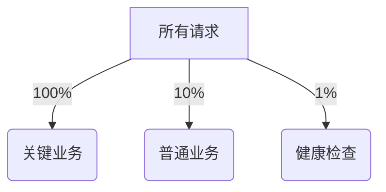

# 客户端采样控制

## 介绍

在分布式追踪系统中，**采样控制**是决定哪些请求需要被记录的关键机制。Zipkin的客户端采样功能允许开发者通过配置采样率（如10%或100%），在系统性能和追踪数据完整性之间取得平衡。对于高流量系统，全量采样可能导致存储压力，而采样率过低可能丢失关键链路信息。

:::tip 为什么需要采样？
- 减少网络和存储开销
- 避免高并发场景下的性能损耗
- 聚焦关键业务路径的追踪
:::

## 基础采样策略

### 1. 概率采样（Probability Sampling）

最简单的采样方式，通过固定比例决定是否记录请求：

```java
// Java示例：使用 Brave 库配置 10% 采样率
Sampler sampler = CountingSampler.create(0.1); // 0.1 = 10%
Tracing.newBuilder()
       .localServiceName("my-service")
       .sampler(sampler)
       .build();
```

**输入/输出示例**：
- 系统收到100次请求 → 约10条追踪数据被记录

### 2. 速率限制采样（Rate Limiting）

控制单位时间内的最大追踪数：

```python
# Python示例：每秒最多采样5个请求
from py_zipkin.sampling import RateLimitingSampler
sampler = RateLimitingSampler(5)  # 5 traces per second
```

## 高级采样配置

### 动态采样

根据请求属性动态决策，例如：
- 对 `/payment` 路径100%采样
- 对 `/healthcheck` 路径0%采样

```java
// Java动态采样示例
Sampler dynamicSampler = request -> {
    if (request.path().contains("/payment")) {
        return true;
    }
    return Math.random() < 0.2; // 其他请求20%采样
};
```

### 分层采样



## 实际案例

**电商场景配置**：
```yaml
# 假设的配置示例（非真实语法）
sampling:
  default: 0.3
  overrides:
    - path: "/checkout/**"
      rate: 1.0
    - path: "/api/inventory"
      rate: 0.8
    - path: "/static/**"
      rate: 0.01
```

:::caution 注意事项
1. 采样率变更需要重启应用
2. 低采样率可能导致链路不完整
3. 生产环境建议从50%开始逐步调整
:::

## 总结

关键要点：
- 采样率需根据业务关键性和系统负载调整
- 混合使用静态和动态采样能达到最佳效果
- 监控采样效果（如丢失的重要错误追踪）

**延伸阅读**：
- [Zipkin官方采样文档](https://zipkin.io/pages/samplers.html)
- 《分布式追踪：原理与实践》第4章

**练习建议**：
1. 在本地环境尝试配置50%和10%采样率，观察控制台输出差异
2. 为登录接口实现100%采样，其他接口5%采样的动态逻辑