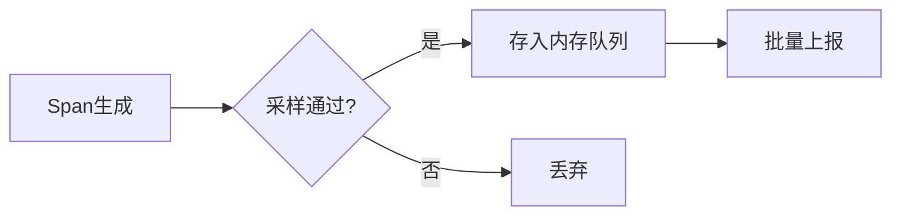

# 客户端配置参数

## 介绍

在分布式系统中，Zipkin客户端负责收集和上报追踪数据（traces）。正确配置客户端参数是确保追踪数据完整性和系统性能的关键。本节将详细介绍常见的Zipkin客户端配置参数及其作用。

:::note 什么是客户端配置参数？
这些参数控制客户端如何采样(sampling)、上报(reporting)和存储(spans)追踪数据，通常通过环境变量、配置文件或代码直接设置。
:::

---

## 核心配置参数

### 1. 服务名称（Service Name）
**作用**：标识当前服务的名称，在Zipkin UI中显示为追踪数据的来源。

```java
// Spring Boot示例（application.properties）
spring.application.name=order-service
```

### 2. 上报地址（Endpoint URL）
**作用**：指定Zipkin服务器接收数据的API地址。

```yaml
# 环境变量方式
ZIPKIN_BASE_URL=http://zipkin-server:9411/api/v2/spans
```

### 3. 采样率（Sampling Rate）
**作用**：控制收集追踪数据的比例（1.0=100%采样）。

```javascript
// Node.js示例
const { Tracer } = require('zipkin');
const tracer = new Tracer({
  ctxImpl: new CLSContext(),
  recorder: new BatchRecorder({
    logger: new HttpLogger({
      endpoint: 'http://zipkin:9411/api/v2/spans'
    })
  }),
  sampler: new CountingSampler(0.5) // 50%采样率
});
```

### 4. 批量上报参数
| 参数 | 说明 | 默认值 |
|------|------|--------|
| `batchSize` | 每批上报的最大span数量 | 100 |
| `timeout` | 批量等待超时（毫秒） | 1000 |

---

## 高级配置

### 1. 本地存储策略


### 2. 自定义Tags
```python
# Python示例
from py_zipkin import zipkin

@zipkin.zipkin_client_span(service_name='payment-service', span_name='process_payment')
def process_payment():
    zipkin.add_sa_binary_annotation('payment.method', 'credit_card')
```

---

## 实际案例

### 电商系统配置示例
```properties
# 订单服务配置
spring.zipkin.base-url=http://zipkin-prod:9411
spring.zipkin.sender.type=web
spring.sleuth.sampler.probability=0.3
management.metrics.web.server.request.autotime.enabled=true
```

:::tip 生产环境建议
- 采样率设置为0.1-0.3以避免性能开销
- 使用HTTP压缩（`spring.zipkin.compression.enabled=true`）
- 为关键服务添加自定义tags
:::

---

## 总结

关键配置要点：
1. 必须设置正确的服务名称和上报地址
2. 采样率需要根据系统负载调整
3. 批量上报参数影响网络开销和数据处理延迟

## 扩展练习
1. 尝试在本地启动Zipkin服务器并配置客户端连接
2. 比较不同采样率对系统性能的影响
3. 为你的服务添加自定义业务tags

## 附加资源
- [Zipkin官方配置文档](https://zipkin.io/pages/configuration.html)
- Spring Cloud Sleuth配置指南