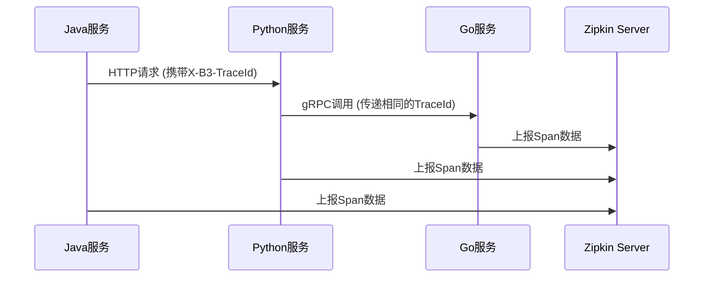

# 多语言环境集成

## 介绍

在分布式系统中，服务可能由不同编程语言编写（如Java、Python、Go等）。Zipkin通过多语言客户端库支持跨服务链路追踪。本章将介绍如何在常见语言环境中集成Zipkin客户端，并确保它们能协同工作。

:::note 核心概念
Zipkin的多语言集成依赖于：
1. **统一协议**：所有客户端通过HTTP或Kafka等协议上报数据到Zipkin Server
2. **标准化数据格式**：遵循[B3 Propagation](https://github.com/openzipkin/b3-propagation)的trace ID传递规范
3. **语言特定库**：各语言有官方/社区维护的SDK
:::

## 基础集成步骤

### 1. Java集成示例

```java
// 添加依赖（Maven）
<dependency>
  <groupId>io.zipkin.brave</groupId>
  <artifactId>brave</artifactId>
  <version>5.13.2</version>
</dependency>

// 初始化Tracer
Tracing tracing = Tracing.newBuilder()
  .localServiceName("order-service")
  .spanReporter(AsyncReporter.create(URLConnectionSender.create("http://zipkin:9411/api/v2/spans")))
  .build();
```

### 2. Python集成示例

```python
# 安装库
pip install py_zipkin

# 配置追踪器
from py_zipkin.zipkin import zipkin_span

@zipkin_span(service_name='payment-service')
def process_payment():
    # 业务逻辑
    pass
```

### 3. Go集成示例

```go
// 引入库
import "github.com/openzipkin/zipkin-go"

// 创建Tracer
reporter := zipkinHTTP.NewReporter("http://zipkin:9411/api/v2/spans")
tracer, _ := zipkin.NewTracer(reporter, zipkin.WithLocalEndpoint(ep))
```

## 跨语言追踪原理



## 实际案例：电商系统

假设一个包含以下服务的系统：
- **订单服务**（Java）：接收用户订单
- **支付服务**（Python）：处理支付逻辑
- **库存服务**（Go）：扣减库存

:::tip 实践建议
1. 确保所有服务使用相同的Zipkin服务器地址
2. 统一采样率配置（如全部设为100%用于调试）
3. 验证B3头部是否在服务间正确传递
:::

## 常见问题排查

1. **Trace中断**：检查网络防火墙是否阻止了跨服务调用或Zipkin上报
2. **时间不同步**：确保所有服务器时间同步（NTP服务）
3. **数据缺失**：检查各客户端的采样率配置

## 总结

多语言集成是Zipkin在微服务架构中的核心价值，关键点包括：
- 遵循B3传播规范传递trace上下文
- 各语言选择成熟的客户端库
- 保持配置一致性（采样率、收集端点等）

## 扩展资源

1. [官方支持的客户端列表](https://zipkin.io/pages/tracers_instrumentation.html)
2. [B3传播规范文档](https://github.com/openzipkin/b3-propagation)
3. 练习：尝试在两种不同语言服务间实现完整的追踪链路