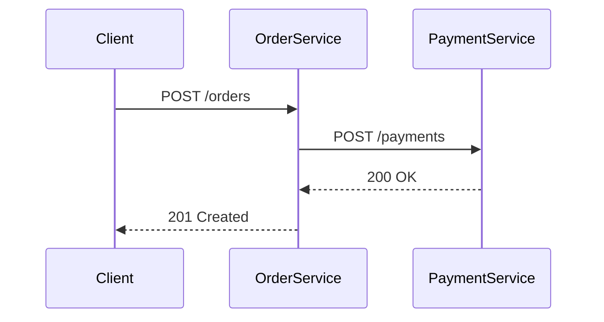

# Spring Cloud Sleuth集成

## 介绍

Spring Cloud Sleuth是Spring Cloud生态系统中的一个组件，用于在分布式系统中实现请求链路追踪。它与Zipkin集成后，可以可视化服务间的调用关系，帮助开发者快速定位延迟或故障问题。本章将介绍如何为Spring Boot应用集成Sleuth并上报数据到Zipkin。

:::note 核心概念
- **Trace ID**：唯一标识一个分布式请求链路的ID。
- **Span ID**：标识链路中的单个操作（如HTTP请求）。
- **Baggage**：跨服务传递的上下文数据。
:::

## 基础配置

### 1. 添加依赖
在`pom.xml`中引入Sleuth和Zipkin客户端依赖：

```xml
<dependency>
    <groupId>org.springframework.cloud</groupId>
    <artifactId>spring-cloud-starter-sleuth</artifactId>
</dependency>
<dependency>
    <groupId>org.springframework.cloud</groupId>
    <artifactId>spring-cloud-sleuth-zipkin</artifactId>
</dependency>
```

### 2. 配置Zipkin地址
在`application.yml`中配置Zipkin服务器地址：

```yaml
spring:
  zipkin:
    base-url: http://localhost:9411  # Zipkin 服务器地址
  sleuth:
    sampler:
      probability: 1.0  # 采样率（1.0表示100%上报）
```

## 代码示例

### 基础HTTP请求追踪
以下是一个简单的Controller示例，Sleuth会自动为请求添加Trace信息：

```java
@RestController
public class DemoController {
    @GetMapping("/hello")
    public String hello() {
        return "Hello from Sleuth!";
    }
}
```

调用该接口时，日志会显示Trace信息：
```
2023-01-01 12:00:00 [app,,] INFO  [app,3df0a8c7b5e6b123,3df0a8c7b5e6b123] ... 
```

### 自定义Span
手动创建Span记录业务操作：

```java
@Autowired
private Tracer tracer;

public void businessOperation() {
    Span span = tracer.nextSpan().name("custom-operation").start();
    try {
        // 业务逻辑...
    } finally {
        span.end();
    }
}
```

## 实际应用场景

### 微服务调用追踪
假设有两个服务：
- `order-service` 调用 `payment-service`

通过Sleuth+Zipkin可以看到完整的调用链：



在Zipkin UI中会显示：
1. 整个请求的Trace时长
2. 每个服务的处理耗时
3. 调用层级关系

## 常见问题

:::warning 采样率注意
生产环境建议将`probability`设置为低于1.0的值（如0.1），避免高流量时对性能造成影响。
:::

## 总结

通过本章学习，你已掌握：
- Sleuth与Zipkin的基本集成方法
- 如何解读Trace和Span信息
- 手动创建Span的技巧
- 实际微服务场景下的追踪分析

## 延伸学习

1. **高级配置**：学习Sleuth的[自定义采样策略](https://docs.spring.io/spring-cloud-sleuth/docs/current/reference/html/)
2. **实战练习**：尝试在本地启动Zipkin服务器并追踪多服务调用链
3. **相关技术**：了解OpenTelemetry与Sleuth的兼容性配置