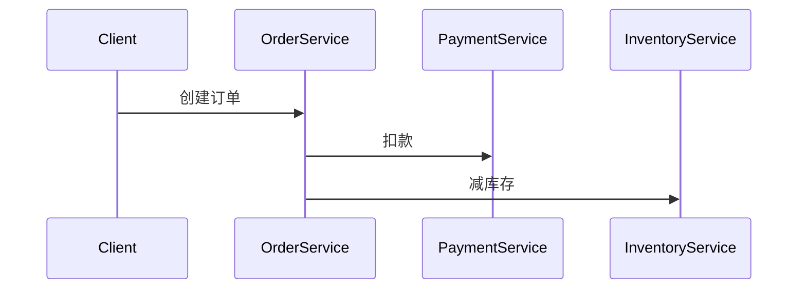

# Python客户端集成

## 介绍

Zipkin是一个开源的分布式追踪系统，用于收集服务架构中的时序数据以排查延迟问题。Python客户端集成允许你将应用中的请求链路数据自动上报到Zipkin服务器，形成可视化的调用链追踪。本节将使用官方推荐的 `py_zipkin` 库进行演示。

:::note 核心概念
- **Span**: 代表一个独立的工作单元（如HTTP请求）
- **Trace**: 由多个Span组成的调用链
- **Transport**: 数据上报到Zipkin的方式（HTTP/Kafka等）
:::

## 环境准备

首先安装必要依赖：
```bash
pip install py_zipkin flask
```

## 基础集成示例

### 1. 初始化Zipkin客户端
```python
from py_zipkin.zipkin import zipkin_span
import requests

def do_some_work():
    with zipkin_span(
        service_name='my_python_service',
        span_name='custom_work',
        transport_handler=transport_handler,
        sample_rate=100.0,  # 100%采样
    ):
        # 你的业务代码
        res = requests.get('https://example.com')
        return res.text

def transport_handler(encoded_span):
    # 上报数据到Zipkin服务器
    requests.post(
        'http://localhost:9411/api/v2/spans',
        data=encoded_span,
        headers={'Content-Type': 'application/json'},
    )
```

### 2. Flask应用集成
```python
from flask import Flask
from py_zipkin.flask import zipkin_span

app = Flask(__name__)

@app.route('/')
@zipkin_span(service_name='webapp', span_name='index')
def hello():
    return "Hello with tracing!"

app.run(port=5000)
```

## 关键配置参数

| 参数 | 说明 | 示例值 |
|------|------|--------|
| `service_name` | 服务标识 | `'user-service'` |
| `span_name` | 操作名称 | `'db_query'` |
| `sample_rate` | 采样率(0-100) | `50.0` |
| `transport_handler` | 数据上报处理器 | 自定义函数 |

## 实战案例：微服务调用链

假设我们有一个订单处理流程：



对应代码实现：
```python
# order_service.py
@zipkin_span(service_name='order_service')
def create_order():
    with zipkin_span(span_name='call_payment'):
        requests.post('http://payment:5000/pay')
    
    with zipkin_span(span_name='call_inventory'):
        requests.post('http://inventory:5000/decrease')
```

## 高级功能

### 自定义注解
```python
with zipkin_span(...) as span:
    span.add_sa_binary_annotation(
        key='http.url',
        value='https://api.example.com',
    )
    span.add_annotation('process_start')
```

### 异步支持
```python
from py_zipkin.util import generate_random_64bit_string

async def async_task():
    context = ZipkinAttrs(
        trace_id=generate_random_64bit_string(),
        span_id=generate_random_64bit_string(),
        parent_span_id=None,
        flags='0',
        is_sampled=True,
    )
    
    with zipkin_span(...):
        await some_async_operation()
```

## 常见问题排查

:::caution 注意事项
1. 确保Zipkin服务器地址正确
2. 检查采样率是否过低（建议开发时设为100）
3. 跨服务传播需要携带 `X-B3` 头信息
:::

## 总结

通过 `py_zipkin` 库，我们能够：
- 自动生成和传播追踪上下文
- 记录服务间调用的耗时和依赖关系
- 通过Zipkin UI可视化分析性能瓶颈

## 扩展资源

1. [py_zipkin官方文档](https://github.com/Yelp/py_zipkin)
2. [OpenTracing Python实现](https://opentracing.io/guides/python/)
3. 练习：尝试将Zipkin集成到Django应用中