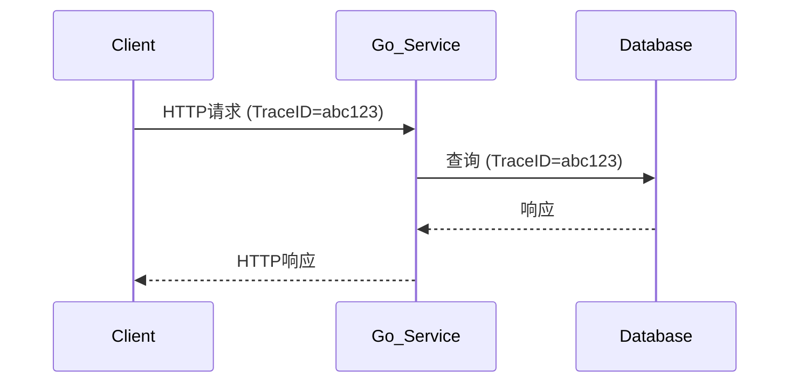

# Go客户端集成

## 介绍

Zipkin是一个开源的分布式追踪系统，用于收集服务架构中的时序数据以解决微服务架构中的延迟问题。Go语言作为高性能后端开发的主流语言之一，通过集成Zipkin客户端可以轻松实现请求链路的追踪和监控。

在本章节中，你将学习：
- Zipkin Go客户端的基本原理
- 如何配置和初始化Zipkin tracer
- 实际代码示例演示
- 常见应用场景分析

## 前置条件

在开始之前，请确保：
1. 已安装Go 1.16+环境
2. 运行中的Zipkin服务（本地或远程）
3. 基础Go语言开发经验

## 基础集成步骤

### 1. 安装依赖包

首先安装官方推荐的Zipkin Go库：

```go
go get github.com/openzipkin/zipkin-go
go get github.com/openzipkin/zipkin-go/reporter/http
```

### 2. 初始化Tracer

以下是基础配置示例：

```go
package main

import (
	"context"
	"net/http"

	"github.com/openzipkin/zipkin-go"
	zipkinhttp "github.com/openzipkin/zipkin-go/reporter/http"
)

func initTracer() *zipkin.Tracer {
	// 创建HTTP reporter（将数据发送到Zipkin服务器）
	reporter := zipkinhttp.NewReporter("http://localhost:9411/api/v2/spans")
	
	// 创建本地端点（标识你的服务）
	localEndpoint, _ := zipkin.NewEndpoint("my-go-service", "localhost:8080")
	
	// 初始化tracer
	tracer, _ := zipkin.NewTracer(
		reporter,
		zipkin.WithLocalEndpoint(localEndpoint),
		zipkin.WithSampler(zipkin.AlwaysSample),
	)
	
	return tracer
}
```

### 3. 创建追踪span

在业务代码中添加追踪逻辑：

```go
func handleRequest(w http.ResponseWriter, r *http.Request) {
	// 从请求中提取或创建新的span
	span := zipkin.SpanFromContext(r.Context())
	if span == nil {
		// 如果没有父span，创建新的trace
		span = tracer.StartSpan("handle_request")
		defer span.Finish()
	} else {
		// 有父span则创建子span
		span = tracer.StartSpan("handle_request", zipkin.Parent(span.Context()))
		defer span.Finish()
	}

	// 添加标签和注解
	span.Tag("http.method", r.Method)
	span.Annotate(time.Now(), "start processing")
	
	// 你的业务逻辑...
}
```

## 实际应用场景

### HTTP服务追踪

完整HTTP服务集成示例：

```go
func main() {
	tracer := initTracer()
	
	// 创建HTTP处理函数
	handler := http.HandlerFunc(func(w http.ResponseWriter, r *http.Request) {
		// 从请求中创建span
		span, ctx := tracer.StartSpanFromContext(r.Context(), "http-request")
		defer span.Finish()
		
		// 将span context传递到下游
		r = r.WithContext(ctx)
		
		// 模拟业务处理
		time.Sleep(50 * time.Millisecond)
		w.Write([]byte("Hello, Zipkin!"))
	})

	// 添加Zipkin中间件
	zipkinMiddleware := middleware.NewServerMiddleware(
		tracer,
		middleware.SpanName("request"),
		middleware.TagResponseSize(true),
	)
	
	http.ListenAndServe(":8080", zipkinMiddleware(handler))
}
```

### 数据库调用追踪

```go
func queryDatabase(ctx context.Context, query string) ([]string, error) {
	span, ctx := tracer.StartSpanFromContext(ctx, "db-query")
	defer span.Finish()
	
	span.Tag("db.query", query)
	
	// 模拟数据库调用
	time.Sleep(100 * time.Millisecond)
	
	return []string{"result1", "result2"}, nil
}
```

## 追踪上下文传播

在微服务架构中，需要将追踪上下文传递给下游服务：

```go
func callDownstreamService(ctx context.Context, url string) {
	span, ctx := tracer.StartSpanFromContext(ctx, "call-downstream")
	defer span.Finish()

	req, _ := http.NewRequest("GET", url, nil)
	
	// 将追踪信息注入HTTP头
	_ = zipkinhttp.Inject(ctx, req.Header)
	
	// 执行请求
	client := &http.Client{}
	resp, _ := client.Do(req)
	defer resp.Body.Close()
}
```

## 可视化追踪数据

完成集成后，你可以在Zipkin UI上看到类似这样的追踪关系：



## 最佳实践

:::tip 生产环境建议
1. 调整采样率：开发环境使用`AlwaysSample`，生产环境建议使用`RateLimitedSampler`
2. 添加服务名称和版本标签
3. 监控追踪数据量，避免性能影响
4. 对敏感信息进行过滤
:::

## 常见问题

:::caution 问题排查
1. **数据未显示**：检查Zipkin服务器地址是否正确，网络是否连通
2. **采样率过低**：临时调整为`AlwaysSample`进行测试
3. **性能影响**：减少高频率操作的追踪点
:::

## 总结

通过本章学习，你已经掌握了：
- Zipkin Go客户端的基本集成方法
- 如何在HTTP服务和数据库调用中添加追踪
- 追踪上下文在微服务间的传播方式
- 生产环境的最佳实践

## 扩展学习

1. 尝试集成到你的现有Go项目中
2. 实验不同的采样策略对系统性能的影响
3. 探索Zipkin的依赖关系图功能
4. 结合Prometheus实现指标监控

如需进一步学习，推荐参考：
- [Zipkin官方Go客户端文档](https://github.com/openzipkin/zipkin-go)
- [OpenTelemetry Go SDK](https://opentelemetry.io/docs/instrumentation/go/)
- [分布式追踪模式](https://microservices.io/patterns/observability/distributed-tracing.html)