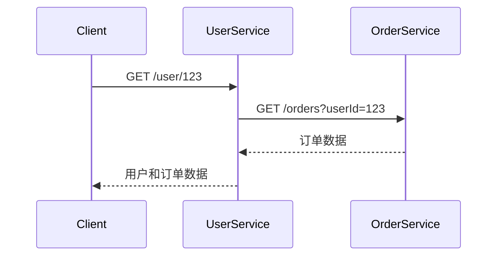

# Node.js客户端集成

## 介绍

Zipkin是一个开源的分布式追踪系统，用于收集和分析微服务架构中的延迟问题。在Node.js应用中集成Zipkin客户端，可以帮助你追踪请求在多个服务间的流转情况，从而更好地理解系统的性能瓶颈。

在本章节中，我们将学习如何在Node.js应用中集成Zipkin客户端，并通过实际示例展示其工作原理。

## 前置条件

在开始之前，请确保你已经具备以下条件：

- 安装了Node.js（建议版本14或更高）
- 一个正在运行的Zipkin服务器（本地或远程）
- 基本的Node.js和npm知识

## 安装Zipkin客户端库

首先，我们需要安装Zipkin相关的Node.js库。打开终端，运行以下命令：

```bash
npm install zipkin zipkin-transport-http zipkin-instrumentation-fetch zipkin-instrumentation-express --save
```

这些库的作用分别是：
- `zipkin`: 核心库
- `zipkin-transport-http`: 通过HTTP协议将追踪数据发送到Zipkin服务器
- `zipkin-instrumentation-fetch`: 对fetch请求进行追踪
- `zipkin-instrumentation-express`: 对Express应用进行追踪

## 基本配置

下面是一个基本的配置示例，展示如何初始化Zipkin追踪器：

```javascript
const { Tracer, BatchRecorder, jsonEncoder: { JSON_V2 } } = require('zipkin');
const { HttpLogger } = require('zipkin-transport-http');

// 创建追踪器
const tracer = new Tracer({
  ctxImpl: new CLSContext('zipkin'), // 上下文实现
  recorder: new BatchRecorder({
    logger: new HttpLogger({
      endpoint: 'http://localhost:9411/api/v2/spans', // Zipkin服务器地址
      jsonEncoder: JSON_V2
    })
  }),
  localServiceName: 'my-node-service' // 服务名称
});
```

## 集成Express应用

对于使用Express框架的应用，可以这样集成Zipkin：

```javascript
const express = require('express');
const { expressMiddleware } = require('zipkin-instrumentation-express');

const app = express();

// 添加Zipkin中间件
app.use(expressMiddleware({ tracer }));

app.get('/', (req, res) => {
  res.send('Hello Zipkin!');
});

app.listen(3000, () => {
  console.log('Server running on port 3000');
});
```

## 追踪HTTP请求

如果你想追踪应用发出的HTTP请求，可以使用`zipkin-instrumentation-fetch`：

```javascript
const wrapFetch = require('zipkin-instrumentation-fetch');
const fetch = wrapFetch(require('node-fetch'), { tracer });

// 发起一个被追踪的请求
async function makeRequest() {
  const response = await fetch('https://example.com/api/data');
  const data = await response.json();
  return data;
}
```

## 实际案例

假设我们有一个简单的微服务架构，包含两个服务：
1. 用户服务（Node.js）
2. 订单服务（Node.js）



在这种场景下，Zipkin可以帮助我们追踪整个请求链，了解每个服务的处理时间。

## 高级配置

### 采样率控制

在生产环境中，你可能不想追踪所有请求，可以通过采样率来控制：

```javascript
const { sampler } = require('zipkin');

const tracer = new Tracer({
  ctxImpl: new CLSContext('zipkin'),
  recorder: new BatchRecorder({
    logger: new HttpLogger({
      endpoint: 'http://localhost:9411/api/v2/spans',
      jsonEncoder: JSON_V2
    })
  }),
  localServiceName: 'my-node-service',
  sampler: new sampler.CountingSampler(0.1) // 10%的采样率
});
```

### 自定义标签

你可以为追踪添加自定义标签：

```javascript
app.get('/user/:id', (req, res) => {
  const { id } = req.params;
  tracer.scoped(() => {
    tracer.recordBinary('user.id', id);
    // 业务逻辑...
  });
  res.send('User data');
});
```

## 常见问题

:::caution 注意
1. **性能影响**：Zipkin追踪会带来一定的性能开销，特别是在高采样率下。
2. **数据安全**：确保Zipkin服务器安全，因为追踪数据可能包含敏感信息。
3. **网络延迟**：如果Zipkin服务器在远程，网络延迟可能影响应用性能。
:::

## 总结

通过本章节的学习，你应该已经掌握了：
- 如何在Node.js应用中安装和配置Zipkin客户端
- 如何集成Zipkin到Express应用
- 如何追踪HTTP请求
- 一些高级配置选项

Zipkin是一个强大的工具，可以帮助你理解分布式系统中的请求流转和性能问题。

## 进一步学习

1. [Zipkin官方文档](https://zipkin.io/)
2. [OpenTelemetry与Zipkin的集成](https://opentelemetry.io/)
3. 尝试在你的项目中实现Zipkin追踪，并分析追踪数据

:::tip 练习
1. 创建一个简单的Express应用，集成Zipkin追踪
2. 模拟两个服务间的调用，并查看Zipkin UI中的追踪结果
3. 尝试调整采样率，观察对性能的影响
:::