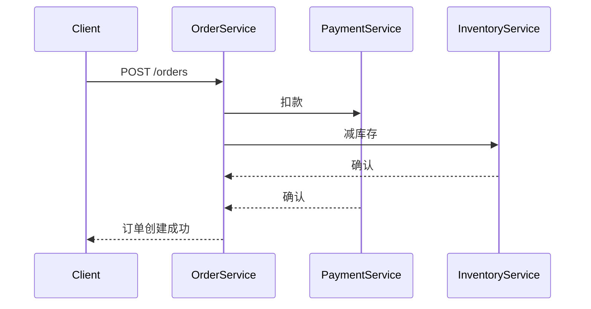

# Ruby客户端集成

## 介绍

Zipkin是一个开源的分布式追踪系统，用于收集服务架构中的时序数据以解决延迟问题。Ruby客户端集成允许你将Zipkin追踪功能添加到Ruby应用程序中，帮助监控请求链路和性能瓶颈。本章将使用`zipkin-ruby`库演示完整的集成流程。

:::note 适用场景
- 微服务架构中的Ruby服务
- 需要分析跨服务调用的延迟问题
- 生产环境性能监控
:::

## 前置条件

1. 已安装Ruby ≥ 2.5
2. 运行中的Zipkin服务器（本地或远程）
3. 基础Ruby开发知识

## 安装与配置

### 1. 添加依赖

在Gemfile中添加以下内容：

```ruby
gem 'zipkin-tracer'
```

然后执行：

```bash
bundle install
```

### 2. 基础配置

在Rails应用的`config/initializers/zipkin.rb`中配置：

```ruby
ZipkinTracer::TraceClient.local_component_endpoint = 'your-service-name'
ZipkinTracer::TraceClient.sample_rate = 1 # 采样率(0.0-1.0)

config = {
  service_name: 'your-service-name',
  json_api_host: 'http://zipkin:9411/api/v2/spans',
  traceable_requests: ->(request) { !request.path.start_with?('/assets') }
}

ZipkinTracer::TraceClient.tracer_config = config
```

:::tip 参数说明
- `sample_rate`: 1表示100%采样
- `traceable_requests`: 可过滤不需要追踪的请求
:::

## 核心功能实现

### 1. 手动创建Span

```ruby
ZipkinTracer::TraceClient.local_component_span('database-query') do |span|
  # 添加标签
  span.record_tag('query.type', 'SELECT')
  span.record_tag('db.instance', 'users')
  
  # 执行数据库操作
  User.where(active: true).count
end
```

### 2. 跨服务追踪

当调用其他服务时，自动传播追踪上下文：

```ruby
require 'faraday'

conn = Faraday.new(url: 'http://inventory-service') do |faraday|
  faraday.use ZipkinTracer::FaradayHandler
  faraday.adapter Faraday.default_adapter
end

response = conn.get('/items')
```

## 实战案例：电商订单流程

假设我们需要追踪"创建订单"的完整流程：



对应代码实现：

```ruby
class OrdersController < ApplicationController
  def create
    ZipkinTracer::TraceClient.local_component_span('create-order') do |span|
      # 处理支付
      payment_service.charge(params[:amount])
      
      # 处理库存
      inventory_service.reduce_stock(params[:product_id])
      
      # 创建订单记录
      Order.create!(order_params)
    end
  end
end
```

## 常见问题排查

:::caution 问题1: 数据未出现在Zipkin UI
- 检查Zipkin服务器地址是否正确
- 确认采样率不为0
- 查看应用日志是否有错误输出
:::

:::warning 问题2: 性能影响
高采样率可能影响性能，生产环境建议：
```ruby
ZipkinTracer::TraceClient.sample_rate = ENV['ZIPKIN_SAMPLE_RATE'] || 0.1
```
:::

## 总结与扩展

### 关键点回顾
1. 通过`zipkin-tracer` gem轻松集成
2. 支持自动和手动Span创建
3. 可配置采样率控制性能影响

### 进阶练习
1. 尝试将追踪数据导出到Kafka而非HTTP
2. 实现自定义的采样逻辑（如只追踪特定用户）
3. 集成Rails的ActiveJob异步任务追踪

### 附加资源
- [zipkin-ruby官方文档](https://github.com/openzipkin/zipkin-ruby)
- [OpenTracing Ruby实现](https://github.com/opentracing/opentracing-ruby)
- [分布式追踪模式](https://microservices.io/patterns/observability/distributed-tracing.html)