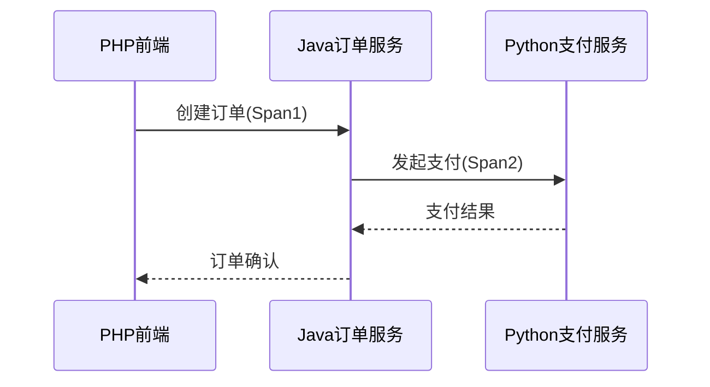

# PHP客户端集成

## 介绍

Zipkin是一个开源的分布式追踪系统，用于收集服务架构中的时序数据以解决延迟问题。PHP客户端集成允许你将PHP应用纳入分布式追踪体系，与其他服务（如Java/Python微服务）形成完整的调用链可视化。

:::note 核心概念
- **Span**：代表一个独立的工作单元（如HTTP请求）
- **Trace**：由多个Span组成的调用链
- **Transport**：将追踪数据发送到Zipkin服务器的方式
:::

## 前置条件

1. 运行中的Zipkin服务器（本地或远程）
2. PHP 7.4+ 环境
3. Composer依赖管理工具

## 安装客户端库

推荐使用官方支持的`openzipkin/zipkin-php`：

```bash
composer require openzipkin/zipkin-php
```

## 基础集成示例

### 1. 初始化Tracer

```php
<?php
require_once 'vendor/autoload.php';

use Zipkin\Endpoint;
use Zipkin\Samplers\BinarySampler;
use Zipkin\TracingBuilder;
use Zipkin\Reporters\Http;

$endpoint = Endpoint::create('php-service', '192.168.1.100', null, 80);
$reporter = new Http(['endpoint_url' => 'http://zipkin:9411/api/v2/spans']);
$sampler = BinarySampler::createAsAlwaysSample();
$tracing = TracingBuilder::create()
    ->havingLocalEndpoint($endpoint)
    ->havingSampler($sampler)
    ->havingReporter($reporter)
    ->build();
```

### 2. 创建简单Span

```php
$tracer = $tracing->getTracer();
$span = $tracer->newTrace();
$span->setName('database-query');
$span->start();

// 模拟数据库操作
usleep(100000); // 100ms延迟

$span->finish();
$tracer->flush();
```

## 高级配置

### HTTP请求追踪

集成Guzzle HTTP客户端示例：

```php
use GuzzleHttp\Client;
use Zipkin\Instrumentation\Http\Client\Guzzle\TracingMiddleware;

$client = new Client([
    'handler' => TracingMiddleware::create($tracing)()
]);

// 发起被追踪的请求
$response = $client->get('https://api.example.com/users');
```

### 数据库操作追踪

使用PDO包装器：

```php
use Zipkin\Instrumentation\PDO\TracingPDO;

$pdo = new PDO('mysql:host=localhost;dbname=test', 'user', 'pass');
$tracedPdo = new TracingPDO($pdo, $tracer);

$stmt = $tracedPdo->query('SELECT * FROM users');
$results = $stmt->fetchAll();
```

## 实际应用场景

### 电商订单流程追踪



对应代码实现：

```php
// 订单创建入口
$rootSpan = $tracer->newTrace();
$rootSpan->setName('create_order');
$rootSpan->start();

// 调用订单服务
$orderResponse = $client->post('http://order-service/create', [
    'json' => ['product_id' => 123]
]);

// 记录关键标签
$rootSpan->tag('order_id', json_decode($orderResponse->getBody())->id);
$rootSpan->finish();
$tracer->flush();
```

## 常见问题解决

:::caution 采样率配置
生产环境不应使用`AlwaysSample`，改为比例采样：
```php
use Zipkin\Samplers\PercentageSampler;
$sampler = new PercentageSampler(0.1); // 10%采样率
```
:::

:::warning Span忘记关闭
务必在try-finally中确保span关闭：
```php
try {
    $span->start();
    // 业务逻辑
} finally {
    $span->finish();
}
```
:::

## 总结与扩展

通过PHP客户端集成，你可以：
- 可视化PHP应用在分布式系统中的角色
- 定位跨服务调用的性能瓶颈
- 分析微服务间的依赖关系

**进一步学习：**
1. [Zipkin官方PHP客户端文档](https://github.com/openzipkin/zipkin-php)
2. 尝试集成Laravel/Symfony等框架
3. 探索自定义标签和注解的用法

**练习建议：**
1. 在本地Docker环境搭建Zipkin服务器
2. 创建一个模拟的微服务调用链（PHP->Python->Java）
3. 尝试通过Zipkin UI分析追踪数据