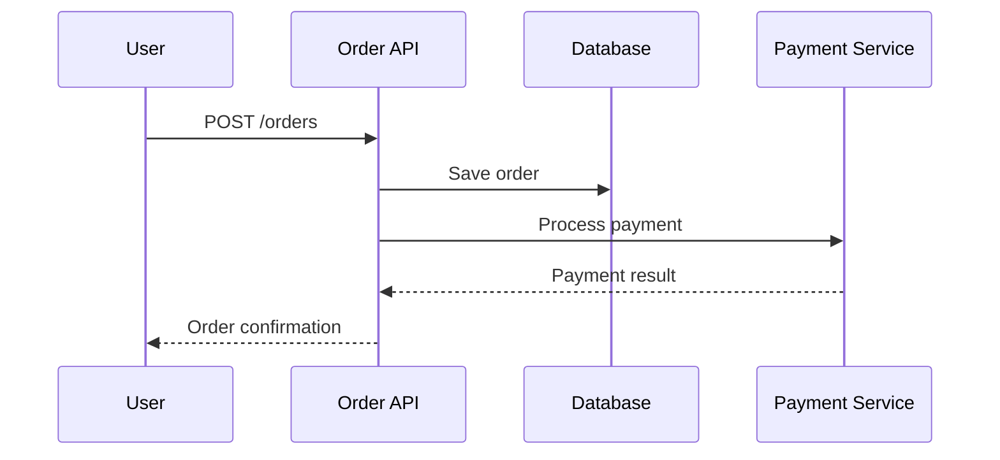

# .NET客户端集成

## 介绍

Zipkin是一个开源的分布式追踪系统，用于收集、存储和可视化微服务架构中的请求链路数据。在.NET生态中，通过集成Zipkin客户端，开发者可以轻松监控应用程序的性能和依赖关系。本章将指导你完成从零开始的集成过程。

## 前置条件

1. 已安装.NET SDK（推荐6.0+）
2. 运行中的Zipkin服务器（本地或远程）
3. 基础C#知识

## 安装依赖

通过NuGet安装官方推荐的客户端库：

```bash
dotnet add package OpenTelemetry.Exporter.Zipkin
dotnet add package OpenTelemetry.Extensions.Hosting
```

## 基础配置

在`Program.cs`中添加以下代码启用Zipkin导出器：

```csharp
using OpenTelemetry.Trace;

var builder = WebApplication.CreateBuilder(args);

builder.Services.AddOpenTelemetryTracing(b =>
{
    b.AddAspNetCoreInstrumentation()
     .AddZipkinExporter(o =>
     {
         o.Endpoint = new Uri("http://localhost:9411/api/v2/spans");
     });
});

var app = builder.Build();
```

:::tip 关键参数说明
- `AddAspNetCoreInstrumentation()`: 自动追踪HTTP请求
- `Endpoint`: Zipkin服务器的收集端点
:::

## 自定义追踪

### 手动创建Span

```csharp
using var tracerProvider = Sdk.CreateTracerProviderBuilder()
    .AddSource("MyApp")
    .AddZipkinExporter()
    .Build();

var activitySource = new ActivitySource("MyApp");

using (var activity = activitySource.StartActivity("CustomOperation"))
{
    // 你的业务逻辑
    activity?.SetTag("user.id", 12345);
}
```

### 追踪数据库操作

```csharp
builder.Services.AddOpenTelemetryTracing(b =>
{
    b.AddAspNetCoreInstrumentation()
     .AddSqlClientInstrumentation() // 监控SQL Server
     .AddZipkinExporter();
});
```

## 实战案例：电商订单系统

假设我们需要追踪订单创建流程：



对应的追踪代码实现：

```csharp
[ApiController]
[Route("orders")]
public class OrderController : ControllerBase
{
    private readonly ActivitySource _activitySource;

    public OrderController()
    {
        _activitySource = new ActivitySource("ECommerce.Orders");
    }

    [HttpPost]
    public async Task<IActionResult> CreateOrder([FromBody] Order order)
    {
        using var activity = _activitySource.StartActivity("CreateOrder");
        
        // 记录业务属性
        activity?.SetTag("order.items.count", order.Items.Count);
        
        // 数据库操作（自动追踪）
        await _repository.SaveAsync(order);
        
        // 支付服务调用
        using var paymentActivity = _activitySource.StartActivity("ProcessPayment");
        var result = await _paymentService.Process(order);
        paymentActivity?.SetTag("payment.amount", order.Total);
        
        return Ok(new { OrderId = order.Id });
    }
}
```

## 查看追踪数据

1. 启动应用程序并发送请求
2. 访问Zipkin UI（通常为`http://localhost:9411`）
3. 在搜索界面可以看到如下追踪信息：

```
Service Name: MyApp
Operation Name: CreateOrder
Duration: 450ms
Tags: { "order.items.count": 3, "http.status_code": 200 }
```

## 高级配置

### 采样率控制

```csharp
builder.Services.AddOpenTelemetryTracing(b =>
{
    b.SetSampler(new AlwaysOnSampler()) // 100%采样
     .AddZipkinExporter();
});
```

### 自定义标签

```csharp
app.Use(async (context, next) =>
{
    var activity = Activity.Current;
    activity?.SetTag("http.user_agent", context.Request.Headers["User-Agent"]);
    await next();
});
```

## 常见问题解决

:::caution 数据未显示？
1. 确认Zipkin服务端地址正确
2. 检查防火墙设置
3. 验证采样率配置
:::

:::warning 性能影响
高频率追踪可能影响性能，建议：
- 生产环境使用概率采样
- 避免在Span中记录大体积数据
:::

## 总结

通过本文你学会了：
- 在.NET中配置Zipkin导出器
- 自动和手动创建追踪Span
- 添加自定义业务标签
- 解决常见集成问题

## 扩展学习

1. 尝试集成其他OpenTelemetry导出器（如Jaeger）
2. 探索Zipkin的依赖关系图功能
3. 在微服务场景中测试跨服务追踪

练习建议：
- 创建一个包含2个服务的迷你系统
- 配置服务间追踪传播
- 分析Zipkin中的完整调用链