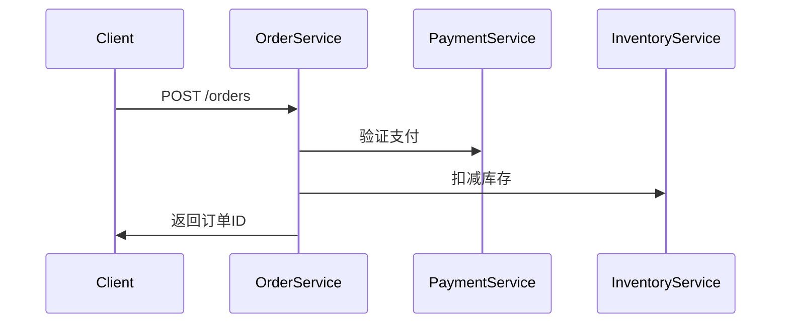

## 介绍

Zipkin是一个开源的分布式追踪系统，用于收集服务架构中的时序数据以解决微服务架构中的延迟问题。在C++应用程序中集成Zipkin客户端，可以帮助开发者监控跨进程/服务的调用链路。本章将详细介绍如何使用流行的`zipkin-cpp-opentracing`库实现集成。

:::note 前置知识
- 基础C++11及以上语法
- CMake构建工具基础
- HTTP协议基础概念
:::

## 环境准备

首先确保系统中已安装：
- C++编译器（g++ ≥ 7 或 clang ≥ 5）
- CMake ≥ 3.10
- [vcpkg](https://vcpkg.io/)（推荐用于依赖管理）

使用vcpkg安装依赖：
```bash
vcpkg install zipkin-cpp-opentracing openssl
```

## 基础集成步骤

### 1. 创建追踪器(Tracer)

```cpp
#include <zipkin/opentracing.h>
#include <memory>

auto tracer_options = zipkin::ZipkinOtTracerOptions{};
tracer_options.service_name = "my_cpp_service";
tracer_options.collector_host = "localhost";
tracer_options.collector_port = 9411;

auto tracer = zipkin::makeZipkinOtTracer(tracer_options);
```

### 2. 创建Span记录操作

```cpp
void processOrder() {
  auto span = tracer->StartSpan("process_order");
  // 添加标签(键值对元数据)
  span->SetTag("order_id", 12345);
  
  // 模拟业务操作
  std::this_thread::sleep_for(std::chrono::milliseconds(100));
  
  span->Finish();
}
```

### 3. 上下文传播示例

```cpp
void parentFunction() {
  auto parent_span = tracer->StartSpan("parent_operation");
  
  // 将上下文注入到子调用
  auto ctx = tracer->Extract({});
  childFunction(tracer->Inject(ctx));
}

void childFunction(opentracing::SpanContext ctx) {
  auto child_span = tracer->StartSpan("child_operation", {opentracing::ChildOf(&ctx)});
  // ...子操作逻辑
  child_span->Finish();
}
```

## 实际应用案例

### 电商订单处理系统



对应的追踪实现：
```cpp
void createOrder(HttpRequest& req) {
  auto span = tracer->StartSpan("http_request");
  span->SetTag("http.method", "POST");
  span->SetTag("http.path", "/orders");

  try {
    verifyPayment(span);
    updateInventory(span);
    span->SetTag("http.status_code", 200);
  } catch (const std::exception& e) {
    span->SetTag("error", true);
    span->SetTag("error.message", e.what());
  }
  
  span->Finish();
}
```

## 高级配置选项

### 采样率控制
```cpp
tracer_options.sample_rate = 0.5; // 50%的请求会被采样
```

### 自定义收集器
```cpp
tracer_options.collector = std::make_shared<MyCustomCollector>();
```

### 日志集成
```cpp
span->Log({{"event", "cache_hit"}, {"key", "user_123"}});
```

## 常见问题解决

:::warning 内存泄漏
确保每个`StartSpan`都有对应的`Finish`调用，建议使用RAII包装器：
```cpp
class SpanGuard {
public:
  SpanGuard(opentracing::Tracer& tracer, const char* name) 
    : span_(tracer->StartSpan(name)) {}
  ~SpanGuard() { span_->Finish(); }
private:
  std::unique_ptr<opentracing::Span> span_;
};
```
:::

## 总结

通过本章学习，你应该已经掌握：
- Zipkin C++客户端的基本集成方法
- Span的创建和上下文传播
- 实际业务场景中的追踪实现
- 常见配置和问题解决方案

## 扩展资源

1. [zipkin-cpp-opentracing官方文档](https://github.com/rnburn/zipkin-cpp-opentracing)
2. [OpenTracing C++ API规范](https://opentracing.io/docs/overview/)
3. 练习：尝试在现有项目中添加对gRPC调用的追踪

:::tip 性能考量
在生产环境中，建议：
- 使用异步上报方式
- 合理设置采样率
- 避免在高频代码路径中创建过多span
:::