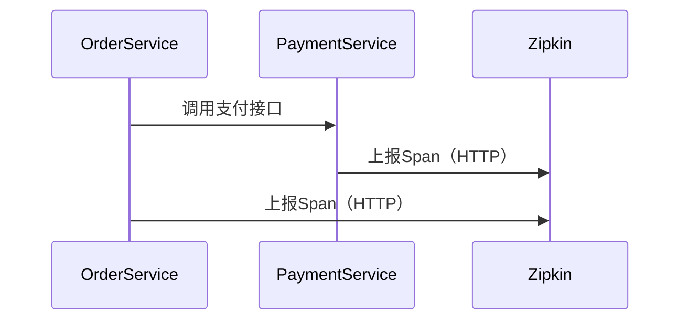

# HTTP收集器配置

## 介绍

Zipkin是一个开源的分布式追踪系统，用于收集、存储和可视化微服务架构中的请求链路数据。HTTP收集器是Zipkin的核心组件之一，它允许应用程序通过HTTP协议将追踪数据（spans）发送到Zipkin服务器。本文将详细介绍如何配置Zipkin的HTTP收集器，包括基本设置、常见参数和实际案例。

:::note
**关键概念**  
- **Span**：表示一个独立的工作单元（如一次API调用）。  
- **Trace**：由多个Span组成的完整请求链路。  
- **Collector**：负责接收和存储Span的Zipkin组件。  
:::

---

## 基础配置

### 1. 启用HTTP收集器
Zipkin默认支持HTTP收集器，通常监听端口`9411`。启动Zipkin服务器时，无需额外配置即可启用HTTP收集器：
```bash
java -jar zipkin-server-{version}-exec.jar
```

### 2. 发送数据到HTTP收集器
应用程序通过HTTP POST请求将JSON格式的Span数据发送到Zipkin的`/api/v2/spans`端点。以下是一个使用`curl`的示例：
```bash
curl -X POST http://localhost:9411/api/v2/spans \
  -H "Content-Type: application/json" \
  -d '[{
    "traceId": "a3d9a9d3e4b5c6d7",
    "id": "b3d9a9d3e4b5c6d7",
    "name": "get-user-data",
    "timestamp": 1620000000000,
    "duration": 10000,
    "localEndpoint": {
      "serviceName": "user-service"
    }
  }]'
```

:::tip
**验证数据是否接收成功**  
访问Zipkin UI（默认`http://localhost:9411`），搜索服务名`user-service`，确认Span已显示。
:::

---

## 高级配置

### 1. 自定义HTTP端口
通过环境变量`QUERY_PORT`和`QUERY_HOST`修改HTTP收集器的监听地址：
```bash
java -jar zipkin-server-{version}-exec.jar \
  --server.port=9412 \
  --QUERY_HOST=0.0.0.0
```

### 2. 数据存储后端
HTTP收集器默认将数据存储在内存中（重启后丢失）。可以通过配置连接到持久化存储（如MySQL或Elasticsearch）：
```bash
java -jar zipkin-server-{version}-exec.jar \
  --STORAGE_TYPE=elasticsearch \
  --ES_HOSTS=http://elasticsearch:9200
```

### 3. 请求限制
通过环境变量限制HTTP请求大小和并发数：
```bash
--COLLECTOR_HTTP_MAX_BYTES=10485760 \  # 最大请求体为10MB
--COLLECTOR_HTTP_MAX_REQUESTS=100      # 最大并发请求数
```

---

## 实际案例

### 场景：微服务链路追踪
假设有两个服务：`order-service`和`payment-service`，通过HTTP收集器上报数据。  
流程如下：



**配置步骤**：  
1. 在`order-service`和`payment-service`中集成Zipkin客户端（如Spring Cloud Sleuth）。  
2. 确保客户端指向Zipkin的HTTP收集器地址：
```yaml
# application.yml（Spring Boot示例）
spring:
  zipkin:
    base-url: http://localhost:9411
    sender:
      type: web
```

---

## 总结

- HTTP收集器是Zipkin接收Span数据的主要方式，默认监听`9411`端口。  
- 支持自定义端口、持久化存储和请求限制。  
- 实际应用中，通常通过客户端库（如Sleuth）自动上报数据。  

**附加练习**  
1. 使用`curl`手动发送一个Span到Zipkin，并在UI中查看。  
2. 尝试配置Zipkin使用MySQL存储数据。  

**进一步学习**  
- [Zipkin官方文档](https://zipkin.io/)  
- Spring Cloud Sleuth的Zipkin集成。