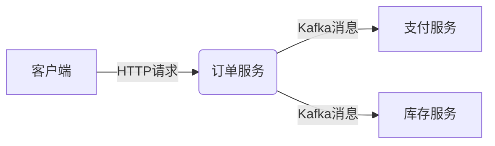

# Kafka收集器配置

## 介绍

在分布式系统中，Zipkin是一个流行的分布式追踪系统，用于收集、存储和可视化微服务架构中的请求链路数据。Kafka作为一个高吞吐量的分布式消息队列，常被用作Zipkin的数据收集中间件，能够有效解决数据丢失和系统解耦问题。

本节将指导你完成Zipkin与Kafka的集成配置，包括基础概念、配置步骤和实际应用示例。

## 前置条件

- 已安装并运行Zipkin Server
- 已部署Kafka集群
- 熟悉基本的Kafka概念（Topic/Producer/Consumer）

## 基础配置

### 1. 添加Kafka依赖

在Zipkin Server的启动配置中，需要添加Kafka收集器依赖。以下是Maven项目的配置示例：

```xml
<dependency>
  <groupId>io.zipkin.zipkin2</groupId>
  <artifactId>zipkin-autoconfigure-collector-kafka</artifactId>
  <version>${zipkin.version}</version>
</dependency>
```

### 2. 配置Kafka连接

在`application.properties`或环境变量中配置Kafka连接信息：

```properties
# Kafka服务器地址
zipkin.collector.kafka.bootstrap-servers=localhost:9092
# Zipkin 将消费的Topic名称（默认zipkin）
zipkin.collector.kafka.topic=zipkin
# 消费者组ID
zipkin.collector.kafka.group-id=zipkin-group
```

:::note
如果使用Docker运行Zipkin，可通过环境变量配置：
```bash
-e KAFKA_BOOTSTRAP_SERVERS=localhost:9092
```
:::

## 高级配置选项

### 消费者并发设置

```properties
# 每个Topic分区的消费者线程数
zipkin.collector.kafka.streams=16
```

### 消息格式配置

Zipkin支持多种消息格式，需与发送方保持一致：

```properties
# 默认是JSON（也支持THRIFT/PROTO3）
zipkin.collector.kafka.encoding=JSON
```

## 实际案例

### 场景：电商系统的订单追踪

假设一个电商系统包含以下服务：
1. 订单服务
2. 支付服务
3. 库存服务



配置步骤：
1. 所有服务将Span数据发送到Kafka的`zipkin` Topic
2. Zipkin Server从同一Topic消费数据
3. 在Zipkin UI中查看完整调用链

## 故障排查

常见问题及解决方案：

| 问题现象 | 可能原因 | 解决方法 |
|---------|---------|---------|
| 数据未显示 | Kafka未连接 | 检查`bootstrap-servers`配置 |
| 数据延迟 | 消费者吞吐不足 | 增加`streams`线程数 |
| 消息解析失败 | 编码格式不匹配 | 统一各服务的编码格式 |

## 总结

通过Kafka收集器配置，Zipkin可以实现：
- 高可靠性的数据传输
- 生产者和消费者的解耦
- 横向扩展能力

## 延伸学习

1. [Kafka官方文档](https://kafka.apache.org/documentation/)
2. 尝试在不同网络分区场景下测试数据收集的可靠性
3. 使用`kafka-topics.sh`工具监控消息流量

:::tip 练习
在本地环境搭建一个Kafka集群，配置Zipkin使用两个不同的Topic分别收集：
- 高频服务（如支付）的追踪数据
- 低频服务（如库存）的追踪数据
:::