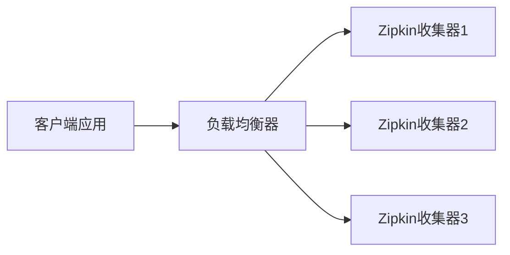
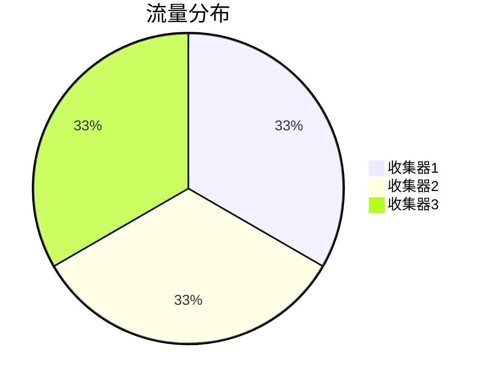

# 收集器负载均衡

## 介绍

在分布式追踪系统中，Zipkin收集器负责接收、处理和存储应用程序发送的追踪数据。随着系统规模扩大，单个收集器可能无法处理高流量，导致性能瓶颈。**负载均衡**通过将请求分散到多个收集器实例，解决以下问题：
- **高并发处理**：避免单点过载。
- **高可用性**：某个收集器故障时，其他实例仍可服务。
- **横向扩展**：动态添加收集器应对流量增长。

:::tip 关键概念
负载均衡器（如Nginx、HAProxy）作为流量分发中心，根据策略（轮询、权重等）将请求路由到多个Zipkin收集器。
:::

## 工作原理

### 基础架构图


### 常见策略
1. **轮询（Round Robin）**：依次分配请求。
2. **最少连接（Least Connections）**：优先选择当前负载最低的实例。
3. **IP哈希（IP Hash）**：同一客户端的请求始终路由到同一实例。

## 配置示例

### 使用Nginx实现负载均衡
以下是一个Nginx配置示例，将流量分发到3个Zipkin收集器（端口9411、9412、9413）：

```nginx
http {
    upstream zipkin_servers {
        server localhost:9411;
        server localhost:9412;
        server localhost:9413;
    }

    server {
        listen 80;
        location / {
            proxy_pass http://zipkin_servers;
        }
    }
}
```

:::note 解释
- `upstream` 定义后端服务器组。
- `proxy_pass` 将请求转发到该组。
:::

### 客户端配置
应用需将Zipkin上报地址指向负载均衡器（而非直接连接收集器）：

```java
// Spring Cloud Sleuth示例
spring.zipkin.base-url=http://your-loadbalancer-ip
```

## 实际案例

### 电商平台的故障排查
某电商平台在促销期间出现追踪数据丢失，诊断发现：
- 单收集器峰值QPS为5000，超出其处理能力（3000 QPS）。
- **解决方案**：部署3个收集器+Nginx轮询负载均衡，总处理能力提升至9000 QPS。



## 总结

- **为什么需要负载均衡**：解决单点性能瓶颈，提高系统可靠性。
- **如何实现**：通过反向代理工具（如Nginx）分发请求。
- **进阶思考**：结合服务发现（如Consul）动态管理收集器实例列表。

## 延伸资源

1. [Nginx负载均衡官方文档](https://nginx.org/en/docs/http/load_balancing.html)
2. [Zipkin部署最佳实践](https://zipkin.io/pages/architecture.html)
3. **练习**：在本地使用Docker部署两个Zipkin实例，并用Nginx配置负载均衡。