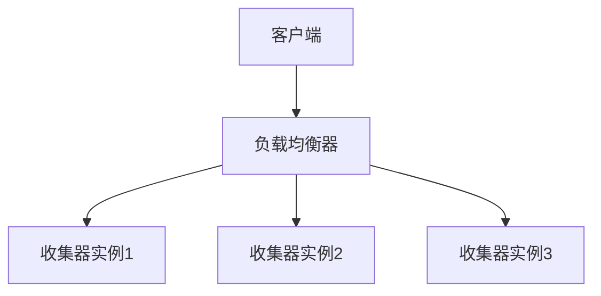
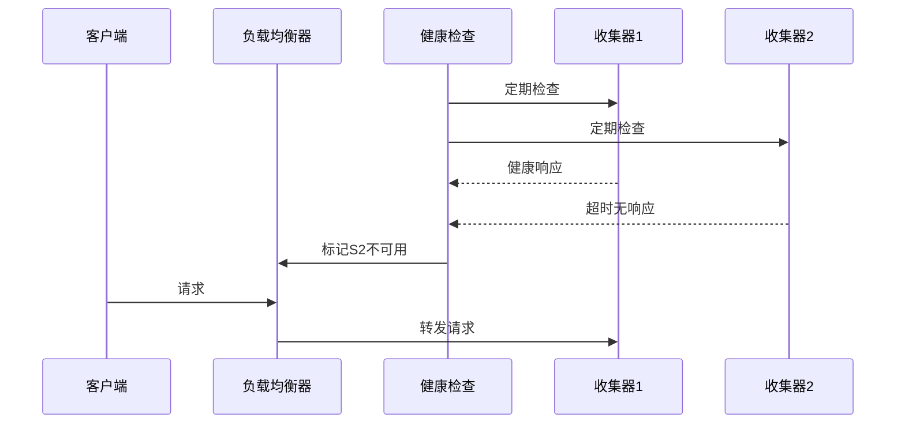

# 收集器高可用性

## 介绍

在分布式系统中，Zipkin收集器负责接收、处理和存储追踪数据。如果收集器出现单点故障，可能导致关键追踪数据丢失。**高可用性（High Availability, HA）**通过冗余设计确保服务持续可用，是生产环境中的必备特性。本节将介绍如何实现Zipkin收集器的高可用性架构。

:::tip 核心目标
- 避免单点故障
- 实现负载均衡
- 保证数据一致性
:::

## 基础架构设计

### 1. 多实例部署
部署多个收集器实例，通常采用以下两种模式：



### 2. 负载均衡配置
使用Nginx或云服务商的LB服务配置轮询策略：

```nginx
http {
    upstream zipkin_collectors {
        server 192.168.1.10:9411;
        server 192.168.1.11:9411;
        server 192.168.1.12:9411;
    }

    server {
        location /api/v2/spans {
            proxy_pass http://zipkin_collectors;
        }
    }
}
```

## 数据存储方案

### 1. 共享存储后端
所有收集器实例应连接相同的存储后端：

| 存储类型      | 配置示例（Spring Boot）                     |
|---------------|---------------------------------------------|
| Elasticsearch | `zipkin.storage.type=elasticsearch`         |
| MySQL         | `zipkin.storage.type=mysql`                 |
| Cassandra     | `zipkin.storage.type=cassandra3`            |

### 2. 消息队列缓冲
使用Kafka作为缓冲队列的配置示例：

```properties
# 收集器配置
zipkin.collector.kafka.bootstrap-servers=broker1:9092,broker2:9092
zipkin.collector.kafka.topic=zipkin
```

## 健康检查与故障转移

### 1. 健康检查端点
Zipkin收集器提供健康检查接口：

```bash
curl -X GET http://localhost:9411/health
# 预期响应：{"status":"UP"}
```

### 2. 自动故障转移策略
结合服务发现工具（如Consul）实现自动故障检测：



## 实际案例：电商平台部署

某电商平台采用以下架构实现高可用：
1. 3个收集器实例跨可用区部署
2. 使用AWS ALB进行流量分配
3. 数据存储采用Elasticsearch集群
4. 通过CloudWatch监控实例健康状态

故障处理流程：
1. 当某个AZ的收集器不可用时
2. ALB自动停止向该实例路由请求
3. SNS通知运维团队
4. 自动伸缩组启动新实例替换故障节点

## 总结与练习

### 关键要点
- 至少部署2个以上收集器实例
- 所有实例共享同一存储后端
- 实现自动化的健康检查和故障转移
- 建议使用消息队列解耦客户端和收集器

### 动手练习
1. 使用Docker Compose部署多实例Zipkin：
```yaml
version: '3'
services:
  zipkin1:
    image: openzipkin/zipkin
    ports: ["9411:9411"]
    environment:
      - STORAGE_TYPE=elasticsearch
      - ES_HOSTS=elasticsearch:9200
  
  zipkin2:
    image: openzipkin/zipkin
    ports: ["9412:9411"]
    environment:
      - STORAGE_TYPE=elasticsearch
      - ES_HOSTS=elasticsearch:9200
```

2. 使用`siege`工具测试负载均衡效果：
```bash
siege -c 50 -t 1M http://localhost/api/v2/spans
```

### 扩展阅读
- [Zipkin官方部署指南](https://zipkin.io/pages/deploy.html)
- [Kafka生产者配置最佳实践](https://kafka.apache.org/documentation/#producerconfigs)
- [AWS高可用架构白皮书](https://aws.amazon.com/architecture/)