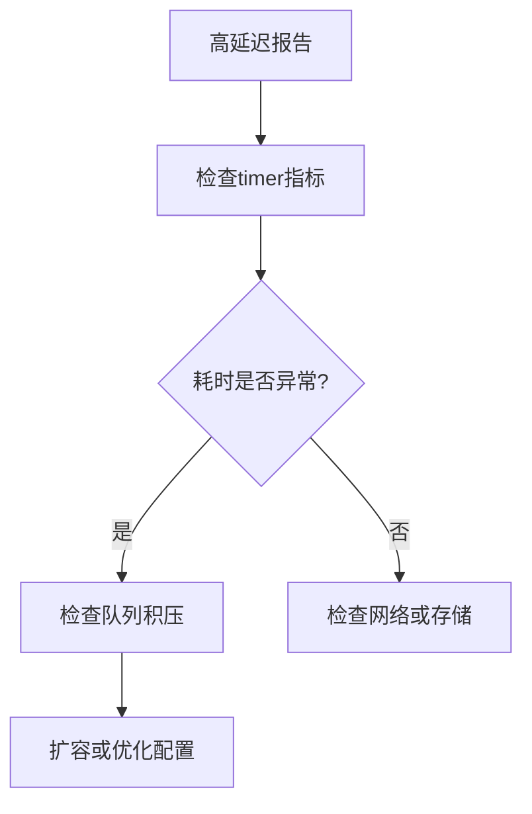

# 收集器监控指标

## 介绍

在Zipkin的分布式追踪系统中，**收集器（Collector）**是接收、处理和存储追踪数据的核心组件。监控收集器的运行指标（Metrics）能帮助开发者快速定位性能瓶颈、发现异常行为，并优化系统稳定性。本章将详细介绍Zipkin收集器的关键监控指标及其实际应用。

---

## 核心监控指标

Zipkin收集器默认通过`/metrics`端点暴露监控数据（需集成Micrometer或Prometheus等监控库）。以下是关键指标分类：

### 1. 吞吐量指标
- **`counter.zipkin_collector.messages`**: 接收到的总消息数（如HTTP请求、Kafka消息）。
- **`counter.zipkin_collector.bytes`**: 接收到的数据总字节数。
- **`counter.zipkin_collector.spans`**: 成功处理的Span数量。

### 2. 错误指标
- **`counter.zipkin_collector.messages_dropped`**: 因队列满或格式错误被丢弃的消息数。
- **`counter.zipkin_collector.spans_dropped`**: 处理失败的Span数量。

### 3. 性能指标
- **`timer.zipkin_collector.message`**: 处理单条消息的平均耗时（单位：毫秒）。
- **`gauge.zipkin_collector.message_queue_size`**: 当前待处理消息队列长度。

---

## 代码示例：指标暴露与查询

### 配置Prometheus监控（Spring Boot示例）
```yaml
# application.yml
management:
  endpoints:
    web:
      exposure:
        include: metrics,prometheus
  metrics:
    export:
      prometheus:
        enabled: true
```

### 查询示例
通过PromQL查询最近5分钟的Span处理速率：
```promql
rate(counter_zipkin_collector_spans_total[5m])
```

---

## 实际案例：诊断高延迟问题

### 场景描述
用户报告Zipkin收集器响应变慢，追踪数据延迟高达10秒。

### 诊断步骤
1. 检查`timer.zipkin_collector.message`指标，发现平均处理时间从50ms飙升到1200ms。
2. 观察`gauge.zipkin_collector.message_queue_size`，发现队列积压超过10,000条消息。
3. 结合`counter.zipkin_collector.messages_dropped`上升，确认系统过载。

### 解决方案
- 横向扩展收集器实例。
- 调整Kafka消费者组的并发度（如果使用Kafka传输）。



---

## 总结

监控Zipkin收集器指标是保障分布式追踪系统健康运行的关键。重点应关注：
- **吞吐量**：确保系统能处理预期负载。
- **错误率**：及时发现数据丢失或格式问题。
- **延迟与队列**：避免处理瓶颈。

:::tip 扩展练习
1. 部署本地Zipkin服务器，启用Prometheus指标并模拟高负载场景。
2. 使用Grafana创建仪表盘，可视化`spans_dropped`与`message_queue_size`的关联性。
:::

**附加资源**：
- [Zipkin官方文档：Collector配置](https://zipkin.io/zipkin/)
- [Micrometer监控指南](https://micrometer.io/docs)