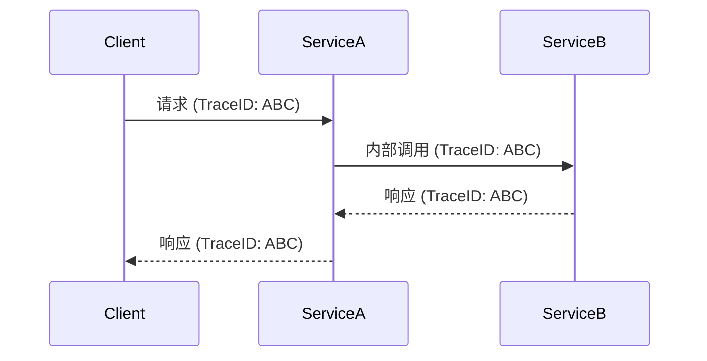

# Zipkin 数据收集最佳实践

## 介绍

Zipkin 是一个开源的分布式追踪系统，用于收集、存储和可视化微服务架构中的请求链路数据。数据收集是 Zipkin 的核心功能之一，它决定了追踪信息的完整性和准确性。本章将介绍 Zipkin 数据收集的最佳实践，包括工具选择、配置优化和常见场景的解决方案。

## 数据收集基础

Zipkin 支持多种数据收集方式，主要包括：

1. **HTTP 上报**：通过 REST API 直接发送追踪数据。
2. **消息队列**：使用 Kafka 或 RabbitMQ 异步传输数据。
3. **代理模式**：通过 Sidecar（如 Envoy）自动收集数据。

### 基础代码示例

以下是一个使用 Zipkin Java 客户端上报数据的示例：

```java
// 初始化 Zipkin 上报器
Sender sender = OkHttpSender.create("http://zipkin-host:9411/api/v2/spans");
Tracing tracing = Tracing.newBuilder()
    .localServiceName("my-service")
    .spanReporter(AsyncReporter.create(sender))
    .build();

// 创建一个追踪 span
Span span = tracing.tracer().nextSpan().name("expensive-operation").start();
try (Scope scope = tracing.tracer().withSpanInScope(span)) {
    // 业务逻辑...
} finally {
    span.finish();
}
```

## 最佳实践

### 1. 采样策略配置

合理的采样策略能平衡系统开销和数据完整性：

```yaml
# Spring Cloud Sleuth 配置示例
spring:
  sleuth:
    sampler:
      probability: 0.1 # 10%的请求会被采样
```

:::tip
生产环境建议：
- 低流量服务：采样率 100%
- 高流量服务：采样率 1-10%
- 可根据服务重要性动态调整
:::

### 2. 数据上报优化

**批量上报**减少网络开销：

```java
// 创建批量上报器（每5秒或100条span批量发送）
AsyncReporter<Span> reporter = AsyncReporter.builder(sender)
    .closeTimeout(5000, TimeUnit.MILLISECONDS)
    .queuedMaxSpans(100)
    .build();
```

### 3. 元数据标准化

统一关键标签命名：

| 标签名          | 说明                  | 示例值            |
|-----------------|---------------------|------------------|
| `http.method`   | HTTP 请求方法         | `GET`, `POST`    |
| `http.path`     | 请求路径              | `/api/users`     |
| `error`         | 错误信息              | `Timeout`        |

### 4. 跨服务上下文传播

确保追踪ID在服务间正确传递：



## 实际案例

### 电商系统追踪

场景：用户下单流程涉及多个服务：

1. 前端发起 `/create-order` 请求
2. 订单服务调用库存服务
3. 库存服务调用支付服务

**异常排查**：当支付超时时，通过 Zipkin 可以快速定位：
- 请求在支付服务停留了 8 秒
- 发现数据库连接池不足的问题

## 总结

Zipkin 数据收集的关键要点：

1. **合理采样**：根据流量调整采样率
2. **高效上报**：使用批量异步上报
3. **标准统一**：规范标签命名和日志格式
4. **完整上下文**：确保跨服务追踪连续性

## 扩展资源

1. [Zipkin 官方文档](https://zipkin.io/)
2. [Brave  instrumentation 指南](https://github.com/openzipkin/brave)
3. 练习：在本地搭建 Zipkin 服务器，配置两个微服务相互调用并观察追踪数据

:::caution
避免在生产环境使用 100% 采样率，这可能导致：
- 存储空间快速耗尽
- 系统性能显著下降
:::