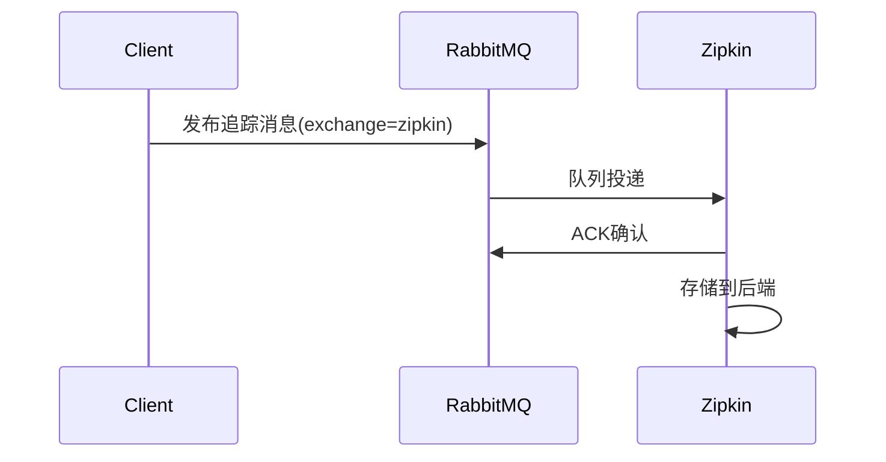

# RabbitMQ收集器配置

## 介绍

RabbitMQ收集器是Zipkin中用于通过消息队列异步接收追踪数据的组件。相比直接HTTP上报，使用RabbitMQ能提供更好的可靠性、削峰能力和解耦特性。当你的系统面临高并发或需要保证数据不丢失时，这是理想的选择。

:::note 为什么选择RabbitMQ？
- **异步处理**：生产者和消费者无需同时在线
- **流量控制**：避免突发流量压垮收集服务
- **重试机制**：消息失败后自动重试
- **分布式友好**：天然适应微服务架构
:::

## 前置条件

在开始前，请确保：
1. 已安装并运行RabbitMQ服务（默认端口5672）
2. Zipkin服务已配置RabbitMQ支持（使用官方提供的`zipkin-server`或自定义部署）
3. 客户端应用已集成Zipkin发送库（如Spring Cloud Sleuth）

## 基础配置

### 服务端配置

启动Zipkin服务时添加RabbitMQ参数：

```bash
java -jar zipkin-server.jar \
  --RABBIT_ADDRESSES=localhost:5672 \
  --RABBIT_USER=guest \
  --RABBIT_PASSWORD=guest \
  --RABBIT_QUEUE=zipkin
```

参数说明：
- `RABBIT_ADDRESSES`: RabbitMQ服务器地址（多个用逗号分隔）
- `RABBIT_USER`/`RABBIT_PASSWORD`: 认证信息
- `RABBIT_QUEUE`: 队列名称（默认为zipkin）
- `RABBIT_VIRTUAL_HOST`: 虚拟主机路径（可选）

### 客户端配置示例（Spring Boot）

在`application.properties`中添加：

```properties
spring.zipkin.sender.type=rabbit
spring.rabbitmq.host=localhost
spring.rabbitmq.port=5672
spring.rabbitmq.username=guest
spring.rabbitmq.password=guest
```

## 高级配置

### 消息持久化

确保消息不因服务重启丢失：

```bash
--RABBIT_QUEUE=zipkin \
--RABBIT_QUEUE_DURABLE=true
```

### 并发消费者

提高消息处理能力：

```bash
--RABBIT_CONCURRENCY=4
```

### 消息编码控制

```bash
--RABBIT_ENCODING=proto # 可选json/proto（默认json）
```

## 消息流转流程



## 故障排查

常见问题及解决方案：

1. **连接拒绝**：
   - 检查RabbitMQ服务状态
   - 验证认证信息
   - 确认网络连通性

2. **消息积压**：
   ```bash
   # 查看队列状态
   rabbitmqctl list_queues name messages_ready messages_unacknowledged
   ```
   - 增加`RABBIT_CONCURRENCY`值
   - 扩展Zipkin实例

3. **编码不匹配**：
   - 确保客户端和服务端使用相同的编码格式（json/proto）

## 实际案例

电商系统使用场景：

1. **订单创建流程**：
   - 前端服务 -> 订单服务 -> 支付服务 -> 库存服务
   - 每个服务通过RabbitMQ异步上报Span

2. **优势体现**：
   - 双十一期间承受百万级QPS
   - 支付服务维护时不影响追踪数据收集
   - 网络抖动时自动重试

## 总结

RabbitMQ收集器为Zipkin提供了可靠的消息传输机制，特别适合：
- 高并发系统
- 对数据丢失敏感的场景
- 需要服务解耦的分布式架构

关键配置要点：
1. 正确设置连接参数
2. 根据业务需求选择持久化选项
3. 合理配置消费者数量

## 扩展学习

推荐练习：
1. 搭建本地RabbitMQ集群测试高可用性
2. 模拟网络中断观察消息重试行为
3. 比较HTTP和RabbitMQ收集器的性能差异

官方资源：
- [Zipkin RabbitMQ Collector文档](https://zipkin.io/pages/collectors.html)
- [RabbitMQ Java客户端指南](https://www.rabbitmq.com/api-guide.html)