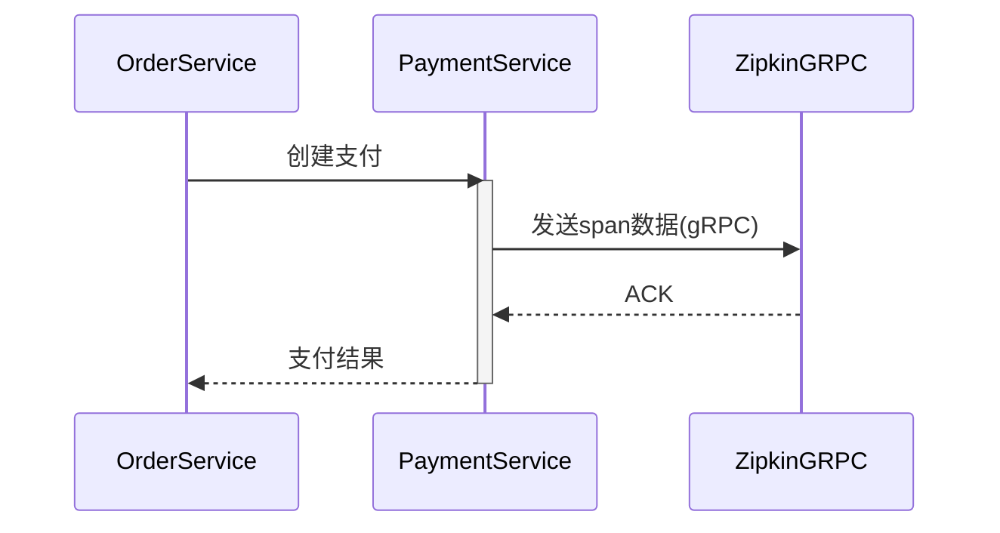

# gRPC收集器配置

## 介绍

Zipkin的gRPC收集器是一种高性能的数据接收组件，允许应用程序通过gRPC协议（而非传统的HTTP）将追踪数据发送到Zipkin服务器。gRPC基于HTTP/2协议，具有低延迟、高吞吐量和流式传输等优势，适合大规模分布式系统。

:::tip 何时选择gRPC收集器？
- 需要处理高频率的追踪数据（如微服务架构）
- 追求更低的网络开销
- 需要双向流式通信
:::

## 基础配置

### 1. 启用gRPC收集器

在Zipkin服务器的配置文件中添加以下参数（以`application.yml`为例）：

```yaml
zipkin:
  collector:
    grpc:
      enabled: true
      port: 9411  # 默认gRPC端口
```

### 2. 客户端配置示例

使用Zipkin的Java客户端发送数据到gRPC收集器：

```java
// 创建gRPC发送器
Sender grpcSender = GrpcSender.newBuilder()
    .endpoint("http://zipkin-server:9411")
    .build();

// 配置追踪系统
Tracing tracing = Tracing.newBuilder()
    .localServiceName("my-service")
    .spanReporter(AsyncReporter.create(grpcSender))
    .build();
```

## 高级配置

### 1. 安全传输（TLS）

启用TLS加密通信：

```yaml
zipkin:
  collector:
    grpc:
      enabled: true
      port: 9411
      tls:
        cert: /path/to/server.crt
        key: /path/to/server.key
```

客户端需要配置信任证书：

```java
Sender grpcSender = GrpcSender.newBuilder()
    .endpoint("https://zipkin-server:9411")
    .trustManager(new File("/path/to/ca.crt"))
    .build();
```

### 2. 性能调优参数

```yaml
zipkin:
  collector:
    grpc:
      maxMessageSize: 4194304  # 4MB最大消息大小
      streamTimeout: 120s      # 流超时时间
      threadCount: 4          # 处理线程数
```

## 实际案例：电商系统追踪

以下是一个电商系统中订单服务的gRPC收集配置流程：



对应的Java客户端配置：

```java
// 订单服务配置
@Bean
public Tracing orderServiceTracing() {
    Sender sender = GrpcSender.newBuilder()
        .endpoint("zipkin:9411")
        .compressionEnabled(true)  // 启用压缩
        .build();

    return Tracing.newBuilder()
        .localServiceName("order-service")
        .spanReporter(AsyncReporter.create(sender))
        .sampler(Sampler.ALWAYS_SAMPLE)
        .build();
}
```

## 常见问题解决

:::caution 连接问题排查
1. **连接拒绝**：确保Zipkin服务器已启用gRPC收集器
   ```bash
   netstat -tuln | grep 9411
   ```
2. **TLS握手失败**：检查客户端和服务端的证书是否匹配
3. **性能瓶颈**：调整`maxMessageSize`和`threadCount`参数
:::

## 总结

gRPC收集器为Zipkin提供了高性能的数据接收方案：
- 比HTTP收集器减少约30%-50%的网络开销
- 支持双向流式通信，适合实时性要求高的场景
- 通过TLS可确保数据传输安全

## 延伸学习

1. [Zipkin官方gRPC文档](https://zipkin.io/zipkin-api/#/default/post_spans)
2. 练习：在本地Docker环境部署支持gRPC的Zipkin服务器
3. 进阶：比较gRPC与HTTP收集器的性能差异