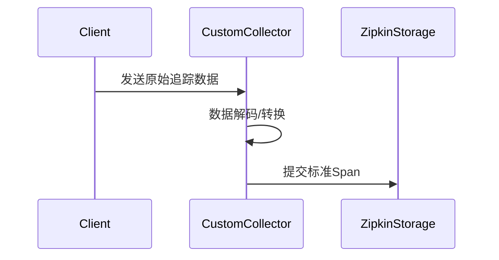

# 自定义收集器开发

## 介绍

在分布式系统中，Zipkin作为流行的追踪工具，默认支持HTTP、gRPC等常见协议的收集器。但当你的技术栈包含自定义协议或特殊数据源时，开发**自定义收集器**（Custom Collector）就成为必要。本章将指导你从零实现一个Zipkin收集器，处理自定义格式的追踪数据。

:::note 为什么需要自定义收集器？
- 默认收集器不支持你的传输协议（如MQTT、WebSocket）
- 需要对接私有化日志格式或二进制协议
- 实现数据过滤/增强等预处理逻辑
:::

## 核心概念

### 1. Zipkin数据模型
自定义收集器需生成Zipkin兼容的Span数据，关键字段包括：

```json
{
  "traceId": "a3d9a9d3f4e7b832",
  "id": "e7b832a3d9a9d3",
  "name": "query-users",
  "timestamp": 1623986140000,
  "duration": 12000,
  "localEndpoint": {
    "serviceName": "user-service"
  }
}
```

### 2. 收集器工作流程


## 开发实战

### 案例：处理Kafka中的追踪日志
假设你的服务通过Kafka发送JSON格式日志，需要转换为Zipkin Span。

#### 步骤1：基础收集器结构
```java
public class KafkaCollector implements Collector {
    private final KafkaConsumer<String, String> consumer;
    private final Sender sender; // Zipkin发送接口

    public void run() {
        while (true) {
            ConsumerRecords<String, String> records = consumer.poll(Duration.ofMillis(100));
            records.forEach(record -> {
                Span span = convertToSpan(record.value());
                sender.sendSpans(Collections.singletonList(span));
            });
        }
    }
}
```

#### 步骤2：数据转换逻辑
```python
def convert_to_kafka_record(log_entry):
    return {
        "traceId": log_entry["correlation_id"],
        "id": log_entry["span_id"],
        "name": log_entry["operation"],
        "timestamp": log_entry["timestamp"] * 1000,
        "localEndpoint": {"serviceName": log_entry["service"]}
    }
```

:::caution 注意事项
- 时间戳需转换为微秒级（Zipkin要求）
- traceId/spanId需符合16或32字符十六进制格式
:::

## 高级功能

### 1. 批量提交优化
```go
func (c *CustomCollector) batchSubmit(spans []model.Span) {
    batch := make([]*zipkin_proto3.Span, 0, batchSize)
    for _, span := range spans {
        if protoSpan := toProtoSpan(span); protoSpan != nil {
            batch = append(batch, protoSpan)
            if len(batch) >= batchSize {
                c.sender.Send(batch)
                batch = batch[:0]
            }
        }
    }
}
```

### 2. 数据采样配置
通过环境变量控制采样率：
```yaml
# application.yaml
collector:
  sampling:
    rate: 0.5 # 50%采样
```

## 测试策略

验证收集器正确性的方法：
1. 单元测试：验证数据转换逻辑
```javascript
test('should convert custom log to span', () => {
    const log = {traceId: 'abc', durationMs: 100};
    const span = converter(log);
    expect(span.duration).toBe(100000); // 微秒验证
});
```

2. 集成测试：启动真实收集器发送测试数据

## 总结

关键要点：
- 自定义收集器本质是**协议适配器** + **数据转换器**
- 必须遵循Zipkin的Span数据模型
- 生产环境需考虑性能优化（批处理/异步IO）

## 延伸学习

推荐练习：
1. 尝试为WebSocket协议实现收集器
2. 添加基于Tag的过滤功能

官方资源：
- [Zipkin数据模型规范](https://zipkin.io/zipkin-api/#/)
- [Brave自定义收集器示例](https://github.com/openzipkin/brave/tree/master/collector)