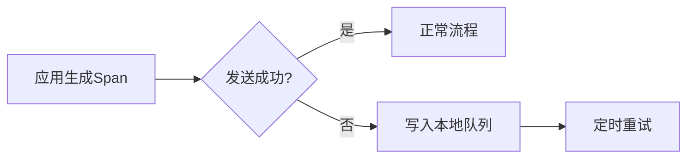

# 数据收集错误处理

在分布式系统中，Zipkin作为链路追踪工具，数据收集的可靠性至关重要。本节将介绍如何优雅地处理数据收集过程中的错误，确保追踪数据的完整性。

## 介绍

Zipkin数据收集错误处理是指在Span数据上报到Zipkin服务器时，因网络问题、服务不可用或数据格式错误等原因导致失败后，系统采取的恢复措施。良好的错误处理机制能避免数据丢失，并为运维提供诊断依据。

## 常见错误类型

1. **网络错误**：连接超时、DNS解析失败
2. **服务端错误**：Zipkin服务返回5xx状态码
3. **数据错误**：非法的Span格式或过大Payload
4. **资源限制**：队列满、内存不足

## 错误处理策略

### 1. 重试机制

对于临时性错误（如网络抖动），应采用指数退避重试策略：

```java
// Brave库示例（Java）
sender = KafkaSender.newBuilder()
    .bootstrapServers("kafka:9092")
    .topic("zipkin")
    .overrides(RetryConfig.MAX_ATTEMPTS_CONFIG, "3") // 最大重试3次
    .build();
```

:::note
重试时需注意：
- 设置合理的重试上限（通常3-5次）
- 对非幂等操作要谨慎
:::

### 2. 本地缓存

当Zipkin服务不可用时，应将数据暂存本地：



### 3. 错误监控

实现健康检查端点监控收集状态：

```python
# Flask示例
@app.route('/health')
def health():
    try:
        # 测试Zipkin连接
        response = requests.get(zipkin_url + '/health')
        return jsonify({"zipkin": response.status_code == 200})
    except Exception as e:
        return jsonify({"error": str(e)}), 503
```

## 实际案例

**电商系统场景**：
- 问题：黑色星期五期间Zipkin服务过载
- 解决方案：
  1. 客户端实现本地环形缓冲区
  2. 采样率动态调整为50%
  3. 监控面板添加错误率告警

```javascript
// Node.js示例
const {BatchRecorder} = require('zipkin');
const {HttpLogger} = require('zipkin-transport-http');

const recorder = new BatchRecorder({
  logger: new HttpLogger({
    endpoint: 'http://zipkin:9411/api/v2/spans',
    httpInterval: 1000,
    httpTimeout: 5000,
    log: console // 错误输出到控制台
  })
});
```

## 总结

关键处理原则：
1. **分级处理**：区分临时错误和永久错误
2. **优雅降级**：在极端情况下保证主流程可用
3. **可观测性**：所有错误必须可监控

## 延伸学习

推荐实践：
- 使用Zipkin的`StorageComponent`测试存储连接
- 在Kubernetes中配置Readiness Probe检查依赖服务
- 通过Prometheus监控`zipkin_collector_spans_received`指标

:::tip 练习
1. 模拟网络断开场景，观察您的应用如何处理Span上报失败
2. 实现一个本地文件缓存方案，在Zipkin不可用时保存Span数据
:::