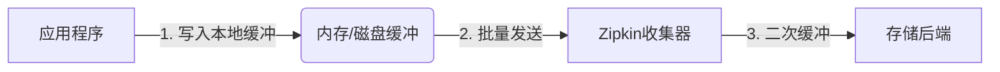

# 数据缓冲管理

## 介绍

在分布式系统中，Zipkin作为一款流行的追踪工具，需要高效地收集和传输大量的追踪数据。数据缓冲管理是确保这些数据可靠传递的关键机制，它通过在数据发送到Zipkin服务器前暂存数据，来应对网络波动或服务不可用的情况。

数据缓冲的核心目标包括：
- **可靠性**：防止数据因瞬时故障丢失
- **性能优化**：减少对应用主线程的影响
- **流量控制**：避免突发流量压垮收集系统

## 基本工作原理

Zipkin的数据缓冲通常发生在两个层面：

1. **客户端缓冲**：追踪数据首先缓存在应用本地
2. **收集器缓冲**：数据到达收集器后的二次缓冲



## 缓冲实现方式

### 1. 内存缓冲

最简单的缓冲形式，使用内存队列存储数据：

```java
// 示例：基于内存队列的缓冲实现
public class InMemoryBuffer {
    private final Queue<Span> queue = new ConcurrentLinkedQueue<>();
    private final int maxSize;
    
    public void addSpan(Span span) {
        if (queue.size() < maxSize) {
            queue.offer(span);
        }
    }
    
    public List<Span> drain() {
        List<Span> batch = new ArrayList<>();
        while (!queue.isEmpty()) {
            batch.add(queue.poll());
        }
        return batch;
    }
}
```

**特点**：
- 优点：实现简单，延迟低
- 缺点：应用重启会导致数据丢失

### 2. 持久化缓冲

更可靠的方案，将数据写入本地存储：

```python
# 示例：基于本地文件的缓冲
class PersistentBuffer:
    def __init__(self, storage_path):
        self.storage_path = Path(storage_path)
        self.storage_path.mkdir(exist_ok=True)
    
    def add_span(self, span):
        timestamp = int(time.time() * 1000)
        filename = f"span_{timestamp}_{uuid.uuid4()}.json"
        with open(self.storage_path / filename, 'w') as f:
            json.dump(span, f)
```

:::note
生产环境中通常会结合两种方式：内存缓冲用于快速处理，持久化缓冲作为后备方案。
:::

## 关键配置参数

在Zipkin客户端中，常见的缓冲相关配置包括：

| 参数 | 说明 | 默认值 |
|------|------|--------|
| `buffer.max_size` | 内存缓冲最大条目数 | 1000 |
| `buffer.timeout` | 缓冲刷新超时(毫秒) | 5000 |
| `batch.size` | 每次发送的批量大小 | 100 |
| `retry.max_attempts` | 失败重试次数 | 3 |

## 实际案例

### 电商系统的订单追踪

假设一个电商系统在促销期间面临高流量：

1. **问题**：直接发送每个追踪数据会导致：
   - 网络带宽吃紧
   - Zipkin收集器过载
   - 应用线程因网络等待变慢

2. **解决方案**：
   - 配置1000条的内存缓冲
   - 每5秒或缓冲满时批量发送
   - 失败时写入本地磁盘，后台重试

```java
// Spring Boot示例配置
@Bean
Sender sender() {
    return URLConnectionSender.newBuilder()
        .endpoint("http://zipkin:9411/api/v2/spans")
        .connectTimeout(5000)
        .writeTimeout(5000)
        .messageMaxBytes(5 * 1024 * 1024) // 5MB
        .build();
}

@Bean
AsyncReporter<Span> reporter() {
    return AsyncReporter.builder(sender())
        .queuedMaxSpans(1000)  // 内存缓冲大小
        .messageTimeout(5000, TimeUnit.MILLISECONDS)
        .build();
}
```

## 故障处理策略

:::warning
缓冲管理必须包含完善的错误处理机制
:::

1. **重试策略**：
   - 指数退避重试
   - 最大重试次数限制

2. **死信队列**：
   - 将彻底失败的数据转移到特殊区域
   - 提供人工干预接口

3. **监控指标**：
   - 缓冲队列长度
   - 发送成功率
   - 平均延迟时间

## 总结

数据缓冲管理是Zipkin数据收集流程中的关键环节，它：

- 平衡了系统可靠性与性能
- 通过批量处理提高网络效率
- 需要根据业务特点调整参数

## 扩展学习

1. **推荐练习**：
   - 在本地环境模拟网络故障，观察缓冲行为
   - 调整缓冲参数，监控系统性能变化

2. **进阶主题**：
   - 背压(Backpressure)处理机制
   - 分布式环境下的缓冲一致性
   - 与消息队列(Kafka/RabbitMQ)的集成方案

3. **相关文档**：
   - Zipkin官方文档中的"Sender"和"Reporter"章节
   - OpenTelemetry的批处理处理器实现