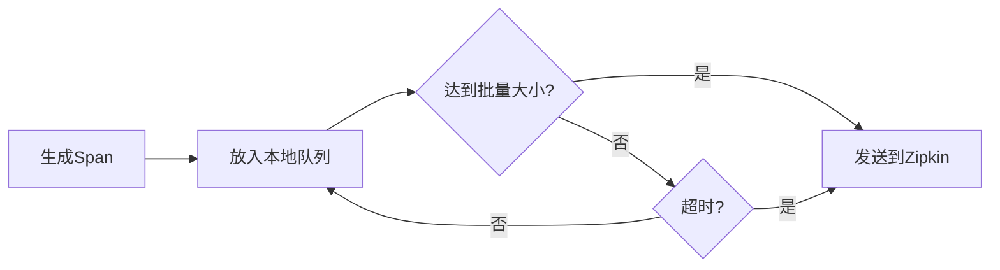

# 批处理策略

## 介绍

批处理（Batching）是Zipkin数据收集中的核心优化策略，它通过将多个跟踪数据（spans）合并为单个请求发送到Zipkin服务器，显著减少网络开销并提升系统吞吐量。对于初学者来说，理解批处理的工作原理和实际应用场景至关重要。

:::tip 为什么需要批处理？
- 减少网络请求次数
- 降低服务器负载
- 提高数据传输效率
- 更适合高流量系统
:::

## 基本工作原理

Zipkin客户端不会立即发送每个生成的span，而是会：

1. 将spans缓存在本地队列中
2. 当满足以下任一条件时触发发送：
   - 队列达到预设的批量大小
   - 超过最大等待时间
3. 将批量数据压缩后发送到Zipkin服务器



## 配置参数

常见的批处理配置参数（以Java为例）：

```java
// 使用Zipkin的OkHttpSender配置批处理
sender = OkHttpSender.newBuilder()
    .endpoint("http://localhost:9411/api/v2/spans")
    .compressionEnabled(true) // 启用压缩
    .connectTimeout(10_000)  // 连接超时10秒
    .writeTimeout(60_000)    // 写入超时60秒
    .messageMaxBytes(5_000_000) // 最大消息字节数
    .build();

// 使用AsyncReporter配置批处理策略
reporter = AsyncReporter.builder(sender)
    .queuedMaxSpans(1000)    // 队列最大span数
    .queuedMaxBytes(5_000_000) // 队列最大字节数
    .messageTimeout(1, TimeUnit.SECONDS) // 超时时间
    .build();
```

## 实际案例

### 电商系统应用

假设一个电商系统在黑色星期五期间面临高流量：

1. **无批处理**：每秒1000个请求 → 1000次Zipkin请求/秒
2. **启用批处理**（每批100个span，超时1秒）：
   - 最佳情况：10次Zipkin请求/秒（立即达到批量）
   - 最差情况：1次Zipkin请求/秒（按超时发送）

```java
// 实际配置示例
@Bean
Sender zipkinSender() {
    return OkHttpSender.create("http://zipkin:9411/api/v2/spans");
}

@Bean
Reporter<Span> zipkinReporter(Sender sender) {
    return AsyncReporter.builder(sender)
        .closeTimeout(500, TimeUnit.MILLISECONDS)
        .messageTimeout(1, TimeUnit.SECONDS)
        .queuedMaxSpans(500)
        .build();
}
```

## 性能调优建议

:::caution 注意事项
- **批量大小**：过大可能导致内存压力，过小则优化效果有限
- **超时时间**：太长会增加数据延迟，太短会降低批处理效果
- **队列容量**：应根据系统内存合理设置
:::

推荐初始配置：
- 批量大小：100-500个spans
- 超时时间：1-5秒
- 队列容量：批量大小的2-3倍

## 总结

批处理策略是Zipkin数据收集的关键优化手段，通过合理配置可以：
- 降低网络请求频率
- 减轻Zipkin服务器压力
- 提高整体系统稳定性
- 保持可接受的延迟水平

## 扩展学习

1. **实践练习**：
   - 尝试在不同批量大小下测试系统性能
   - 监控Zipkin服务器的CPU和内存使用变化

2. **进阶主题**：
   - 背压(Backpressure)处理
   - 自适应批处理策略
   - 与采样(Sampling)策略的配合使用

3. **官方资源**：
   - [Zipkin官方文档](https://zipkin.io/)
   - [Brave库批处理配置](https://github.com/openzipkin/brave)