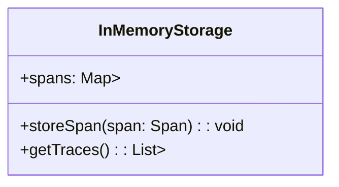

# 内存存储适配器

## 介绍

在 Zipkin 中，**内存存储适配器（In-Memory Storage Adapter）** 是一种轻量级的存储方案，它将追踪数据临时保存在内存中，而不是持久化到数据库或文件系统。这种存储方式非常适合开发和测试环境，因为它不需要额外的依赖（如 MySQL 或 Elasticsearch），并且能够快速启动和运行。

:::note 适用场景
- **开发和测试环境**：快速验证追踪数据。
- **演示和教学**：无需配置外部存储即可展示 Zipkin 功能。
- **短期数据分析**：数据仅保存在内存中，重启后会丢失。
:::

## 工作原理

内存存储适配器通过 Java 的 `ConcurrentHashMap` 或其他内存数据结构存储追踪数据。它的主要特点包括：

1. **临时性**：数据仅在应用程序运行时存在，重启后丢失。
2. **高性能**：内存读写速度快，适合高吞吐量场景。
3. **无外部依赖**：无需安装数据库或文件系统。

### 数据存储结构



- `spans`：以 `Trace ID` 为键，存储属于同一追踪的所有 Span。
- `storeSpan`：将单个 Span 存入内存。
- `getTraces`：返回所有存储的追踪数据。

## 配置内存存储适配器

在 Zipkin 中，可以通过以下方式启用内存存储适配器。

### 通过环境变量配置

```bash
STORAGE_TYPE=mem java -jar zipkin-server.jar
```

### 通过代码配置（Spring Boot）

如果你在 Spring Boot 应用中集成 Zipkin，可以在 `application.properties` 中配置：

```properties
zipkin.storage.type=mem
```

或者通过 `@Bean` 显式定义：

```java
@Bean
public StorageComponent storage() {
    return InMemoryStorage.newBuilder().build();
}
```

## 实际案例

### 场景：本地开发调试

假设你正在开发一个微服务应用，并希望快速验证 Zipkin 的追踪功能。以下是使用内存存储适配器的步骤：

1. **启动 Zipkin 服务器**：
   ```bash
   STORAGE_TYPE=mem java -jar zipkin-server.jar
   ```
2. **发送追踪数据**：
   你的应用通过 HTTP 或 Kafka 将 Span 发送到 Zipkin。
3. **查看数据**：
   访问 `http://localhost:9411`，可以看到临时存储的追踪数据。

### 输入与输出示例

**输入**：一个简单的 HTTP 请求追踪数据  
（通过 `curl` 或代码发送到 Zipkin）：

```json
{
  "traceId": "a1b2c3d4e5f6",
  "id": "1",
  "name": "http-get",
  "timestamp": 1620000000000,
  "duration": 100,
  "localEndpoint": {
    "serviceName": "frontend"
  }
}
```

**输出**：在 Zipkin UI 中看到的追踪数据  
（重启服务后数据会消失）：

```plaintext
Trace ID: a1b2c3d4e5f6
Spans:
- http-get (frontend) - 100ms
```

## 注意事项

:::caution 内存存储的限制
1. **数据丢失**：服务重启后数据会清空，不适合生产环境。
2. **容量限制**：内存有限，不适合存储大量或长期数据。
3. **无查询优化**：相比 Elasticsearch 或 MySQL，内存存储的查询功能较弱。
:::

## 总结

内存存储适配器是 Zipkin 提供的一种简单、快速的存储方案，非常适合开发和测试场景。它的优势在于无需额外依赖和配置，但缺点是数据无法持久化。在正式环境中，建议使用 MySQL、Elasticsearch 或其他持久化存储。

## 附加资源

1. [Zipkin 官方文档 - 存储选项](https://zipkin.io/pages/storage.html)
2. [Spring Cloud Sleuth + Zipkin 集成指南](https://spring.io/projects/spring-cloud-sleuth)
3. **练习**：尝试在本地启动 Zipkin 并发送一些测试数据，观察内存存储的行为。