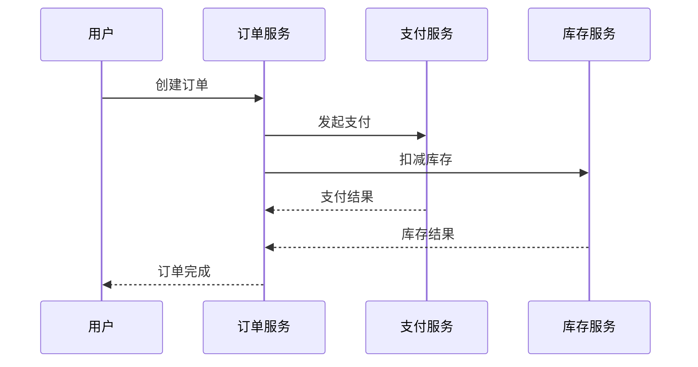

# MySQL存储适配器

## 介绍

MySQL存储适配器是Zipkin提供的一种将追踪数据持久化到MySQL数据库的方案。相比默认的内存存储，MySQL适配器适合生产环境使用，能长期保存追踪数据并支持复杂查询。本节将介绍其工作原理、配置方法和最佳实践。

:::note 为什么选择MySQL？
- 数据持久化：重启服务不会丢失历史追踪记录
- 支持标准SQL查询：可直接通过数据库工具分析数据
- 中等规模部署的理想选择（适合每天千万级span的场景）
:::

## 前置条件

在开始前，请确保：
1. 已安装Java 8+和Zipkin Server
2. 有可用的MySQL 5.7+实例
3. 具备创建数据库和表的权限

## 配置步骤

### 1. 创建数据库表

执行以下SQL创建所需表结构：

```sql
CREATE TABLE IF NOT EXISTS zipkin_spans (
  `trace_id_high` BIGINT NOT NULL DEFAULT 0 COMMENT 'If non zero, this means the trace uses 128 bit traceIds instead of 64 bit',
  `trace_id` BIGINT NOT NULL,
  `id` BIGINT NOT NULL,
  `name` VARCHAR(255) NOT NULL,
  `remote_service_name` VARCHAR(255),
  `parent_id` BIGINT,
  `debug` BIT(1),
  `start_ts` BIGINT COMMENT 'Span.timestamp(): epoch micros used for endTs query and to implement TTL',
  `duration` BIGINT COMMENT 'Span.duration(): micros used for minDuration and maxDuration query',
  PRIMARY KEY (`trace_id_high`, `trace_id`, `id`)
) ENGINE=InnoDB ROW_FORMAT=COMPRESSED;

-- 其他表结构（zipkin_annotations等）详见官方文档
```

### 2. 启动Zipkin时指定MySQL存储

通过环境变量或命令行参数配置存储类型：

```bash
java -jar zipkin-server.jar \
  --STORAGE_TYPE=mysql \
  --MYSQL_HOST=127.0.0.1 \
  --MYSQL_TCP_PORT=3306 \
  --MYSQL_USER=zipkin \
  --MYSQL_PASS=zipkin \
  --MYSQL_DB=zipkin
```

### 3. 验证配置

发送测试请求后，检查数据库中是否出现数据：

```sql
SELECT COUNT(*) FROM zipkin_spans;
```

## 实际案例：电商系统的订单追踪

假设我们有一个微服务架构的电商系统，包含以下服务：
1. 订单服务
2. 支付服务
3. 库存服务



配置MySQL存储后，我们可以：
1. 追踪整个订单生命周期的调用链
2. 分析各服务间的延迟情况
3. 排查支付超时等问题的根本原因

## 性能调优建议

:::caution 性能注意事项
- 为`start_ts`和`duration`字段添加索引以提高查询速度
- 定期清理过期数据（Zipkin默认保留7天）
- 考虑使用MySQL读写分离部署
:::

优化配置示例：

```properties
# 调整连接池设置
spring.datasource.hikari.maximum-pool-size=10
spring.datasource.hikari.connection-timeout=3000

# 启用批量插入
zipkin.storage.mysql.strict-trace-id=false
```

## 总结

MySQL存储适配器为Zipkin提供了可靠的持久化存储方案，适合需要长期保存追踪数据的生产环境。关键要点：
- 配置简单，只需修改启动参数
- 支持标准SQL查询和分析
- 需要合理设计表结构和索引

## 扩展学习

1. 官方文档：[Zipkin MySQL Storage](https://zipkin.io/pages/storage.html#mysql)
2. 实践练习：
   - 尝试在不同网络延迟下测试MySQL存储的性能
   - 实现一个自动清理过期数据的脚本
3. 进阶话题：
   - 比较MySQL与其他存储后端（如Elasticsearch）的性能差异
   - 研究Zipkin的存储SPI机制