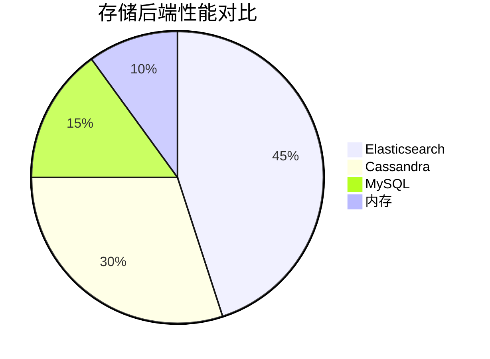

# Zipkin 存储性能调优

## 介绍

Zipkin作为分布式追踪系统，其存储性能直接影响查询速度和系统稳定性。当数据量增长时，未经优化的存储可能成为瓶颈。本章将介绍如何通过配置调整、存储选型和查询优化来提升Zipkin的存储性能。

## 存储后端选择

Zipkin支持多种存储后端，每种都有不同的性能特性：



### 主流存储后端比较

1. **内存存储（开发环境适用）**
   ```properties
   # application.properties
   zipkin.storage.type=mem
   ```
   - 优点：零配置，最快速度
   - 缺点：重启后数据丢失

2. **Elasticsearch（生产推荐）**
   ```properties
   zipkin.storage.type=elasticsearch
   zipkin.storage.elasticsearch.hosts=http://localhost:9200
   ```
   - 优点：强大的全文搜索能力
   - 缺点：需要维护集群

3. **Cassandra（高写入场景）**
   ```properties
   zipkin.storage.type=cassandra3
   zipkin.storage.cassandra.contact-points=localhost
   ```
   - 优点：高写入吞吐量
   - 缺点：查询灵活性较低

:::tip 选择建议
中小规模部署推荐Elasticsearch，超大规模追踪数据考虑Cassandra。
:::

## 索引优化策略

### Elasticsearch索引模板

创建针对Zipkin数据优化的索引模板：

```json
PUT _template/zipkin
{
  "index_patterns": ["zipkin-*"],
  "settings": {
    "number_of_shards": 3,
    "number_of_replicas": 1,
    "refresh_interval": "30s"
  },
  "mappings": {
    "properties": {
      "traceId": { "type": "keyword" },
      "timestamp_millis": { "type": "date" },
      "duration": { "type": "integer" }
    }
  }
}
```

### Cassandra表优化

调整Cassandra的压缩和缓存策略：

```cql
ALTER TABLE zipkin2.traces WITH
  compaction = {'class': 'TimeWindowCompactionStrategy', 
                'compaction_window_unit': 'DAYS',
                'compaction_window_size': 1}
  AND caching = {'rows_per_partition': 'ALL'};
```

## 查询性能优化

### 时间范围查询

总是指定时间范围可以显著提高查询速度：

```bash
# 查询最近1小时的数据
GET http://zipkin/api/v2/traces?lookback=3600000&limit=10
```

### 采样率调整

在客户端设置合理的采样率（如10%）：

```java
@Bean
public Sampler defaultSampler() {
    return Sampler.create(0.1); // 10%采样率
}
```

## 实际案例

### 电商平台优化案例

**问题**：黑色星期五期间，追踪数据量激增导致查询超时。

**解决方案**：
1. 将Elasticsearch从5节点扩展到10节点
2. 实施基于时间的索引（每天一个索引）
3. 设置7天自动过期策略

优化前后对比：

```mermaid
bar
    title 查询响应时间对比(ms)
    x-axis 优化前, 优化后
    y-axis 1200, 350
    bar 1200
    bar 350
```

## 总结

Zipkin存储性能调优的关键点：
- 根据数据规模选择合适的存储后端
- 针对查询模式优化索引结构
- 实施合理的数据保留策略
- 在客户端配置适当的采样率

## 扩展练习

1. 在本地环境尝试不同存储后端的性能测试
2. 使用JMeter模拟高负载场景下的查询性能
3. 实现一个自动清理旧数据的脚本

## 附加资源

- [Zipkin官方存储文档](https://zipkin.io/pages/storage.html)
- [Elasticsearch性能调优指南](https://www.elastic.co/guide/en/elasticsearch/reference/current/tune-for-search-speed.html)
- [Cassandra时间序列数据最佳实践](https://cassandra.apache.org/doc/latest/cassandra/operating/hardware.html)