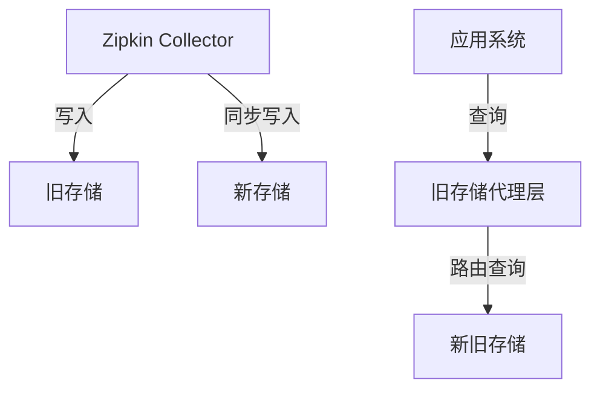

# Zipkin 存储迁移策略

## 引言

存储迁移是Zipkin运维中的关键操作，指将追踪数据从一种存储后端（如内存）转移到另一种（如Elasticsearch或MySQL）。迁移通常发生在业务规模扩大、性能需求变化或成本优化时。本指南将帮助初学者理解迁移的核心流程与最佳实践。

## 为什么需要存储迁移？

:::note 常见迁移原因
- **容量限制**：内存存储无法满足长期数据保留需求
- **性能瓶颈**：现有存储查询速度下降
- **成本优化**：切换到更经济的存储方案
- **功能需求**：新存储支持更复杂的查询（如Elasticsearch的全文检索）
:::

## 迁移前准备

### 1. 存储方案评估

| 存储类型       | 适用场景                     | 注意事项                 |
|----------------|----------------------------|-------------------------|
| 内存           | 开发/测试环境               | 重启后数据丢失          |
| MySQL          | 中小规模生产环境           | 需要索引优化            |
| Elasticsearch  | 大规模数据与复杂查询        | 需要集群维护            |
| Cassandra      | 超大规模分布式部署          | 需要调优读写一致性      |

### 2. 数据兼容性检查

使用Zipkin的`STORAGE_TYPE`环境变量验证新旧存储的兼容性：

```bash
# 检查当前存储类型
echo $STORAGE_TYPE

# 测试新存储连接（以Elasticsearch为例）
curl -XGET http://new-elasticsearch:9200/_cluster/health
```

## 迁移策略详解

### 方案一：双写过渡（推荐）



实施步骤：

1. **配置双写**：修改Zipkin启动参数
```properties
# application.properties示例
zipkin.storage.type: elasticsearch
zipkin.storage.elasticsearch.hosts: http://new-es:9200
zipkin.storage.legacy.type: mysql
zipkin.storage.legacy.mysql.host: old-db
```

2. **数据验证**：对比新旧存储数据一致性
```bash
# 查询新旧存储的trace数对比
curl -s old-storage:9411/api/v2/traces | jq length
curl -s new-storage:9411/api/v2/traces | jq length
```

3. **流量切换**：逐步将查询导向新存储

### 方案二：批量导出/导入

适用于停机迁移场景：
```bash
# 使用zipkin-dependencies工具导出数据
java -jar zipkin-dependencies.jar --storage-type=mysql --mysql-host=old-db > backup.json

# 导入到新存储
curl -X POST -H "Content-Type: application/json" \
  --data @backup.json \
  http://new-storage:9411/api/v2/spans
```

## 真实案例：电商平台迁移实战

**背景**：某电商平台从MySQL迁移到Elasticsearch以支持商品搜索链路分析

**实施过程**：
1. 在低峰期启动双写
2. 使用`zipkin-lens`对比查询结果
3. 发现日期格式不兼容问题后，调整ES的mapping配置
4. 全量数据迁移后，旧存储保留30天作为回滚保障

**关键指标**：
- 迁移后P99查询延迟从1200ms降至300ms
- 存储成本降低40%（利用ES的冷热数据分离）

## 常见问题解决

:::warning 数据不一致处理
若发现差异，可通过`zipkin-check-storage`工具修复：
```bash
java -jar zipkin-check-storage.jar \
  --old-type=mysql --new-type=elasticsearch \
  --trace-id=abcd1234
```
:::

## 总结与练习

**核心要点**：
- 始终保留旧存储的备份
- 监控迁移期间的系统指标（CPU/内存/延迟）
- 验证工具链（如Zipkin UI）与新存储的兼容性

**动手练习**：
1. 在Docker环境部署MySQL和Elasticsearch两种存储
2. 使用`docker-compose`模拟双写配置
3. 生成测试数据（可借助`zipkin-js`示例应用）
4. 对比两种存储的查询性能

**延伸阅读**：
- [Zipkin官方存储文档](https://zipkin.io/zipkin/#storage-component)
- 《分布式系统追踪技术实践》第5章
- OpenTelemetry存储迁移白皮书