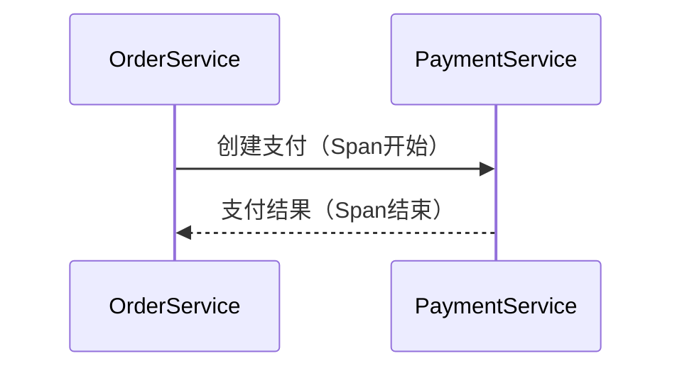

# 存储监控指标

## 介绍

在分布式系统中，Zipkin是一个流行的开源工具，用于收集、存储和可视化请求链路追踪数据。**存储监控指标**是Zipkin的核心功能之一，它记录了请求的延迟、错误率等关键指标，帮助开发者分析系统性能。本章将介绍Zipkin如何存储这些指标，以及如何通过配置和代码实现监控。

:::note
Zipkin默认支持多种存储后端，包括内存（临时测试）、MySQL、Elasticsearch和Cassandra。生产环境推荐使用持久化存储。
:::

---

## 存储机制详解

### 1. 指标类型
Zipkin存储的监控指标主要包括：
- **延迟（Latency）**：请求从发起到完成的耗时。
- **错误率（Error Rate）**：失败请求占总请求的比例。
- **依赖关系（Dependencies）**：服务之间的调用拓扑。

### 2. 存储后端配置
以下是一个配置Zipkin使用Elasticsearch存储的示例（`application.yml`）：

```yaml
zipkin:
  storage:
    type: elasticsearch
    elasticsearch:
      hosts: http://localhost:9200
      index: zipkin
      date-separator: '-'  # 按日期分索引
```

:::tip
生产环境中，建议为Elasticsearch配置副本和分片以提高可靠性。
:::

---

## 代码示例：存储与查询

### 存储指标
当Zipkin客户端（如Brave）上报数据时，指标会自动存储。以下是手动上报Span的Java示例：

```java
tracer.newTrace().name("backend-api").start().finish(); // 创建一个Span并上报
```

### 查询指标
通过Zipkin UI或API查询存储的指标。例如，查询最近1小时的延迟分布：

```bash
curl "http://localhost:9411/api/v2/latency?serviceName=backend-api&lookback=3600000"
```

输出示例：
```json
{
  "50th": 45,
  "75th": 78,
  "90th": 120
}
```

---

## 实际案例：电商系统监控

假设一个电商系统的订单服务调用支付服务，Zipkin会记录以下信息：
1. **延迟监控**：支付服务的平均延迟为200ms，若突然升高至500ms，可能提示性能问题。
2. **错误监控**：支付失败率超过5%时触发告警。



:::caution
确保Span的采样率（Sampling Rate）合理，避免存储过多数据导致成本上升。
:::

---

## 总结

- Zipkin通过存储延迟、错误率等指标，帮助分析分布式系统性能。
- 支持多种存储后端，需根据场景选择（如Elasticsearch适合大规模数据）。
- 结合告警工具（如Prometheus）可实现自动化监控。

### 扩展练习
1. 部署Zipkin并配置MySQL存储，记录不同服务的延迟分布。
2. 使用Zipkin API编写脚本，定期导出错误率数据。

### 附加资源
- [Zipkin官方文档](https://zipkin.io/)
- 《分布式系统可观测性》Chapter 5