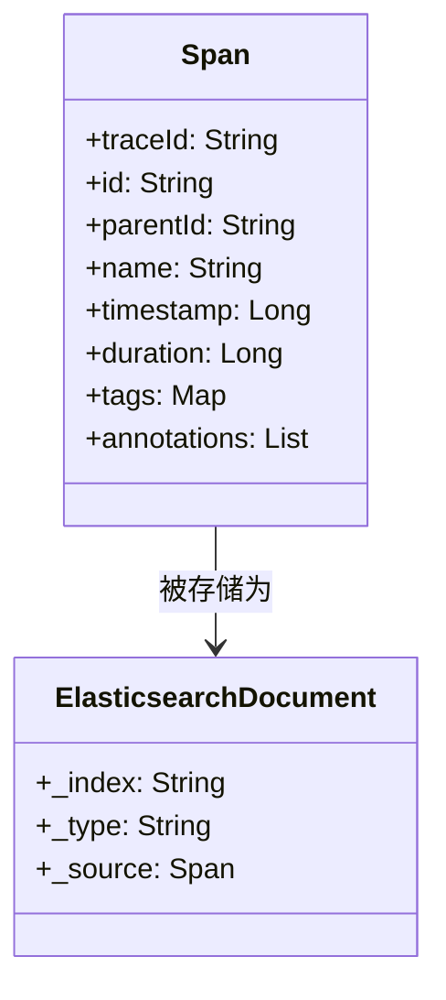
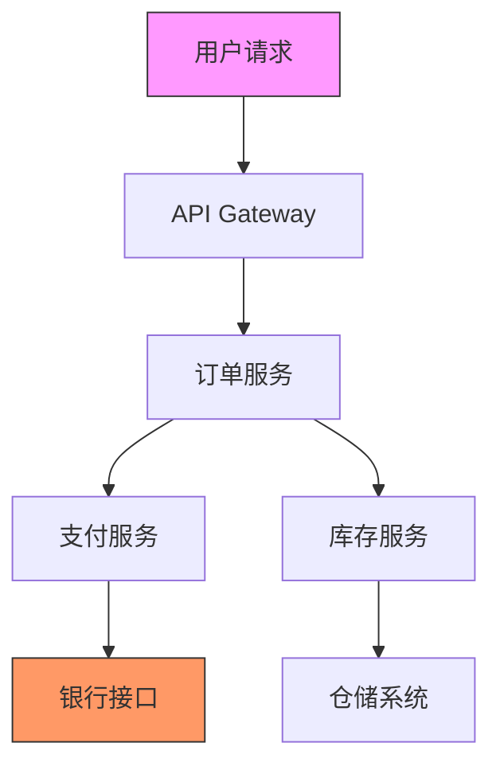

# Elasticsearch存储适配器

## 介绍

Elasticsearch存储适配器是Zipkin与Elasticsearch数据库的集成方案，允许将分布式追踪数据持久化到Elasticsearch集群中。这种组合特别适合生产环境，因为：

- Elasticsearch具备水平扩展能力
- 提供强大的全文检索功能
- 支持复杂聚合查询
- 能够处理高吞吐量的写入操作

## 核心概念

### 1. 数据模型映射

Zipkin将追踪数据映射到Elasticsearch的索引结构中：



### 2. 索引策略

Zipkin默认使用日期格式的索引命名模式：
- `zipkin-span-{dateFormat}`
- `zipkin-dependency-{dateFormat}`

例如每日滚动索引：`zipkin-span-2023-11-01`

## 配置指南

### 基础配置

通过环境变量配置Elasticsearch存储：

```bash
# 使用Docker运行Zipkin时
docker run -d \
  -e STORAGE_TYPE=elasticsearch \
  -e ES_HOSTS=http://elasticsearch:9200 \
  -p 9411:9411 \
  openzipkin/zipkin
```

### 高级配置选项

| 环境变量 | 描述 | 默认值 |
|----------|------|--------|
| `ES_HOSTS` | ES集群节点列表 | `http://localhost:9200` |
| `ES_INDEX` | 索引名前缀 | `zipkin` |
| `ES_DATE_SEPARATOR` | 日期分隔符 | `-` |
| `ES_INDEX_SHARDS` | 分片数量 | `5` |
| `ES_INDEX_REPLICAS` | 副本数量 | `1` |

:::tip 生产环境建议
对于生产部署，建议配置：
- 至少3个节点的Elasticsearch集群
- 合理的分片策略（根据数据量调整）
- 启用安全认证
:::

## 代码示例

### Java应用集成

```java
@Configuration
public class ZipkinConfig {
    @Bean
    public ElasticsearchStorage storage() {
        return ElasticsearchStorage.newBuilder()
            .hosts("http://es1:9200,http://es2:9200")
            .index("zipkin-prod")
            .dateSeparator('-')
            .build();
    }
}
```

### 查询API示例

通过Zipkin API查询特定服务的追踪数据：

```bash
curl -X GET "http://zipkin-server:9411/api/v2/traces?serviceName=order-service&limit=10"
```

对应的Elasticsearch查询：

```json
{
  "query": {
    "bool": {
      "must": [
        { "term": { "localEndpoint.serviceName": "order-service" } }
      ]
    }
  },
  "size": 10,
  "sort": [ { "timestamp_millis": "desc" } ]
}
```

## 实际案例

### 电商平台监控

**场景**：某电商平台在黑色星期五期间需要：

1. 实时监控订单处理链路
2. 快速定位延迟瓶颈
3. 分析服务依赖关系

**解决方案**：



配置：
- 6节点的Elasticsearch集群
- 每日滚动索引
- 保留策略：30天

**效果**：
- 每秒处理`10,000+ spans`
- 查询响应时间`<500ms`
- 成功识别支付服务瓶颈

## 性能优化

### 索引模板

创建优化的索引模板：

```json
PUT _template/zipkin_template
{
  "index_patterns": ["zipkin-*"],
  "settings": {
    "number_of_shards": 3,
    "number_of_replicas": 1,
    "refresh_interval": "30s"
  },
  "mappings": {
    "properties": {
      "traceId": { "type": "keyword" },
      "duration": { "type": "long" },
      "tags": { "type": "nested" }
    }
  }
}
```

:::caution 注意事项
1. 避免过度分片（每个分片应有至少数GB数据）
2. 监控ES集群健康状态
3. 定期优化旧索引（force merge）
:::

## 总结

Elasticsearch存储适配器为Zipkin提供了：
- 高可用的存储后端
- 强大的查询能力
- 灵活的扩展方案

## 扩展学习

### 推荐练习
1. 搭建本地ES集群并集成Zipkin
2. 创建自定义索引模板
3. 实现基于业务标签的追踪查询

### 故障排查
- 检查`/_cat/indices?v`查看索引状态
- 使用Zipkin的`/health`端点验证存储连接
- 监控ES的JVM堆内存使用情况

### 后续学习
- Elasticsearch索引生命周期管理(ILM)
- Zipkin的采样率配置
- 集成APM工具（如Jaeger）
